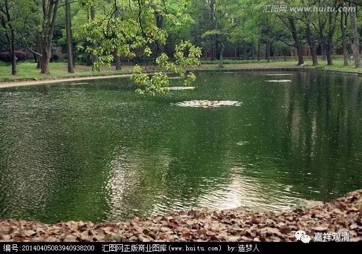
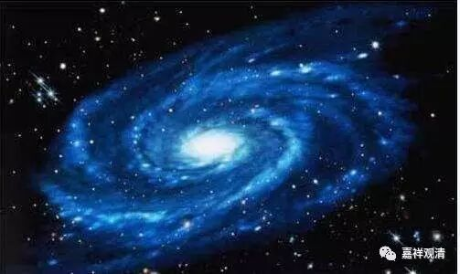

**《金刚经》035（下）**

我在谈到极微的时候一直都要谈一个故事，是佛陀的一个脑筋急转弯题目。那时，佛陀带着一大群弟子走到一个湖边，问大家：“你们看这个湖。来，谁来告诉我这个湖里面有多少桶水？”大家都回答不了，结果一个小沙弥站出来说：“我来回答一下。”佛陀说：“好，你来回答吧。”小沙弥回答说：“这个湖里面有一桶水，这个桶就和这个湖一样大；这个湖里面有两桶水，这个桶就是这个湖的1/2大；这个湖里面有三桶水，这个桶就像这个湖的1/3那么大……”佛陀说：“嗯，对。”这是什么意思呢？就是说，这个湖到底有多少桶水，是依赖于这个桶有多大，是吧？

我们来看这个物理世界，它的组成元素就是极微，或者这里讲的微尘，或者希腊讲的原子，它是什么呢？它是我们的意识分析到再也不能往下分的最小单位。极微就是分到最小的、不能再分的东西。但实际上只要存在这么一个东西，你只要可以找得到这个东西，它就可以继续被分。而我们意识如果是偷懒了，或者实在太累了，到最后我们不再分的时候，就给一个阶段性的名字，叫极微。原子现在还能再分到夸克，对吧？所以根本就没有最小的一个东西。

关于这个问题，庄子也说过：“其大无外,其小无内。”最小的东西里面啥都没有，这个就是最小了。啥都没有的东西，那就不存在了，只能是个空集，是吧？“其大无外”，在这个以外再没有其他东西了；“其小无内”，更小的内涵就没有了。所以，“其大无外”这个东西只是一个概念的东西，它根本不存在，那是空的概念；“其小无内”也是一样，也是一个空的概念。

这里讲的是微尘和世界。我们现在知道微尘就是极微，就是通常讲的原子，是物质分析的最小单位。这里的世界，主要是指的物理世界。当然我们也可以说包括器世间和有情世间，那有情世间就不用谈微尘了，所以这里主要还是谈的物理世界。

这个界呢，实际上是空间的概念，而这个世呢，就是时间的概念，就是我们所讲的三世——过去、现在、未来。世和界合在一起，有点类似我们今天说的宇宙这个概念。宇和宙也是一样，一个是时间，一个是空间。像世界、宇宙这类词，特别是世界这个词，本来就是佛教的用词，今天倒是经常被我们使用，而且更大程度上好像接近于指代地球上的情况。

好，今天我们先到这里，谢谢大家。

