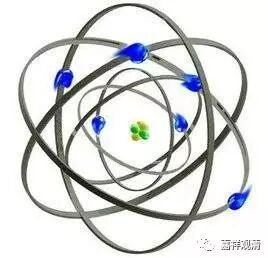
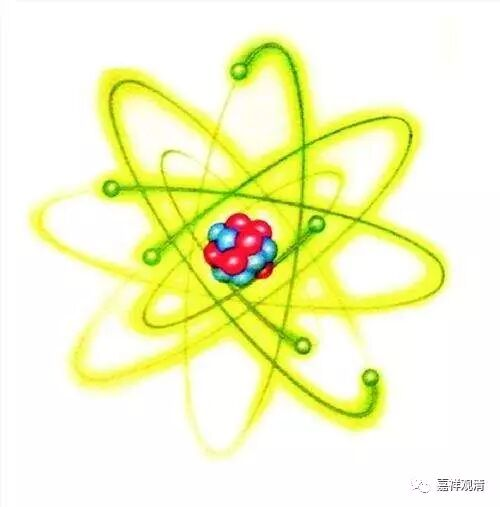
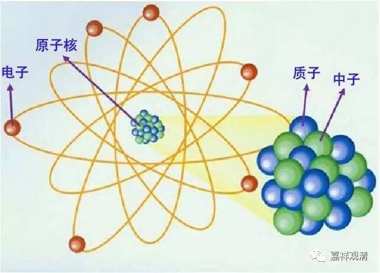

**金刚经 036**

** **

好，继续《金刚经》。

《金刚经》现在讲到第七个问题，是吧？第七个问题这一段是比较长的，面主要是讲佛的。已经成佛以后，是不是实有呢？“究竟佛地，获无边色身，岂非有法可得？”基于这个呢，又展开了其他的内容，比如说较量功德——在《金刚经》当中较量功德的情况是比较多的。

好，我们说回来。上次讲到微尘，微尘就是极微，就类似我们今天讲的原子。“极”就是最极，“微”就是微小，“极微”就是最极微小的物质单位。声闻佛教，主要是有部，认为这种东西是实有的，而大乘则认为这些东西不是实有的，是一种概念性的东西。整个世界，就是我们的物质世界——器世间，都是由极微所组成的。《金刚经》这里说是由微尘所组成的，也就是我们现在讲的由原子所组成。《金刚经》说：不管是小至“极微”也好，大到“世界”也好，都是并非实有，都是依赖各种条件而建立的。

如果单单从文字上说，极微好像是不依赖其他条件而建立的，但从大乘佛教上来说，真正的极微——最小的、不可分的物质，是不存在的，它仅仅是我们意识构画的一个东西。它很明显是基于其他的物质形式而存在，然后我们在概念上把它分化以后所成立的一个概念。比如说刚才我们所讲的原子，实际上原子还可以再分，是吧？

大乘佛教讲，即使是极微，它仍然可以再分。如果它不可以再分的话，那么两个极微、三个极微又是怎么组合在一起的呢？两个极微组合在一起的时候，它们彼此之间就有相对的方向，有了方向的话就可以再分。佛教里面讲方向就是东南西北，或者上下前后等等。如果是前后、左右、上下两个结合在一起的话，就是有方向的，那就可以分了。极微应该是“无方分”的极微，它是不可再分的，是“无分”的。“无方”，是指它就是没有上下、左右、前后的，这个叫“无方分的极微”。最后，所谓“无方分的极微”仅仅是我们的一个概念。但凡只要是一个物质，是一个色法，基于我们目前的物理世界的这种概念，最后它还是可以无限地被分下去的。

