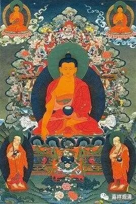

**《金刚经》036（中）**

** “不也，世尊，不可以三十二相得见如来，何以故？如来说三十二相，即是非相，是名三十二相。”**这就是说，不能以具备某种形象来说这是佛。在今天，如果以形象来认为是佛的话，那么我们这个地球有六、七十亿的人口，还是可以找得出一个稍微像一点的或者差不多像的。再不行，去韩国整容吧，可以整成这个样子……所以说形象不是佛。当然，我们通常是借用形象来观察的。

不过，今天的人其实越来越肤浅了。我前两天还在想这个事情，我们越来越多地考虑颜值、去整容等等，却越来越少观察实质的东西。但是，什么叫实质也是个问题啊！以前我们就说什么心灵啊、知识啊这些精神方面的东西。近代的儒家也在谈物质和精神哪个更重要？那显然是精神更重要了。所以儒家后来就发展出了新心学，他们认为西方物质上的进化够了，但是心灵的层面呢，是不够的。

这里也是一样。如果单单说是从形象上，从眉眼、手脚上来分辨佛，我们也会觉得这不科学。释迦佛的兄弟们都长得很像，有两位也说有三十相等等，按我们今天来讲，那就是遗传嘛，基因都差不多，所以提婆达多也有很多相，阿难好像也有三十相，印度还说转轮圣王有三十二相。

假如我们今天要重构那个时代的情况的话，那应该说所谓的三十二相就是印度认为的最好的相。实质上呢，国王、王子还有谁敢说不好的呢？在《大智度论》里面就提到过这个三十二相，有人问：“是不是一定要具足三十二相呢？”《大智度论》前后的答案是不一样的。后面的答案说，实际上三十二相是印度人的一种审美，在其他地方可能这三十二相有多有少，或者这三十二相不一样。如果今天站在历史的角度来看的话，尼泊尔人和中印度、南印度人的审美恐怕还是不一样的。所以这所谓的三十二相呢，其实并不是很确定的这三十二个，它其实是一种古代传说中比较圆满的相好，就是长得比较好。

如果你们去观察这三十二相，会发现有很多的内容表现为不是很单纯的。比如说，有些部分完全是一种小孩的形象，足平满啊（肉嘟嘟的小脚）、头发绀青（黑头发黄皮肤，远看像青色）等等……还有些地方又是一种成年的样子。传说是阿私陀仙在释迦太子幼时看到了释迦牟尼佛的三十二相，但是那些作为成人才有的相，阿私陀仙其实不可能在那个时候看见的。如果说这三十二相是成人的时候所具备的相，那其中很多的相又是小孩才有的……所以，这三十二相，我们还是用《大智度论》里面的说法吧：这三十二相是印度人认为一个比较完美的或者说是有一些完美的形象特征。

