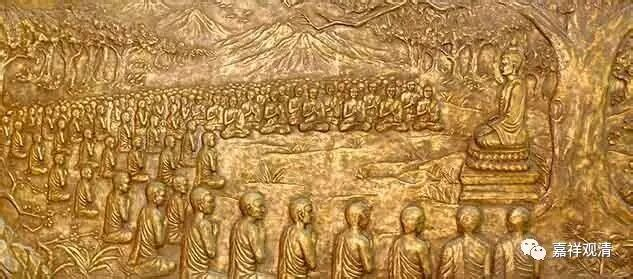

**《金刚经》036（下）**

其实我认为三十二相八十种好，其中的有些特征并不见得真的存在，假如你按照这些特征去寻找的话。按我们今天来看，有些好像会是遗传病……我们知道印度人是比较夸张的，而释迦种族又是“战斗民族”，所以他们的肌肉会比较发达，但并不是像三十二相所描述的那么夸张。因为夸张到了最后，就变成了刚才我们所讲的遗传病一样，那不太可能。

还有一些其实是后人整理的。今天我们会以为三十二相、八十种好是当时就存在那里的，佛陀时代就那样定型了，一直到现在没变过——其实这种可能性并不大，或者进一步说，一定不可能。第一，北方的尼泊尔人是黄种人，他们的审美和南方的印度人的审美肯定不完全一样。这是地域的差别，还有时代的差别，关于“相好”，一些是后期慢慢固定下来的，比如说手指之间有蹼——类似这样，网幔相。实际上，婴儿的小手可能可以看出来有一点点类似的意思，但肯定不会那么夸张。

另外呢，所谓的指间有蹼是怎么造成的呢？如果你去印度的一些博物馆的话，可以看出来，它实际上是石刻佛像建造时候的需要，其实也不是审美问题，而是一种造像时的技巧。因为如果在造佛像的时候，把手指雕刻得太精细，从而每一根手指都是分开的话，会比较容易碰碎，所以在古代雕刻这些佛像的时候，经常会出现这种指与指间的鬘网相。所以，我更愿意接受这种鬘网相是后期的雕刻师所总结出来，然后慢慢社会化传播开了。这是一种说法，而且它有一些实物的证据。上次在印度参观一个博物馆的时候有这样的实物，但可惜不允许拍照，所以照片没有拍下来，以后可以在一些允许的地方拍下照片来，或者看他们博物馆网站有没有……这是一个很明显的指间的鬘网相。

当然这只是我提供的一种说法，大家完全可以去接受其他的说法，而且我也说了，我个人也比较接受《大智度论》里面的说法——在《大智度论》里还提到一个问题，大概是八十八卷最后面那段，就是刚才所说的是不是有确定的三十二相、八十种好的问题。龙树菩萨就讲了一个故事，说不是所有的地方都是这个样子的。他举的例子就是在今天的克什米尔，以前叫迦湿弥罗的地方，说是有位菩萨出生在那里，就是有指间的鬘网相，结果他爸爸觉得“生了个怪胎，搞得像鸭子似的”，就拿把剪刀给剪了。这个故事说明那个地方就不接受这种指间的鬘网相。所以鬘网相又有这样一种说法，大家可以自行去选择。龙树菩萨的意思是，鬘网相，只是当时印度人的一种审美，不作为人类文明的普遍性。

今天好像讲三十二相多了一点，明天继续，谢谢大家。

