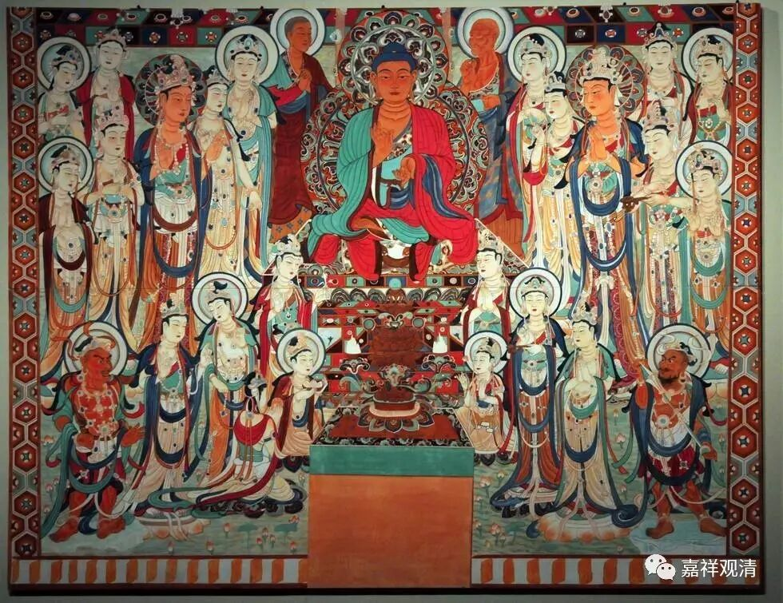

**《金刚经》 037（上）**

** **

好，我们继续《金刚经》。

现在还是讲到《金刚经》的第七个问题：“究竟佛地，获无边色身，岂非有法可得？”在这里就谈到了三十二相，我们昨天也专门讲了一下这个三十二相，给了大家几种说法：一种呢，三十二相是指圆满的相好；另一种呢，在有些地方说是固定的，有些地方像《大智度论》就讲这个三十二相其实是印度人对比较圆满的相好的一种统称；以现在研究的角度来说，今天的三十二相其实也是后期慢慢固定下来的。

我们应该把三十二相称为一种“圆满的相好”比较好。我一直觉得用这样的名词也挺好的，作为三十二相八十好来说，它更多地是一个约数吧。但是我们现在所学习的阿毗达磨中基本上都把它认为是一个实数，认为实际就是这样的，那我们就……就这样学习吧。

我觉得，大家如果能够接受的话就接受，不能接受也可以存疑，这也没关系，其实佛教里面很多地方都是这样的。有时候我们在讲课的时候，也会聊到类似的一些内容。有些东西并不是经典本身带给我们的，而是后人的一些猜测，后人的一些解释本来希望能够把佛教的经典简化，但是有时候简化的背后就会出现一些新的说法，以后，通常是这些解释出了问题，甚至是解释了再解释出了问题……那么，我们也已经把几个说法都稍微讲了。

关于三十二相还有一个问题，前面我讲了它实际上是指“圆满的相好”，而在印度，包括《金刚经》本身也给了另外一个暗示：转轮圣王是具备三十二相八十种好的。我们可以由此看出，对于大的国王也必须要说他是具备圆满的相好的，包括这部经里面也是这么说的。“如果你真的认为三十二相就是佛的话，那转轮圣王怎么办呢？”另外一方面呢，对于大的国王你当然不能去挑他什么地方长得不好，这也算是对三十二相的一种推理吧，当然也不是百分之百正确的。那么，三十二相这个事情我们就这样翻过了。

 ** “不也，世尊，不可以三十二相得见如来，何以故？如来说三十二相，即是非相，是名三十二相。”**这个在讲什么呢？三十二相——佛陀的相好本身，它不是实有的。最简单的一种理解，它是基于其他的条件而成立的，比如基于肉、骨头、头发等等，那么它不是实有的。就在这些条件或情况下，取了一个名字，总结出这个所谓的三十二相。在这部经的后面也提到了，假如三十二相就是佛陀的话，其他人如果具备这三十二相，那是不是佛陀呢？显然是不能用这个三十二相来确定是不是佛陀的。

当然，佛陀的三十二相，在经典当中也说是有因的。如果长得符合一个时代的圆满的相好，他在这个时代就比较容易被接受、追星，那一定是有他的因。但如果你要说确定某一个相就是某一个因造成的话，我觉得还是过于机械了。

举个例子来说，今天我们评判一些人长得帅等等，就和三、五百年前的标准完全不一样——这是从时间角度来看；中国的审美观肯定和其他地方的不一样，欧洲的和非洲的也不完全一样——这是从地域角度来看。所以我自己更愿意这样理解：“圆满的相好”当中的这些相好，一定是有福德的因，至于每一个相好具体到底对应哪一个因，则未必如后世这样机械的、一一对应的关系——但阿毗达磨当中经常会讲这种关系。其实，好像不同的经典当中对于相好所对应的因的讲法也不完全一样，我们可以看作是不同的论师各自对三十二相由来的解释——这种解释常常是从文字开始联想、引申的。

