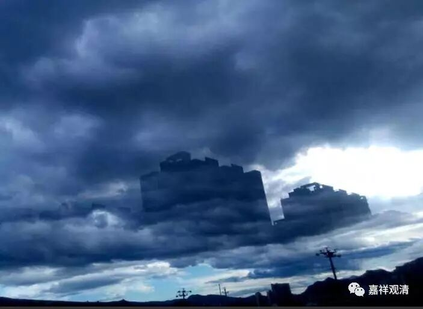

（如幻的海市蜃楼）

**《金刚经》037（下）**

** “世尊，若复有人得闻是经，信心清净，则生实相，当知是人，成就第一、希有功德。”**须菩提就说，我这样已经证悟空性的人，已经成为罗汉这样的人，听到这样的法都认为是甚深难得——** “未曾得闻”**，以前都没有听到过这样的经典。如果以后有人能够接触到这样的经典、这样的教法，** “信心清净”**，能够相信，** “则生实相”**，而且能够认为这个是正确的。这个** “生实相”**不是“认为实有”的意思，而是认为是正确的，是谛实的。这个谛实是指相信佛所说的诸法的胜义空。** “当知是人，成就第一、希有功德。”**这样的人以前具有甚深的希有的功德，今天才能够信解领受。

** “世尊，是实相者，即是非相，是故如来说名实相。”**这里说的“实相”是什么意思呢？也和前面的一样，这个实相不是指实有，这个实相应该是指谛实。谛实的意思就是真话，他相信如来上面所讲的是真话。（很多人听到这样的教法会产生恐怖的心，因为以为“佛教是与空相应的教法，佛教说什么都没有”。历史上确实有这个情况，很多人听到会非常害怕的，佛陀时代，也有人认为释迦摩尼是个“幻师”。）那么，这样的人能够生起信心，并且认为如来所说就是确实的究竟的教导，这样的理解是非常难得的，这样的人也是非常难得的。

（如幻的海市蜃楼）

所以说，** “是实相者，即是非相，是故如来说名实相。”**这个也是和上面一样常用的句型——“是A,即非A，是A”。这个什么意思呢？就是实相也好，谛实也好，都不是实有的，因为它是无自性的，是依名言而有的，是依缘起而有的。是因观待而成立的。

好，今天先到这里。快过年了，大家过年快乐，吉祥如意！谢谢大家。

