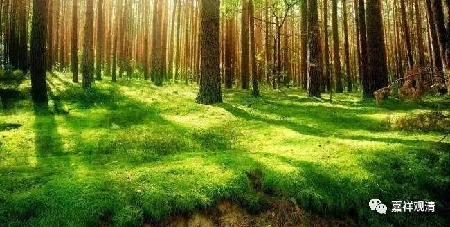

**《金刚经》 038（上）**

好，我们继续讲《金刚经》。

我们在这里用的是鸠摩罗什法师的版本，现在讲到了《金刚经》的第七个问题：“究竟佛地，获无边色身，岂非有法可得？”成佛以后的色身有没有呢？岂不是有吗？前面已经讲了好几段了，包括有两段的较量功德。现在讲到** “尔时须菩提闻说是经，深解义趣……”**这一段。

昨天讲到：** “世尊，是实相者，即是非相，是故如来说名实相。”**那么，须菩提继续讲：** “世尊，我今得闻如是经典，信解受持，不足为难。”**说他今天在世尊面前听到这样的说教，能够理解、能够相信是不难的。这个不难是相对于后面的人说的，他要进行比较的。为什么呢？因为他当时在佛的面前，有问题可以直接问，就像我们今天现场听法和听录音、看录像等等，还是有些区别的。他说：** “我今得闻如是经典，”**我现在听现场的讲法，能够信解受持还不算难。

** “若当来世，后五百岁，”**从现在往后五百岁，** “其有众生，得闻是经，信解受持，是人则为第一希有。”**这样的人呢，非常希有。从当时往后五百岁，差不多就是公元前后的时候。这个时候如果有人能够信解受持佛语的话，就不容易了。** “是人则为第一希有”**，这是非常非常难得的。

为什么呢？因为佛陀那个时候是正法时期，五百年以后是像法时期。就是呢，佛教的演化，在时间上过了五百年以后，就像牛奶冲了水，时间越长，冲的水越多，它就越来越淡了。后五百岁的时候，整个佛法相对于正法时代肯定是衰弱的。这个时候如果有人能够信解受持般若系的经典，那这样的人是非常非常难得的——第一希有，因为这已经是像法时代，去圣时遥……

另外还有一种说法，有些人说这里是指龙树菩萨，因为龙树菩萨是在佛灭后五百年左右出世的。这个能不能算一种授记呢？这点不好说，但是单从文字本身来看，也确实可以有这种解释。

** “何以故？”**为什么呢？** “此人无我相、人相、众生相、寿者相。”**这个前面已经讲过了，我相、人相、众生相、寿者相，实际上是一个意思，都是没有我执的意思。今天我们讲没有自性执，这里面讲的是没有我执。这样的人，对自性执已经能够破除，对人无我已经能够通达，或者对无自性这件事情能够通达。这样的人才对般若系的经典能够信解——能够相信、能够理解，能够受持——能够领受、能够持诵，或者说是能够领受、能够保持。这个持，可以说是能够任持。

** “所以者何？我相即是非相，人相、众生相、寿者相，即是非相。”**为什么呢？因为自性无，我相、人相、众生相、寿者相，** “即是非相”**。人我，它是不存在的，这个不存在和前面的讲法有点不一样的，是两种讲法。第一，如果讲自性的我，就像龟毛兔角一样不存在，是根本不存在的。那么，如果说名言我，在世俗上就有这样一个人走来走去，有众生等等，这个有没有呢？也不能说没有。如果这个也没有了，就变成“失坏世俗”。

就是在世俗上，比如说林——经常有这个比喻的：树林是由一棵棵树木组成的，离开一棵棵树木就没有树林，但也不是没有这个树林，只是树林的“自性”没有，树林是依靠这些树木等等这些内容而存在的。

衣服也是一样，衣服依于它的经纬线（是不是叫经纬啊？），一横一竖这样的。或者说，衣服是基于纤维而存在的，离开了这些纤维、剪裁、纽扣、拉链、缝纫，没有独立的衣服。衣服也是自性无的。那么，衣服有没有呢？衣服是世俗有，它还是有的。如果说“衣服、树林不存在”那就变成“失坏世俗”了——衣服树林，有！衣服树林的自性，没有！

