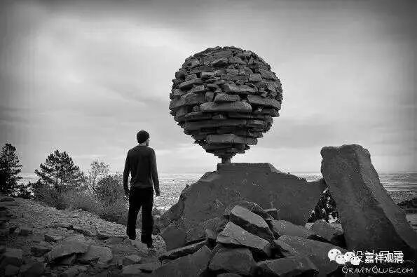

**《金刚经》 039（上）**

** **

好，我们继续《金刚经》。上次我们讲到第七个问题的最后，第七个问题是：“究竟佛地，获无边色身，岂非有法可得？”那么，这里讲即使是无边色身，它也是缘起有而自性空的。

最后一段，就有一个关于版本的问题。这一段是这样的：** “佛告须菩提：‘如是，如是！若复有人，得闻是经，不惊、不怖、不畏，当知是人，甚为希有。何以故？须菩提，如来说第一波罗蜜，即非第一波罗蜜，是名第一波罗蜜。’”**这个是我们通常所见的版本，但是我们看其他版本的话，可以发现这一段是漏了几个字的，其实在** “何以故？须菩提，如来说……”**的后面要加几个字，应该是：** “如来说（般若波罗蜜，是名第一波罗蜜。）”**然后呢，** “（须菩提，）第一波罗蜜，即非第一波罗蜜，是名第一波罗蜜。”**应该是这样的，否则看起来会有点突兀。文字倒也能够说得通，但加上这几个字，意思上比较说得通，而且其他的版本当中都是有这些文字的。

接下来就是第八个问题了。佛陀的无边色身的问题讲完了以后，结论就是“佛陀的无边色身，也是自性无所得的”。这两天微信推送的《心经》讲记里面也讲到了“无所得”的问题。第八个问题就来了：“既无所得，云何有忍辱事？”既然是无所得，那么又为什么说释迦牟尼佛在因地上有这种忍辱事呢？就是指《金刚经》里面讲到的“忍辱仙人”。

这段的经文：** “须菩提，忍辱波罗蜜，如来说非忍辱波罗蜜。”**如果按照之前的格式把这句话说全的话，就是：“须菩提，忍辱波罗蜜，如来说非忍辱波罗蜜，是名忍辱波罗蜜。”对吧？忍辱波罗蜜这个事情，即非忍辱波罗蜜——忍辱波罗蜜的自性无，是名忍辱波罗蜜——它的唯名言有。

** “何以故？须菩提，如我昔为歌利王割截身体，我于尔时，无我相、无人相、无众生相、无寿者相。何以故？我于往昔节节支解时，若有我相、人相、众生相、寿者相，应生嗔恨。”**这段呢，在小乘里面的讲法会和大乘里面的讲法不一样。

比如说，** “我于尔时，无我相、无人相、无众生相、无寿者相”**,这个时候就是释迦牟尼佛的前身——释迦菩萨的时候，在这个时候他已经证得了初地以上的果位，是初地以上的圣者菩萨，他是无我相、无人相、无众生相、无寿者相的。这样的人，一旦被割截身体的时候，他会不会有嗔恨心等等呢？他不会有！因为对他来说，就跟剃头发一样简单，如此一来，好像我们又觉得不那么高尚、不那么伟大了。但在大乘里面就是这样讲的，就是他已经证得了无我相、无人相、无众生相、无寿者相的时候，已经是圣者了，而这些被割截身体的事情对于圣者菩萨来说是比较轻松的，经典里面讲就像割韭菜一样。如果在声闻里的说法则不然，声闻乘的意思是，此时，释迦菩萨还是凡夫菩萨，并未证圣者位。没证圣位而能行忍辱事，好像更伟大哦……

