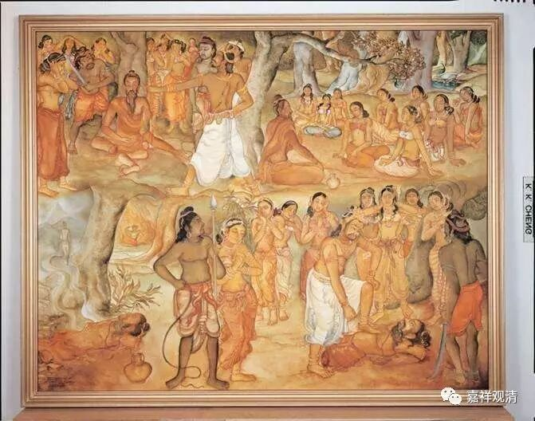

**《金刚经》039（中）**

释迦菩萨和歌利王的故事是这样的：佛陀当年做忍辱仙人的时候，有一次在树荫里面打坐，正好歌利王带着他的嫔妃们出来郊游。国王累了，休息睡着了。一帮妃子们自己到处晃荡……看到有这样一个修行人就围了过去，请教问讯……结果歌利王醒过来以后，也走过来了，就看到他的女人全都围着一个修行模样的人，觉得很暧昧，国王觉得这个是假修行，忽悠他的女人，就生气，就要砍他——割截身体。

歌利王就问：“你到底是真修行，还是假修行？”忍辱仙人回答：“我是真修行人。我修忍辱……”歌利王就让人砍了忍辱仙人的身体，问：“我砍你的身体，你有没有嗔恨心？”忍辱仙人说：“我没有嗔恨心。”并且发誓说：“如果我刚才所说的‘没有嗔恨心’是谛实语的话，我的身体就能平复如故——还原成本来的样子（在《般若经》里经常有这种情况）。”然后忍辱仙人的身体就平复如故。

这个歌利王呢，在佛教的典籍当中说他就是后来的阿若乔陈如。当时忍辱仙人对歌利王说：“我成佛以后，要第一个度你，你是我座下第一个成就的弟子……因为你的嗔恨心太重了。”据说歌利王先是因为伤害了菩萨而下了地狱，后来因为和忍辱仙人——释迦佛的这段因缘，成为释迦佛座下第一个成就的阿罗汉——乔陈如。

那么，这里是在讲什么呢？是在讲忍辱事。忍辱有没有我相、人相、众生相、寿者相、或者自性执、或者有自性呢？没有！你看这里，** “我于尔时，无我相、无人相、无众生相、无寿者相。”**如果这个时候有我相、人相、众生相、寿者相，那就是凡夫菩萨了，就有可能生嗔恨心了。而他证得了一切法自性空以后，已经是大乘的圣者了，按照一般的说法，这个时候他是在修忍辱波罗蜜多。在十地的菩萨当中，专修忍辱波罗蜜多的是第三地的菩萨，是按照布施、持戒、忍辱……这样的顺序。后面说五百世做忍辱仙人等等，都是指专修忍辱波罗蜜多的三地菩萨。三地菩萨的智慧很超胜，禅定也很超胜，他一定是证得性空的圣者菩萨。

** “须菩提，又念过去，于五百世作忍辱仙人，”**这以后或者这前后五百世做忍辱仙人，这个时候是专门修忍辱波罗蜜多。六度当中的布施、持戒、忍辱、精进、禅定、智慧，对应的是初地到六地，第七地是“方便”，第八地是“愿”，第九地是“力”，第十地是“智”。这个忍辱波罗蜜多是对应第三地。

** “于五百世作忍辱仙人，于尔所世，”**在那些时候，** “无我相、无人相、无众生相、无寿者相。”**这个时候呢，已经证得圣果了，对一切法的自性空能够证悟和通达。

