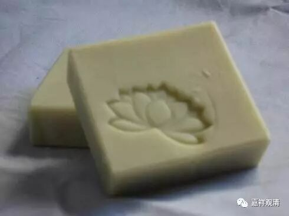
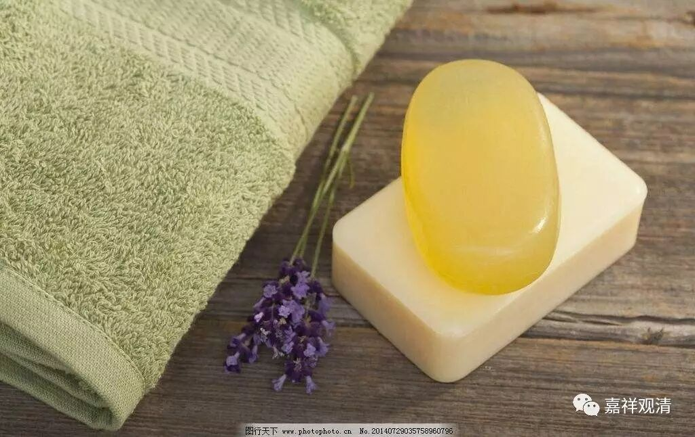

《大智度论札记》·天竺肥皂

《大智度论》卷十：

**“譬如利刀，著好饮食中，刀便生垢，饮食虽好而与刀不相宜；若以石磨之，脂灰莹治，垢除刀利。是菩萨亦如是，生杂世界中，利智难近。如人少小勤苦，多有所能，亦多有所堪……”**

这段是说，娑婆世界虽是秽土，而诸菩萨智慧通利，少有及者。比如厨房里用的刀具，用石头磨制则锋利，用“脂灰莹治”则垢除。

这里谈到的“脂灰莹治”能除垢，不经让人眼前一亮！“脂+灰”能除垢，这不就是今天的肥皂吗？最早的“肥皂”就是由动物油脂加草木灰制成。

百度一下，据说最早的“肥皂”配方在公元前三千年的两河流域（好早），用五分草木灰加一份油脂混制而成。意大利庞贝遗址发现了制作肥皂的作坊，则表明公元二世纪（为什么是公元二世纪？不是公元前？）已有生产。至十九世纪末，由于基础化学等方面的进步，肥皂转入工业化生产。1842年，肥皂由英国人带到广州（实际估计当略早）。

《大智度论》的作者龙树，出生于公元一世纪，或有说不晚于二世纪（有说长寿至六世纪，此则不在本文取信之中），译者鸠摩罗什，约公元344-413年。《大智度论》，罗什法师译于公元402-405年。从《大智度论》的这一段记载看来，印度人使用“肥皂”当不晚于公元二世纪——这或许是沿商路从两河流域传至印度。

一般说，宋代《武林旧事》中记载的皂角制“肥皂”是中国最早的此类记载了，也有说《礼记·内则篇》说:“冠带垢,和灰清漱”为中国最早有关的洗涤剂的记载——但都不是这里说的“脂+灰”，即油+碱的（脂肪酸）制法。若以此《大智度论》汉译本看来，至少“脂+灰”用来除垢的“洗涤用品”，在公元五世纪时就已经在中国文献里有记载了——这应该是中国文献里最早有关“肥皂”的出典了。当时罗什法师能这么翻译，说明他明白“脂灰除垢”是怎么回事，落笔的弟子们也一定能听明白……

