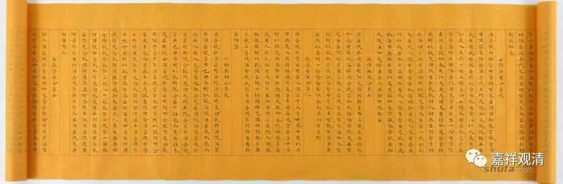

**《金刚经》 040（上）**

** **

好，我们继续《金刚经》。

《金刚经》现在已经讲到第八个问题了，我们来回顾一下前面的几个问题，看一下这八段里都在讲什么。

第一个问题是：“无相之因，云何感有相之果？”无相之因，它的果也是无相的。

第二个问题：“此法甚深，云何得有信者？”有没有相信的人呢？之前获得相当大的善根的人，还是会相信的。

“信解者难得，为什么还要说法？”这是第三个问题。这个“法无定法”的“定”，并不是确定的意思，不是说这个法是一定的，而是说佛的教法不是实有的。如来所说的教法虽然不是实有的，但是如果依它而修行的话，可以证得诸佛的阿耨多罗三藐三菩提。这段中讲：** “须菩提，一切诸佛，及诸佛阿耨多罗三藐三菩提法，皆从此经出。”**所以应该要说法。

接下来是第四个问题：“既云无取无证，为何又云‘圣贤皆证无为法’？”其实一切贤圣所证的无为法，也是并非实有。在世俗上、在名言上要承认这些贤圣是证得无为法的，但是他们所证的无为法，并不是实有的。如果是实有的话，也不会证得圣果。在这里还用了初果、二果、三果、四果来做比方。

所以接下来会有第五个问题：“二乘固尔，大乘云何？岂非‘昔在燃灯佛所，于法有所得’？”释迦菩萨过去在燃灯佛所——在燃灯佛的面前，不是得了授记吗？那不是有所得吗？总之呢，就是在不断地强调无所得、无自性以后，一般的人心里面总还是觉得背后应该有一个实有的存在，所以不断地想去找到背后的实有。好，既然你说小乘是不可得的，那么大乘呢？大乘也是这样不可得的。在这里举了一个得授记的例子，这个所谓的授记，也是** “于法实无所得”**。如果是实有所得的话，他就不可能得授记，也不可能得七地、八地的果。

既然七地是这样，那么八地以上呢？接下去第六个问题就是：“增上意乐（初地至七地）固当如此，三清净地菩萨如何？岂不见云‘菩萨当严净佛土、成熟有情、成满大愿’乎？”八地以上的三清净地菩萨，要严净佛土、成熟有情、成满大愿。我们就会认为，七地以下的菩萨固然如此，那么七地以上呢？七地以上的菩萨，他所做的事业——庄严国土、成熟有情、成满大愿这些，也不能够认为是实有的。

八、九、十三地的菩萨讲完了以后就讲佛地。第七个问题就是：“究竟佛地，获无边色身，岂非有法可得？”佛在色究竟天成佛的时候，获得圆满的色身，有人会认为，这不是有所得吗？这一段就讲：其实所谓的成佛，或者是十地菩萨成佛得报身，也不是有一个实有的佛可得。那么，要成佛的话，其中最重要的因素是什么？是智慧波罗蜜多。智慧波罗蜜多依然也是并非实有的。** “第一波罗蜜，即非第一波罗蜜，是名第一波罗蜜。”**

** **

接下来，对方觉得：“既然是无所得的，那么成佛也无所得。佛的因位上不是修忍辱吗？这个忍辱呢？”第八个问题就是：“既无所得，云何有忍辱事？”回答就是：释迦牟尼佛在三地菩萨于五百世修行忍辱等等的时候，已经证得了圣位，他所做的以忍辱为代表的布施、持戒等等，这一切也都是无所得的，也都是无自性的。如果他是有自性地去认知、去行为的话，就不是圣者了。所以说，在因地上的这些忍辱事，也没有自性。

