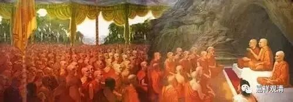
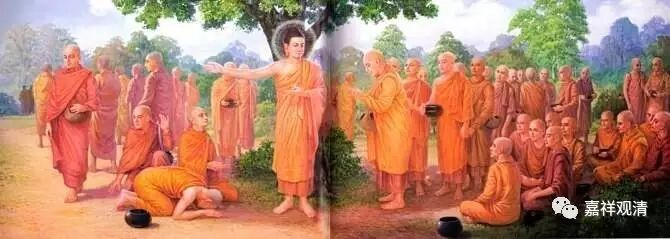

**《金刚经》 041（上）**

好，我们继续讲《金刚经》。我们这里的讲法会和其他的讲法有点不一样，主要是依据三位唯识大师——无著菩萨、世亲菩萨和弥勒菩萨的注解。

现在我们讲到了第九个问题：“言说为有为法，应不得为成就无为法之因？”言说是有为法，怎么会成为成就无为法的因呢？佛所说的教法，引发我们最终证得佛果。佛的这些谛实语——真实的、随顺解脱的话，能够令我们去随顺胜义，最终去证得胜义，所以说它能够引发胜义。

当然，这些语言的体性并不是谛实有的，虽然佛的这些教法——佛所说的这些话，我们称之为谛实语。这个谛实语，意思是“真实的话”，并不是说它是“谛实有”的，这两个意思的区别大家一定要搞清楚。“谛实有”就是指终极的存在，那是没有的。

接下来是第十个问题。这里谈到了无为法，无为法就是有为法背后的真理。假如我们简单说的话，无为法就是一切法上面的空性。就无为法而言，在圣者也是这样，在凡夫也是这样，一切法的自性的无，在这个方面是没有差异的。既然这样，为什么还会有圣者和凡夫的差异呢？这就是第十个问题：“无为法本无在凡、在圣之差异，云何见有凡夫、圣者？”

这一段也比较长，因为又有一大段的较量功德。我们先把文字过一下吧。** “须菩提，若菩萨心住于法而行布施，如人入暗，则无所见。若菩萨心不住法而行布施，如人有目，日光明照，见种种色。”**这里就分出凡圣了，我们平时可能没注意这句话。

** “须菩提，”**须菩提，我告诉你，** “若菩萨心住于法而行布施，如人入暗，则无所见。”**假如菩萨——善男子、善女人，** “心住于法，”**还是认为法是实有的而行布施——这里的布施就代表了布施、持戒、忍辱、精进、禅定、智慧等六度，那么这个人会怎么样呢？** “如人入暗，则无所见。”**他就像进入黑暗的房间一样，没有任何东西可以看得到。就像进入黑暗的房间，看不到任何东西——这个就是比喻凡夫。下面一段是比喻圣者。** “若菩萨心不住法而行布施，”**如果菩萨通达了一切法的真实或者证悟了一切法的真实，然后行布施或者六度——布施、持戒、忍辱、精进、禅定、智慧等等，这样的人，就好像什么呢？** “如人有目，日光明照，见种种色。”**他的内有目，外有** “日光明照”**。他能够** “见种种色”**，看到各种各样的青黄赤白等等。这两个是一对比喻，比喻什么呢？前者是比喻凡夫，后面是比喻圣者，这两者的差别在于见和不见空性。

这个第十个问题是什么呢？无为法本来在凡、圣当中都是这样的，那么凡和圣的差别在哪里？上面这句话就回答了凡圣的差别——凡圣之别，在于有没有证悟空性。无为法固然在凡也不减，在圣也不增，但是能不能通达、证悟空性就是凡和圣的差别。如果不能通达空性，比如这里所讲的** “心住于法”**，那么就** “如人入暗，则无所见”**——这就是凡夫。如果** “心不住法”**——能够通达一切法的体性空，或者证悟一切法的体性空，这就是** “如人有目，日光明照，见种种色”**。

