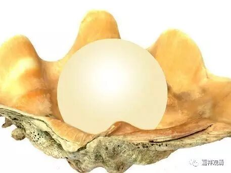

**《金刚经》041（中）**

所以，这句话就回应了大家心里面的问题。“无为法在凡不减，在圣不增，但是凡和圣的差别在哪里呢？”“凡和圣的差别在于有没有证悟无为法！”如果用比喻来说，就是你可能口袋里面有东西，但是你不知道。《法华经》里面有一个比喻，我们把它拿到这里来用一下可能也可以，虽然意思是不一样的。我先明确一下，意思是有点不一样的。这个比喻就是你口袋里面或者你的衣角里有一颗无价的明珠，但是你不知道，那你还是穷人，一旦你知道了，那你就不是穷人了。虽然这个比喻和《法华经》比喻的地方不一样，我们拿来用一下也是可以的。一切法的体性空在我们身上也是如此，问题是你不知道，你没有证得，就不能称为圣者，不能说是通达真理的，你也不能说得到空性的真理，只能在通达了以后才能算。凡和圣的差别就在于你明白还是不明白，或者用古文来说，就在于你觉与不觉，或者用修证的方法来讲，就是你证与不证。证什么呢？证得空性，证知诸法的体性空。

** “须菩提，当来之世，若有善男子、善女人，能于此经受持读诵，则为如来以佛智慧，悉知是人，悉见是人，皆得成就无量、无边功德。”**

** **

这个内容后面也会讲，我们先把文字过一下。** “须菩提，当来之世，”**须菩提，以后，** “若有善男子、善女人，”**也就是发起菩提心的人，** “能于此经受持读诵，”**能够获得这部经，然后受持、读诵、为人解说等等，** “则为如来以佛智慧，悉知是人，悉见是人，皆得成就无量无边功德。”**这句话应该是这样顺下来读的：如来以佛的智慧，** “悉知是人，悉见是人，”**知道、见到这个人是成就了无量、无边功德的。能够遇到空性的教法、般若的教法而不惊、不怖、不畏，这样的人是希有难得的，是在往昔就已经累积了无量的善根的——这里是指那种根器比较利的人，因为通达空相应的言教而不惊怖。一般的人呢，是根本连怀疑心都生不起来的那种“莫名”“其妙”处的“不惊、不怖、不畏”，现在叫“呆萌”，于空义毫无知觉，这样的我不知道算不算成就无量功德，应该不算吧。

这一段想要说什么呢？从这个往下，就是较量功德了。这段往下是想说，今天我们所讲的正闻熏习——闻持与空相应的教法，是悟入甚深的方便。这是什么意思呢？“闻持”般若就是听闻、受持般若波罗蜜，这一段里面是讲能够听闻、受持《金刚经》。意思就是，能够听闻、受持般若波罗蜜，是能够通达空性、证悟甚深的方便。

