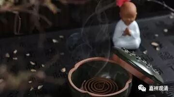

**《金刚经》041（下）**

我们前两天刚学了正闻熏习，就是正确地听闻，不断地熏习。熏，就好像在衣服下面放香，时间长了以后，衣服也会带着香的味道。我们不断不断地听闻正确的佛法，然后自己也慢慢地能够理解，慢慢地能够熏修。当然，要正闻，首先就必须是正确的，然后还要慢慢地学习、进步。

这里在说什么呢？闻持般若是悟入般若、悟入空性的方便。所以，善男子、善女人能闻（包括看）、能持（受持读诵），是将来证悟的方便。比如说，从闻、思、修的角度来说，就是从听闻空性的教法，到思维空性的教法，到修证空性的教法，所以闻思般若是证悟空性、悟入甚深的方便。

这样的人呢，佛以如来的智慧，能够知道这样的人是希有难得的。反过来说，前面和这里都在讲，这样的人能够受持、读诵，能够不惊、不怖、不畏般若波罗蜜多，是甚深难得的，那么他们又是怎么成为这样甚深难得的根器的呢？也还是由于之前的正闻熏习。“正”就是正确的正，“闻”就是听闻的闻，“熏”就是熏香的熏，“习”就是修习的习。他们也是由于之前能够听闻、披阅、受持、读诵，这样一点一点地修习，今天才会得到诸佛的观察、授记和眷爱。那么，现在我们也去正闻熏习般若的教法，至少能为将来的解脱作一个因。

今天先到这里，谢谢大家！

