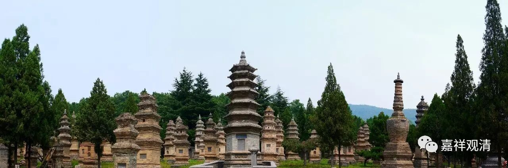

**《金刚经》042（中）**

** “须菩提，在在处处，若有此经，一切世间天、人、阿修罗，所应供养。当知此处则为是塔，皆应恭敬、作礼、围绕，以诸华香而散其处。”**有般若的地方，就是有佛的地方。塔的意思是什么呢？塔是代表了佛身的。那么，有般若的地方就代表有佛身的，也是能够令我们最终成佛的，般若是佛母嘛。《赞般若波罗蜜偈》当中就这样说：“诸佛及菩萨……般若为之母……佛为众生父，般若能生佛，是则为一切，众生之祖母。”有这个说法，很有趣啊！有一位法师就有开玩笑说：“怪不得佛在说般若的时候反复说、反复说，原来是众生之祖母，祖母一般都比较唠叨嘛！”这个当然是玩笑。

有般若的地方，就是有佛的地方。那么，塔就代表了佛身，就是有佛身体的地方。对于这个地方，** “皆应恭敬、作礼、围绕，以诸华香而散其处。”**这个地方，是六道众生都应该要供养的，天、阿修罗等等都来供养这个地方。就如同有佛的地方要供养一样，有般若经的地方也要供养。‘

** “复次，须菩提，若善男子、善女人，受持读诵此经，若为人轻贱，是人先世罪业，应堕恶道，以今世人轻贱故，先世罪业，则为消灭，当得阿耨多罗三藐三菩提。”**这个大家都听得比较多了，就是“重报轻受”。实际上大部分人在类似的问题上，就是对因果的问题上还是不了解。比如说，很多人已经学了很长时间的佛法，还来问我类似的问题。这种问题我已经被问了无数遍了，有些人有豁然开朗的感觉，有些人还是听不懂，其实我的话放在那里时间很长了。

有些人说：“师父，我开始学佛了以后，生意也不顺了，这是怎么回事？”或者说“我布施了以后，今年也不顺了，孩子又生病了，是不是供得不对了？”我回答说：“你到底信不信佛啊？！如果是苦果的话，一定有以前作恶的因；如果是善的因，一定会有乐的果。你为什么要把这两件事情掺在一起呢？前面明明是做了好事，你却把接下去发生的不好的事情，认为是它的果吗？！”

我们好像非常习惯把我前面做的事情作为后面发生的事情的因，其实这个不一定的。我发现很多人学佛已经多年，这个问题还是没有搞清楚。比如今天早上烧香，下午摔断腿了，好象今天早上烧香就是下午摔断腿的因——不可能是这样的。苦果一定是恶的因造成的，你今天的苦果肯定不会是今天早上烧香造成的，你今天早上烧香一定有其他的结果，你不要“非因计因”啊！学了很久的佛法，结果连因果的问题都没有搞清楚。

