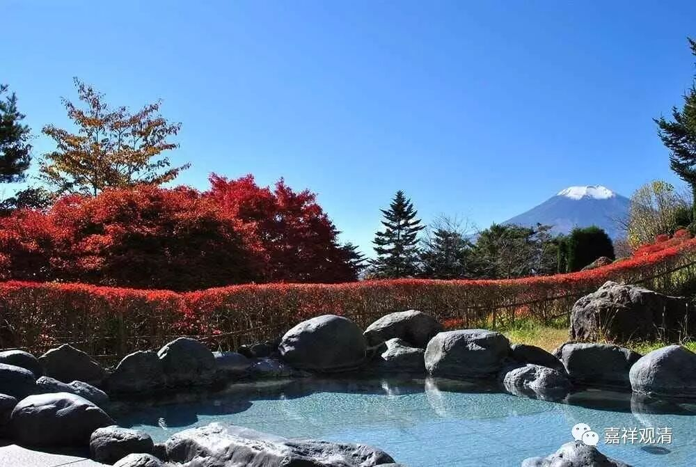

“大地法”之“恒于一切心有”

——《婆沙》“六种一切”与《瑜伽》的“四种一切”

“大地法”在梵语当中可以有多种释词，但最后都解释为“与一切心共起”“恒于一切心有”。

《阿毘昙甘露味论》卷上（尊者瞿沙造）：

“痛、想、思、更乐、忆、欲、解脱、念、定、慧是十大地法。何以故？一切心共生。”

《大毗婆沙论》卷十六：

“问：大地法是何义？

答：大者，谓心。如是十法，是心起处，大之地故；名为大地。大地即法，名大地法。

有说：心名为大。体用胜故。即大是地，故名大地。是诸心所所依处故。受等十法，于诸大地，遍可得故，名大地法。

有说：受等十法，遍诸心品，故名为大。心是彼地，故名大地。受等即是大地所有，名大地法。”

《大毗婆沙论》卷四十：

谓大地法有十种……若法，一切心中可得；名大地法。谓若染污，不染污，若有漏，无漏，若善，不善，无记，若三界系，不系，若学，无学，非学非无学，若见所断，修所断，不断，若在意地，若五识身，一切心中，皆可得故，名大地法。

《俱舍论》卷四:

“地、谓行处，若此是彼所行处，即说此为彼法地，大法地故，名为大地。此中若法，大地所有，名大地法——谓法、恒于一切心有。”

这里的“恒于一切心有”、“一切心共起”是略说，若广说，则如《婆沙》所说之“六种一切”：一切界、一切地、一切趣、一切生、一切种、一切心。

《大毗婆沙论》卷十六：

“问：何故但说十大地法为相应因，非馀法耶？

答：……

有说：若法一切界、一切地、一切趣、一切生、一切种、一切心可得者，此中说之……”

此处《大毗婆沙论》之十大地法“六种一切”说，略同于后来《瑜伽》所谓“四种一切”说——即：“一切处、一切地、一切时、一切（耶）”。

《瑜伽师地论》卷三：

“问：如是诸心所，几依一切处心生？一切地、一切时、一切耶？

答：五。谓‘作意’等，‘思’为后边……”

《瑜伽师地论·遁伦记》解释说：

“‘一切处’者，《唯识》第五解云，谓三性处。

‘一切地’者，有二义：一云‘有寻’等三地；二云九地，谓从欲界乃至非想。

‘一切时’者，心生必有。

‘一切耶’者，随其自位，起一必俱。

‘遍行’具四。”

此中，《婆沙》之“一切界、一切地、一切趣”即《瑜伽》之“一切地”，“一切种”即“一切处”之三性，“一切生”即“一切时”，“一切心”即“一切（耶）”之“起一必俱”之俱起。如下表：

《大毗婆沙论》

《瑜伽师地论》

解释

一切界

一切地

三界

一切地

九地，或谓“有寻有伺”等三地

一切趣

五趣，或六趣

一切种

一切处

三性

一切生

一切时

心生

一切心

一切耶

俱起

《婆沙》乃至《发智论》都说“受、想、思、触、作意、欲、胜解、念、定、慧”十个心所是一心相应、同时“必”俱起，《瑜伽》则谓不然，一心相应，同时“必”俱起的，只有五个遍行心所——作意、触、受、想、思。如《瑜伽师地论》卷三：

“问：如是诸心所，几依一切处心生？一切地、一切时、一切耶？

答：五。谓作意等，思为后边。

几依一切处心生，一切地，非一切时，非一切耶？

答：亦五。谓欲等，慧为后边。”

《瑜伽师地论·遁伦记》释曰：

“遍行具四，别境非后二。”

这是说，五遍行心所，遍生起于三界、九地、五趣、三性，与一切心心所俱起，若起其一，余必俱起；而别境心所，仅遍生起于三界、九地、五趣、三性，非与一切心心所俱起，若起其一，余不必俱（仅为“或俱”）。瑜伽行派之通说如是。

但，“五别境”之解释中，有一个另类——瑜伽行派的著名论师安慧，他的“别境说”有着完全不同于《瑜伽》和《俱舍》的两种说法，且两说截然相反。其一，“起一必俱”：若生起一个，余五必同时生起——此则“别境”似全同于“遍行”；其二“起必不俱”，若生起任何一个，同时必不能生起其余四个心所——此则不是《瑜伽》所说的“非一切俱”，而是“一切非俱”了。（此有别文，详见拙文《安慧论师的二种别境说》。）

