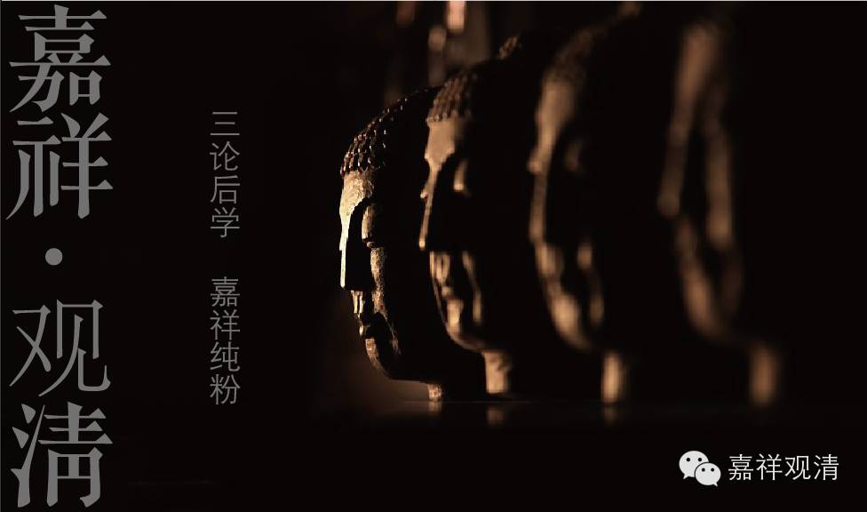

**《金刚经》044（下）**

我们把上面第十一个问题的内容再串起来讲一遍。

我们在听佛所讲的这一段经典的时候，总是会在跟着这个思路走的时候，习惯地自己认为破了一个东西以后，其他东西总还应该有。那么，所破的是什么呢？其实是我们一直没有领会。所破的是自性——不依赖他而自存的！我们总是错误地认为，是把这个“法”给破了，实际上“法”和“法的自性”不是一回事。

比如说，色、声、香、味、触、法，眼、耳、鼻、舌、身、意，乃至佛的一切种智，是有还是没有呢？这是有的！那么，它们是不是自性有呢？它们不是自性有的！也就是说，它们不是“自己成立自己”的那种存在，或者说“不依靠别的事物的存在”那种存在。

一切的诸法都是缘起有而自性空的，是依缘起而有的。这个依缘起而有，如果以中观应成派来讲呢，它是“唯依名言有”的，而同时它是“自性空”的，是胜义空的。世俗有、缘起有、名言有或者唯名言有！我们说，只要是法就是存在，那么一切法的存在是什么呢？都是世俗有，都是缘起有，都是唯名言有，简单来说，都是依赖各种条件而建立的。而空是什么呢？空，并不是说这个事物不存在，而是指它不是究竟的存在，它不是那个self-being。

好，今天我们就先讲到这儿，第十二个问题明天再讲。谢谢大家！

