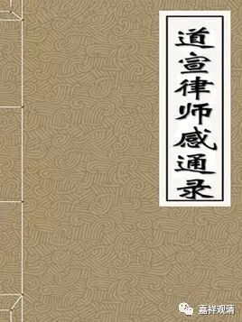

**《道宣律师感通录》，伪作！**

学佛教的人，大概总会听到一些“非常异议可怪之论”，常常一笑了之，这本无足多论。但有些相当熟捻的此类“典故”（什么韦将军啦、哪咤、戒神护戒……等等等等）居然都出自一位律学高僧之传记、著作，这就不能不让我惊诧、甚至担忧了。这就是本文要说的道宣律师和他的《感通录》。

寻《宋高僧传》之《道宣传》，系于《明律篇》下首席，而全传体裁倒更像是该系于《感应篇》下的。此传的素材就是基本来自《道宣律师感通录》。

《道宣律师感通录》一卷，又叫《律相感通传》（和“律相”基本没关系），据经录和藏经，仅见于赵城藏、丽藏、弘教藏、大正藏（以上名为《道宣律师感通录》）和续藏（名为《律相感通传》），经录中无闻。丽藏本云“书藏所无”，“惠澄上座传来寄帙”，大正藏因此收录。

《感通录》诸说，颇见怪异，兹举两则，并试论其妄。

“（问：为何有）……识来形起，如生不殊……（答：）人禀七识，识各有神。心识为主，主虽前往，而余神守护，不足怪也。”

这在《太平广记》《法苑珠林》两部外、内学的类书里也都引了，可见底本一致。这段是问“有些人死了几天又活过来了，怎么身体不坏呢？”回答说是“人有七识，每个识有个神看着，心识（赖耶？！）虽然不在了，其他神还守着呢，所以不朽坏，有啥可怪的？！”

这就更怪了！

“七识”之说，闻所未闻，道宣参加过玄奘法师的译场，对唯识相当了解，也用唯识义解戒学上的纷争，哪会写这种不通的滥东西！另外，留下不走的，怎么也谈不到“识”上去，再丢人的唯识家，都会说那叫“根”（就是这么说，也已经是错得一踏胡涂了）的！

再看一条。《感通录》：

“……问余云：师言受戒？一戒几神？余答云：见五戒中，一戒五神，未知大戒如何？答：僧之受戒，有二百五十神。若毁一重戒，唯一神去，则二百五十神恒随戒者。”

《太平广记》引作：

“如大僧受戒，戒有二百五十神，亦戒戒之中，感得二百五十，防卫比丘。若毁一重戒，但二百五十神去，余者恒随。”

《法苑珠林》作：

“如五戒中一戒五神，五戒便有二十五神。一戒破，五神去，余者仍在。如大僧受戒，戒有二百五十神，亦戒戒之中，感得二百五十，防卫比丘。若毁一重戒，但二百五十神去，余者常随。”

这是说：僧人每条戒有250个神守护，犯一戒，就吓跑250……

道宣律师怎么都是名律师，那会丢人至此！那尼众岂不每戒348神，沙弥每戒10神……而且，根本“重戒”一破，即非沙门，哪里会有什么“余者常随”的戒律？！

所以此篇定非道宣律师所作。

在道宣律师《续高僧传》卷第八《义解篇·释僧范传》有云：

“（僧范）自有英悟之量，罕能继者，而感通灵异，则事全难准云。”

明白表明了宣律师对所谓“感通”的看法。

又，赞宁《宋高僧传》卷第十四《明律篇·道宣传》在荒唐的《传》文后也加了个尾巴，小心地表示了一点看法：

系曰：律宗犯即问心，心有虚实故。如未得道，起覆想说，则宜犯重矣！若实有天龙来至我所而云，犯重招谤，还与罗汉同也。宣屡屡有天之使者，或送佛牙，或充给使，非宣自述也。如遣龙去孙先生所，岂自言邪？至於乾封之际，天神合沓，或写只洹图经付嘱仪等，且非寓言於鬼物乎？君不见《十诵律》中诸比丘尚扬言：“目连犯妄”。佛言：“目连随心想说无罪”。佛世犹尔，像季嫉贤，斯何足怪也？

说“那些事都是寓言吧，不然不就犯戒了？！道宣自己不知道么？！”可见虽然著录，却也持怀疑态度。（看来此篇伪作出世很早，民间流传很广。当然藏经中不收，应该是诸位大德抉择的结果！）

考，自《开元录》起，倒是有一部书名接近的《……感通录》

“《东夏三宝感通录》三卷（亦云《集神州三宝感通录》见《内典录》，麟德元年夏六月，於清官精舍集）”

此书，以后目录均见著录，藏经也都有收录，又作《集神州塔寺三宝感通录》，三卷或四卷。

丽藏本的《道宣律师感通录》，实际上是把一本“伪书”误以为是这本道宣律师写的《（东夏三宝）感通录》，所以也说：“麟德元年终南山释道宣撰”的。而后来的《大正藏》照搬……

唉！

我看到伪经最恨了，不惜花点时间，“考证”一翻。希望有识者，不再相信“戒神看戒体”“天人鬼不同时吃饭”“韦将军”和古怪的“七识说”……

二〇〇五年六月二十四日

