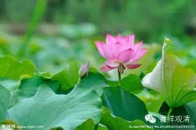

**《金刚经》 046**

好，我们继续。今天我们又加了一个麦，声音应该响一点了。这是我们的何居士操办的，他也是整理录音团队中的人，要谢谢他。

《金刚经》已经讲到第十三个问题了，上次把第十三个问题稍微讲了一下。“若云菩提之因果俱不可得，则当无有佛法？！”如果发菩提心不可得，成佛和佛果也不可得，那么因果俱不可得。由此，从发菩提心到修行到最终成佛的中间的这些佛法，是不是也没有了呢？这里就讲了：** “须菩提，如来所得阿耨多罗三藐三菩提，于是中无实无虚。”**胜义无而世俗有——我们已经讲过很多次了，或者说缘起有而自性空，或者唯名言有而自性空。

** “是故如来说一切法皆是佛法。”**很多人把这句话理解成什么“杯子啊、茶壶啊、纸啊、书啊等等都是佛法”，不是这个意思哦。这是指一切法自性空，通达一切法的自性空就是真正地通达佛法。《大品般若经》等般若经里说的“非相似波罗密多”、“真实波罗密多”就是这个意思——通达无谛实而演说无常等，是真说波罗密多；不知诸法空而说无常等，是相似波罗密多。

接下去，** “须菩提，所言一切法者，即非一切法，是故名一切法。”**法这个词呢，有很多的概念，比如说佛法僧的法，就是法宝，对吧？而这里“一切法”的“法”是指一切事物的存在。佛言：** “须菩提，所言一切法者，即非一切法，是故名一切法。”**就是说，一切的存在——一切法，都无自性。“即非”的“非”呢，是要“非”去一切法的自性的。当时“自性”这两个字不加，因为大家都知道它在讲什么，而现在我们可能要加这两个字，就是一切法的自性不可得。** “是故名一切法。”**那么，一切法是不是不存在呢？不是！我们并不是要破掉在缘起上或者在名言上成立的这一切法。

我们讲到“如幻”的时候也是一样，“一切法如幻”，并不是说讲面前的这个桌子不存在，是讲桌子的“自性”不存在。很多人把“如幻”就理解为面前的所有的一切都不存在，不是这个意思哦。“如幻”，就好比看电影，电影不是真实的，哪怕3D等等，也都不是真实的，但是3D电影这件事情，还是有的哦。只是它不是究竟的存在，不是真实的存在，是这个意思哦，所以称为“如幻”。那么这里也是一样，** “所言一切法者，即非一切法，是故名一切法。”**

** **

如果我们要谈一切法，或者谈一切的存在、一切的事物，都是非有自性，唯依名言而安立。可以讲，一切的事物，是胜义无而缘起有，或者胜义无而世俗有，或者自性无而唯名言有。用什么词就看我们需要讲得有多规范、多精确。简单来说，就是缘起有而自性空，也可以了。

