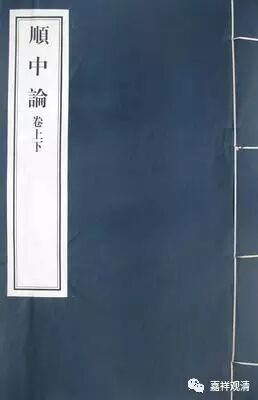

《顺中论》与因三项

《顺中论》卷上：

问曰：**朋中之法，相对朋无，复自朋成** 。如声无常，以造作故，因缘坏故，作已生故……如是等故。若法造作，皆是无常，譬如瓶等。声亦如是，作故无常。诸如是等，一切诸法，作故无常。

《顺中论》是无著论师所著，主要解释《中论》皈敬颂，今梵藏本俱无，仅存汉译本。据宇井伯寿教授发现，《顺中论》是目前佛教文献里最早里提到因三相的。《顺中论》里上卷花了不少篇幅在讨论因三项，而因三相的完整出现，就在这一段，即：“朋中之法；相对朋无；复自朋成”，对因明比较敏感的人可能一眼就会发现，这就是后来常说的“因三相”。

这里的“朋”，就是后来玄奘法师译“宗”的旧译，梵文为paksa。而paksa“宗”之译为“朋”，也是旧译时代的译例。如《根本说一切有部毘奈耶卷第二十五》：

论师即便共彼学徒更相问难，有激论处人咸杜口。城中学士悉皆受屈。

诸人白言：“大师何故辱自朋耶？”

论师报曰：“岂可于此更有他朋也？”

诸人云：“有。”

论师曰：“彼是何人？”

报曰：“是沙门释子，近日方兴……”

说南方外道论师到舍卫城和同道辩论大胜。舍卫城的婆罗门指责他“辱自朋（辱自宗）”，南方论师问：“这里还有他朋（他宗）吗”？……这里的“自朋”“他朋”，就是“自宗”“他宗”。

又，《正法念处经》卷五十四：

“剎利王复有一法是第十一，应勤修习，成就相应，现在、未来二世利益。第十一者，谓闻言语不一切信……以爱自朋如是说故……”

这里说：作为国王，不要随便相信别人说的话，因为人都执爱自己的观点拿来推荐给别人……这里的“自朋”，也就是“自宗”的意思。

可以看出，“朋”就是旧译的“宗”。

旧译的因三相，和新译对应，次序上只是第二相和第三相颠倒了一下，这是很容易发现的。其“朋中之法”，即奘译“遍是宗法性”；“相对朋无”，即奘译“异品遍无性”；“复自朋成”，即奘译“同品定有性”。我们知道，玄奘法师译因三相，是带了一点解释的，如果按照直译的话，因三相是：宗法、同品定有、异品定无。这样更可以看出《顺中论》的旧译和“因三相”是符合的。

再列个表格来对照看一下：

因三相

奘译《因明入正理论》

藏译

《顺中论》

1

遍是宗法性

宗法

朋中之法

2

同品定有性

同品定有

复自朋成

3

异品遍无性

异品定无

相对朋无

中观背景的《顺中论》最早出现了因三相，虽出自无著论师之手，但在本论里它是作为被批判的对象出现的。到了陈那论师时期，他已经被拿来改造完，作为佛教的论理学、逻辑学——因明学，出现在佛教的历史舞台上。

