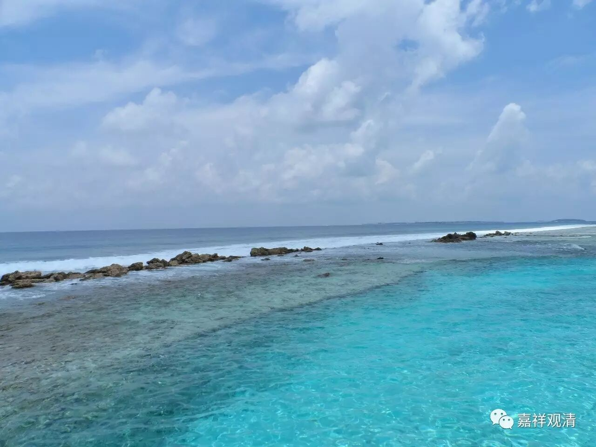

**《金刚经》046（下）**

** “须菩提，菩萨亦如是，若作是言：”**须菩提，你说的没错，菩萨也是这样。** “若作是言‘我当灭度无量众生’，则不名菩萨。何以故？须菩提，实无有法，名为菩萨。”**接下去就讲，菩萨也是这样，菩萨也非实有，菩萨也要证悟非实有。** “若作是言‘我当灭度无量众生’，则不名菩萨。”**为什么呢？如果他是有自性的认知的话，比如说这个菩萨说** “我当灭度无量众生”**，在这个时候，如果他的意思是认为有一个实有的“我”，有一个实有的“度脱”，又有一个实有的众生或者无量众生，认为这些都是实有的话，那他就是凡夫菩萨。前面讲过凡圣的差别，那他就没有证得空性，没有证得空性的话，他就不是圣者菩萨。这里的** “则不名菩萨”**是指他还不是圣者菩萨。

并不是说，凡是菩萨都必须要证空性的，不是这样的意思哦。但有些人，或者有些宗派，有这种说法，他们对菩萨的理解就是圣者以上的。汉地也有这样的情况，就把菩萨直接理解为圣者菩萨，其实今天大部分人也是这样理解的。如果这样的话，那我们受菩萨戒的时候要说“我是菩萨”这样的话，那不就变成大妄语了吗？就变成“未证言证，未得言得”啦。

所以通常来说，菩萨当中既有圣位的菩萨，又有凡夫位的菩萨。而这里** “则不名菩萨”**的“菩萨”，是指圣位的菩萨。如果他是以有自性的去认知的话，或者执着于诸法当中任何一种实有去认知的话，那么，这样的人就没有证得圣果，就不是圣位菩萨。

** “何以故？”**为什么呢？** “须菩提，实无有法，名为菩萨。”**菩萨呢，也是无有自性。可以扩展一点说，菩萨无自性，度众生无自性，众生也无自性，都是一样。那么，又和前面的一句话呼应——** “于是中无实无虚”**。就是一切法无实无虚，菩萨灭度无量众生也是无实无虚。无实就是非实有，无虚则不是说它不存在。如果是龟毛兔角的话，那就直接不存在了，也就不存在什么无实无虚的问题了。而一切法是存在，是什么呢？是无实无虚，胜义无而唯名言有，或唯世俗有。

** “是故佛说一切法无我、无人、无众生、无寿者。”**我们上次已经讲过了，** “无我、无人、无众生、无寿者”**的意思是一样的，就是无自性的意思。在《金光明经》中也是这样的排比句——无我、无人、无众生、无寿者。《金刚经》的其他版本当中这里一共有八个，是排比句。要注意，我、人、众生、寿者不是递增的关系，而是排比关系，它们的意思是一样的。** “是故佛说一切法无我、无人、无众生、无寿者。”**意思就是，一切法无我，诸法无我。我们还讲过《大乘百法明门论》，在《百法》里面也说“一切法无我”。这里也是“一切法无我”，** “一切法无我、无人、无众生、无寿者”**。无我的意思是指无自性，一切法自性空，也就是前面所讲的一切法无实无虚。

今天已经把第十三段讲完了。这第十三个问题是：“若云菩提之因果俱不可得，则当无有佛法？！”这里讲了，佛法是“无实无虚”的。** “一切法皆是佛法”**，是指“通达一切法的自性空，即是通达佛法”。那接上面的问题，有没有佛法呢？有！它是缘起有，而自性空。

我们不断地在讲“缘起有”和“自性空”，为什么呢？如果不断地重复一件事情，它会慢慢地进入我们的大脑，成为我们的知识，也许最后有一天这个知识会变成我们自己的东西。那就让它慢慢、慢慢地在我们的八识田里酝酿、变化吧！其实很多事情确实是这样的，听进去以后未见得接受，但是慢慢地时间长了以后，它在这里面就会变化，比如说酿造酱油就是这样吧。

好，先到这里，谢谢大家！

