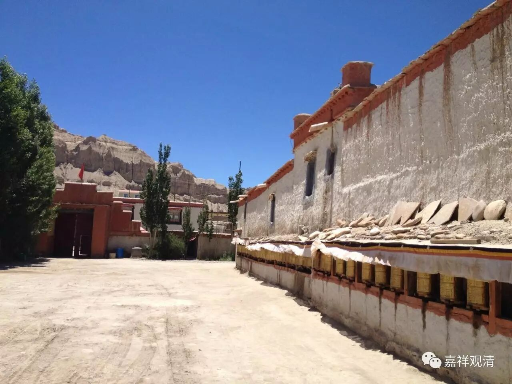
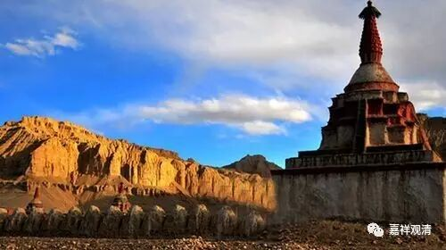

**（阿里托林寺）**

** 拉喇嘛益西沃的故事（一）**

《菩提道次第广论》提到拉喇嘛·益西沃

《菩提道次第广论》卷一：

“天尊长叔侄，如其次第起大殷勤，数数遣使洛拶嚩贾·精进狮子，及拏错戒胜，往印迎请。菩提光时，请至哦日铎，启请治理佛陀圣教。”

这段是说，阿里王益西沃（智慧光）和绛曲沃（菩提光）之时，派遣大译师（洛拶嚩）贾·精进狮子和译师戒胜去印度迎请阿底峡尊者。到菩提光时，阿底峡尊者被请至上阿里地区，弘扬佛法。（“阿里”，这里法尊法师翻译为“哦日”。“哦日铎”，即上阿里。）

我们先谈谈关于拉喇嘛益西沃的现存比较早期的史料记载。

……初，吐蕃王室自朗达玛灭佛被暗杀后，引起内乱纷纷。842年，吐蕃王室成员吉德尼玛衮由于王室内乱，逃往吐蕃西部，在冈仁波齐以西之象泉河流域，建立阿里王国，并据有拉达克。后将拉达克分封给长子贝吉衮，拉达克随之藏化。由于地域上的近便和对吐蕃兴盛时期佛教盛行的怀念，阿里王朝从邻近的佛教重镇迦湿弥罗（今克什米尔）再次引佛教入吐蕃，史称西藏佛教后弘期。其中最初引进佛教的重要政治人物，就是拉喇嘛·益西沃，上文的“天尊长”。

《广论》所说的“天尊长”，即“天喇嘛”，音译为拉喇嘛，史称拉喇嘛·益西沃。“拉喇嘛”，即天师长、天和尚、天师父的意思，是藏人对王族出家人的尊称。益西沃，汉译智慧光，益西沃是他出家之后的名字。他原名松艾，是阿里王扎西衮的次子，生于公元947年，死于公元1024年。据考证，扎西衮传王位于松艾（或云分古格地区给次子松艾，裂布让地区给长子柯热），松艾即位后，更名“赤德松祖赞”，后退位出家，建托林寺。古格的政教合一体制也开始形成。

** 托林寺**

托林寺时期，益西沃结识当时已经颇有名气的大译师仁钦桑布，鼓励并资助他再赴印度（主要在克什米尔地区）取经，并请他物色工匠来建寺院。仁钦桑布便带着十五名青年学僧去克什米尔取经，六年后回到阿里，给托林寺带回了三十二名工匠，并留寺教学两年，同时也译出了很多佛典。

这里，拉喇嘛·益西沃时期有交往的译师是仁钦桑布，也尚没有请他去邀请阿底峡尊者的相关历史记载。

此后，益西沃病重，邀请仁钦桑布见面。但在大译师未赶回之前，益西沃圆寂于托林寺。仁钦桑布赶到后，主持了超荐法会。

这是基于早期可信史料下还原的拉喇嘛略传。但，很快地，益西沃的传记出现了戏剧化的演变……

待续……

