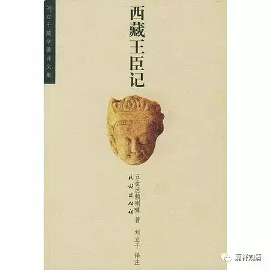

**拉喇嘛·益西沃的故事（二）**

上一篇发布后，陆续有朋友问起“原文记载”、“出典”，看起来确实很有必要贴出史料之原文以让大家放心。之前没做引用，是因为那仅是作为介绍性的结论让大家了解，而本来不是作为纯粹的考证文章。考证文章的做法，一般，呃，阅读量很惨……

好，我们先看一下《大译师仁钦桑波传》（张长虹译，《中国藏学》，2014年第一期，总第112期）：

** “……他（大译师仁钦桑波）去了托林寺……做了许多翻译……听闻天喇嘛益西沃生病了，他（大译师仁钦桑波）又急忙赶去会见，由于益西沃病情严重，他没有见上最后一面。祭仪和恶趣清净等仪轨，都是译师他本人亲自实施的。作为赏赐，大喇嘛拉德将大喇嘛菩萨的21处小地方献给他。……”**

这里引用的《大译师仁钦桑波传》，是大译师仁钦桑波的弟子吉唐巴·益西贝撰写的。这里说，仁钦桑波回阿里后，拜见了拉喇嘛·益西沃，并在益西沃所建的托林寺讲经、译经。拉喇嘛·益西沃生重病时，曾邀请外出的仁钦桑波回来见面，但等译师赶到时，益西沃已去世。于是由仁钦桑波主持了拉喇嘛·益西沃超荐法会，并因此得到大喇嘛拉德的赏赐……（传记里的“大喇嘛拉德”，是拉喇嘛·益西沃之子，绛秋沃之父。“大喇嘛菩萨”，指拉喇嘛·益西沃。）

《大译师仁钦桑波传》的作者吉唐巴·益西贝是仁钦桑波的亲传弟子，生卒年代仅略晚于拉喇嘛·益西沃而已，是至今为止据益西沃最早的相关记载，有极高的可信度。

又据《西藏王臣记》（民族出版社，2000版，刘立千译）P54记载：

** “……勒钦·衮坚瓦云：拉喇嘛耶协沃为寻金故，为伽尔劳所获。是说也，竟视拉喇嘛为凡俗乞讨之相，实属浅智之言。盖拉喇嘛系阿里之赞普王裔，多由于事件原委不加详究之过也……”**

** **

《西藏王臣记》（民族出版社，1980版，郭和卿译）P81：

** “……拉喇嘛益西维因觅金被噶罗人投入监牢，这个行为如同匹夫祈祷，是属于愚昧无知的做法，他身处堂堂的阿里之君，这是不凭借事实的失误……”**

《西藏王臣记》是第五世谁谁阿旺·罗桑嘉措所著的，他在叙述了“益西沃寻觅黄金被捕遇难事件”之后，紧接着引述了勒钦·衮坚瓦的质疑，可见他也并不相信拉喇嘛觅金被捕的传说。

待续……

