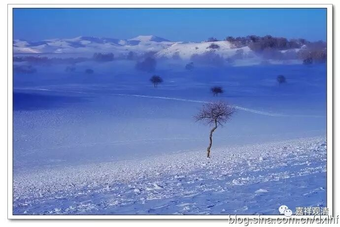

**《金刚经》047（中）**

** “须菩提，若菩萨通达无我法者，如来说名真是菩萨。”**须菩提，如果菩萨能够通达、能够证悟（通达和证悟在很多地方是同一个词）无我的话，这样的菩萨才是圣者菩萨** “真是菩萨”。**这是见真的菩萨，是圣者菩萨，是初地以上的菩萨。或者说，这样才是行真实波罗密多的菩萨。

这里就回答了前面的问题，“严净国土、利乐有情”的事业，也是自性不可得。从另外一方面来说，这一段的文字还有一个什么意思呢？如果不知空性而说所谓的“严净国土、利乐有情”，这些都是世俗边事，或者说都还在颠倒当中，不属于真实的菩萨所行的境界。如果不知空义而做这些事业，就和空不相应，和解脱不相应。当然，这些也是方便，并不是说在空以外的这些都没有意义。这些是什么呢？是福德，属于发起菩提心以后的福德资粮，而智慧资粮是必须要和空相应的。这两种资粮就像鹅王的左右翅膀，不能少一个。

下面是第十五个问题：“若无佛土、无众生，佛当不得见众生（苦）？”因为前面讲了佛土和众生，然后又把自性破完了，那么一般人的理解就是：佛土没有了，众生也没有了，如果也没有佛土也没有众生的话，佛不见众生吗？或者不见众生苦吗？这两个意思都可以——不见众生和不见众生的苦。那么，下面一段就是回答佛见不见众生苦。佛当然见众生苦！怎么见呢？以五眼见，在般若经中也处处提到这个五眼。

** “‘须菩提，于意云何，如来有肉眼不？’‘如是，世尊，如来有肉眼。’‘须菩提，于意云何，如来有天眼不？’‘如是，世尊，如来有天眼。’‘须菩提，于意云何，如来有慧眼不？’‘如是，世尊，如来有慧眼。’‘须菩提，于意云何，如来有法眼不？’‘如是，世尊，如来有法眼。’‘须菩提，于意云何，如来有佛眼不？’‘如是，世尊，如来有佛眼。’”**

** **

这就是佛的五眼。这个五眼放在这里，是想说什么呢？就是佛以他的五眼六神通——有些《般若经》是把六神通也加进来的，佛以他的一切种智，有这样的能力能够知一切众生的心，能够知一切众生的苦——这个就是五眼。我们下面一个一个来讲五眼，今天不一定能讲得完。

首先是肉眼。依照《大智度论》来讲，这个肉眼并不是我们现在所说的简单的肉眼，这个肉眼的意思是：只要没有隔阂，三千大千世界都能看得见——只要没有阻隔的，这个肉眼都能看清楚。现在的中国有点麻烦，有雾霾的话估计还是看不清楚。这个肉眼只要不隔着的，都能看得清楚。藏传对此的理解就是这都是智慧，或者说都是心，可以说都是意识的能力，这就不仅仅是眼的能力——眼在这里仅仅当作辨别或者认识。这里我们还是照《大智度论》的说法来讲，只要是不障碍的（好像这个增上缘还是跟眼根有关吧），就是中间没有东西隔着的，三千大千世界之内的色法都能看得见——这个就是肉眼。

