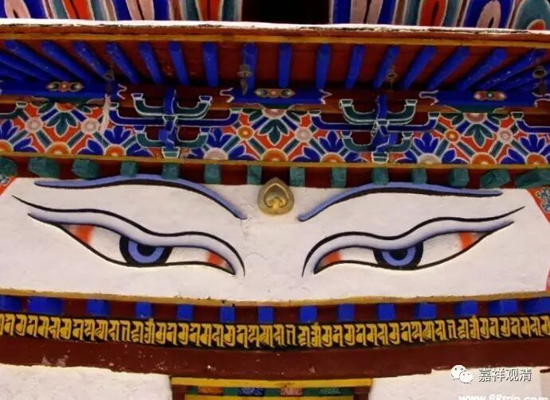

**《金刚经》047（下）**

第二个是天眼。天眼就更厉害了，哪怕有障碍的，天眼也能够看得见，或者说能观察到。用“看得见”这个词可能不是很好，也就是能观察到，这就是天眼的境界了。如果讲眼根可能还能为“肉眼”作增上缘的话，天眼则可能就是和意根有关了，和眼根关系不大了。这个是天眼。

那么，慧眼呢？** “须菩提，于意云何，如来有慧眼否？”**慧眼是指能够认知空的智慧，三乘的圣者都有慧眼，都能够证悟空性。

法眼呢，是指大乘的圣者菩萨对事物的认知，对各种解脱法的通达。

佛眼，就相当于或者说就是佛的一切智智也可以，就是佛的一切种智，或者说佛的圆满的智慧也可以。

佛具有这样的五眼六神通，有这样的能力能够观察到一切的事物。前面讲三千大千世界，还只是对部分的罗汉、菩萨等等来讲的。罗汉或者菩萨，如果证悟越高，包括获得的禅定越高，观察的边界就会越来越大。佛呢，他的观察可以说是无边的，佛的肉眼和天眼就没有三千大千世界的障碍了。

这里一共讲了五眼——肉眼、天眼、慧眼、法眼和佛眼。佛是这五个都有的；圣者菩萨有四个，除了佛眼；罗汉有慧眼，天眼和肉眼不一定有，个别的罗汉会有，但是那些没有神通的罗汉就不见得会有。天眼和肉眼都不一定要证悟的，凡夫也可以有，外道有没有就要看如何定义了，就文字上来说，外道可能也会有，也可以有吧。

这就是五眼。佛的五眼——实际上光说佛的佛眼就可以了，能够认识一切而了知一切众生的心行。

今天就到这里，谢谢大家。

