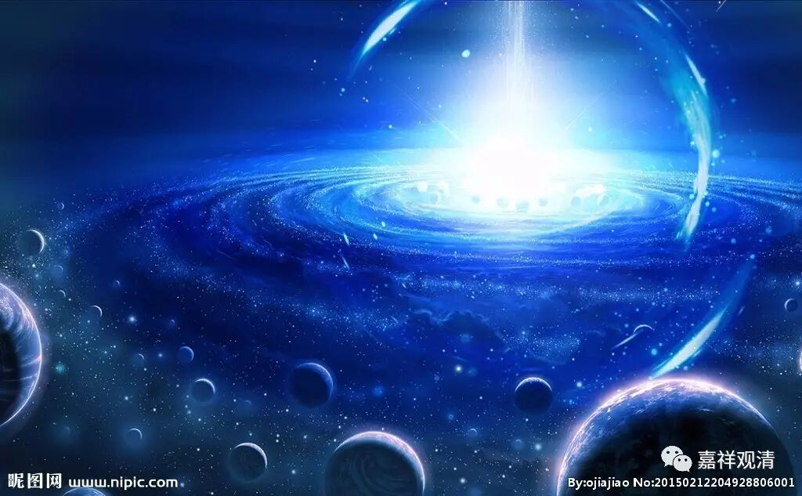

**《金刚经》048（中）**

慧眼呢，** “不见众生，尽灭一异相，舍离诸著，不受一切法。”**慧眼观察不到其他的生灭法，** “智慧自内灭，”**心观察的就是空性，** “是名慧眼，但慧眼不能度众生。”**这个是《大智度论》里面的原文啊。** “所以者何？无所分别故。”**

** **

接下来就是法眼。法眼呢，《大智度论》说：** “知一切众生各各方便门，”**知道度众生的各个方便，然后呢，** “令得道证。”**令得众生得道、得证。但是，法眼不能遍知一切众生的方便，也不能遍知一切事物。

那么佛眼呢，** “无事不知”**，垢障尽除，无不知见——这就是佛眼。

另外，** “肉眼所见不遍故”**，肉眼见色，不周遍、不全部的，有限有量。

** “天眼缘世界及众生无障无碍”**，天眼见色等法无碍，但是不见空。

** “慧眼知诸法实相”**，慧眼见空不见有。

** “法眼见是人以何方便、行何法得道。”**法眼主要是要了知这个众生需要什么相应的引导最终趋向解脱。

《大智度论》本身就是对般若经的解释，般若经当中是这样说肉眼的：** “佛告舍利弗：‘有菩萨肉眼见百由旬，有菩萨肉眼见二百由旬，有菩萨肉眼见一阎浮提，有菩萨肉眼见二天下、三天下、四天下，有菩萨肉眼见小千世界，有菩萨肉眼见中千世界，有菩萨肉眼见三千大千世界。舍利弗，是为菩萨摩诃萨肉眼净。’”**就是说肉眼能够见三千大千世界以内的、没有障碍的。肉眼是怎么见呢？上次我们说了，是不障碍见。

《大智度论》怎么讲呢？** “不以障碍故见。若无障碍，得见三千世界，如观掌无异。”**如果没有障碍，三千大千世界之内的物质都能见，就像看到手上的东西一样。这个就是“肉眼”。那么这里的肉眼呢，是不需要获得禅定的，跟天眼是不一样。

