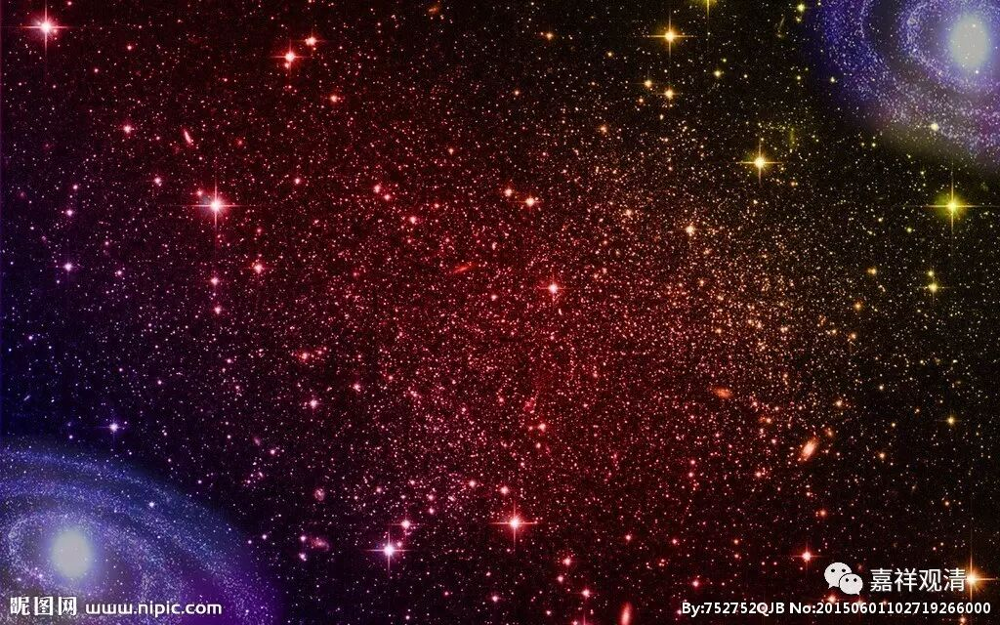

**《金刚经》048（下）**

第二个是天眼，也是般若经当中说的：** “佛告舍利弗：‘菩萨摩诃萨天眼，见一切四天王天所见，见三十三天、夜摩天、兜率陀天、化乐天、他化自在天所见，见梵天王所见，乃至阿迦尼吒天**（色究竟天）** 所见。菩萨天眼所见者，四天王天乃至阿迦尼吒天，所不知不见。”**菩萨天眼的能力呢，要超过世间的天眼，能够** “见十方如恒河沙等诸佛世界中众生死此生彼”**，连这个都能见。

藏传的说法当中，好像仅仅谈到了这一句，仅仅谈到了天眼是能见** “死此生彼”**的。在《大智度论》当中则提到了，天眼能见的东西其实很多，因为其他的天神能见到的，菩萨的天眼都能见到，而且要超过天神所见的。

那么，菩萨的天眼有两种：一种是从果报得的，果报得的天眼是和肉眼合用的；还有一种是从修禅定得的。这两种天眼都有。这里讲到的天眼通，藏传和汉传的讲法还是有点不一样啊。这里所提到的天眼呢，不是报得的，而是修得的。天眼又有两种：一种是佛眼所摄的，就是佛眼把前面的眼全部摄进去了；一种就是单独的、不为佛眼所摄的。

第三个是慧眼。** “佛告舍利弗：‘慧眼菩萨不作是念——有法，若有为、若无为，若世间、若出世间，若有漏、若无漏。是慧眼菩萨，无法不见，无法不闻，无法不知，无法不识。’”**这个所谓的“无法不见……不识”，是指对诸法的自性空的认识，能够知道诸法的虚诳，能够见诸法的自性空。这个慧眼呢，罗汉啊、辟支佛啊、圣者菩萨啊，都得这个慧眼的，但是呢，所得的慧眼也不一样。对罗汉而言，他的慧眼仅仅是指观察自性空，但如果是佛的慧眼，那就不一样了，是吧？佛的慧眼，也有见缘起的部分。所以慧眼也可以分两种：一种是佛的慧眼；一种不是佛的慧眼。

法眼的这段比较长，就不说了。主要是通过法眼能够知道众生的根器，知道他应该修什么法，相对应地给予修行的方便。比如说，知道他是随信行人，还是随法行人，知道他是从信入的，还是从慧入的等等，这个就是法眼。

那么佛眼呢，就是佛陀的两种智慧——如所有智和尽所有智，或者说佛的一切种智。这里面也包括了佛的十力、四无所畏、十八不共法等等，都叫佛眼。

好，这就是我们引申开来讲的五眼。这个五眼，在《大智度论》当中依般若经对它进行了分别的解释，因为内容很广，我就不一一讲了。五眼，就是肉眼、天眼、慧眼、法眼、佛眼。上次我们也讲了，肉眼差不多就是在无障碍的情况下，三千大千世界都能见，当然也不是说所有的肉眼都是这样，肉眼当中也有量大和量小的。天眼呢，是包括了见四生的天所能见。慧眼见空。法眼见度众生的各种方便。佛眼就是佛的一切种智。

好，五眼就先讲到这里，下次再继续，谢谢大家！

