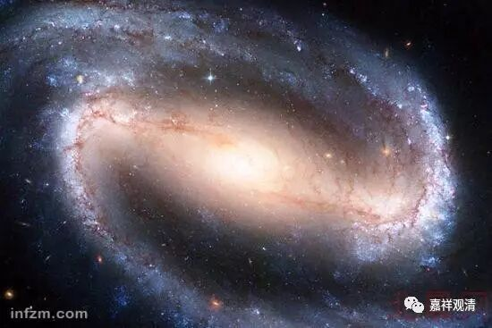

**《金刚经》049（一）**

好，我们继续《金刚经》。

到现在为止《金刚经》已经讲了一大半了，上次讲到五眼了，还多讲了一点。这里主要的意思是：一般的人还是不理解“无自性”的问题，认为发菩提心、佛果和佛法都被你讲没了（其实我们讲的是无自性），那么佛见不见众生苦呢？第十五个问题就是：“若无佛土、无众生，佛当不得见众生（苦）？”这是一个问号。

那么，佛见不见众生苦呢？如果问佛教徒，他肯定回答说“见了”。会有人说不见吗？有有有！前两天还有人告诉我一些说法，这也是中国人当中比较常见的说法：“佛看谁都是佛，众生看谁都是众生，佛看谁都是圆满的。”这个回答就有问题了……。其实佛是如实见的，你要是错了的话，佛肯定见你错的。并不是佛说看到你，你错了也变成对的——没这个事情啊！很多人都把这句话拿出来说：“哎呀！你看别人不对，那你就不对，佛看别人都是对的。”完全不是这个意思。佛是如实见的，你有烦恼而佛说你没烦恼，这不可能啊！

佛见不见众生苦呢？佛见众生苦。那么，以什么见呢？以佛的一切种智见。前面讲五眼的时候也说过了，佛以这个五眼可以见众生苦。按照藏传的说法，这五眼当中的前两个是和眼根有关，而后面三个呢，是和意识有关。

接下来一段是比喻。** “‘须菩提，于意云何，如恒河中所有沙，佛说是沙不？’‘如是，世尊，如来说是沙。’”**来，须菩提，我问你一下：恒河当中的沙，佛说是沙吗？对啊，佛说是沙。

** “须菩提，于意云何，如一恒河中所有沙，有如是沙等恒河，是诸恒河所有沙数佛世界，如是宁为多不？”**须菩提，问你一下：就像一个恒河当中的这么多的沙，又有这么多沙的恒河，那么，像这么多沙的恒河的沙这么大数字的佛的世界，** “如是宁为多不？”**多不多呢？也就是：像恒河沙那样多的恒河的沙那么多的世界——反正就是多的意思，你觉得这个多不多呢？

这个就是印度人的一种夸张，其实中国古代这种夸张也不少。多不多呢？很多，很多。（不过比起围棋的下法，好像还是少哦。）** “‘如是宁为多不？’‘甚多，世尊。’”**是的，这么多的恒河沙的世界，太多了。

** “佛告须菩提：‘尔所国土中，’”**假如说有这么多的国土，** “所有众生若干种心，”**所有众生的这些心行，** “如来悉知。”**佛都知道，都了解。** “何以故？如来说诸心皆为非心，是名为心。”**这个意思并不是说在打圆场，这里的意思就是：一切众生的心行，如来以一切智智或者五眼能够悉皆了知。大家不要以为佛在这里玄之又玄地抛出一段废话来，不是这样的，别去理会这种错误的解释。

