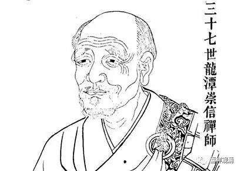

**《金刚经》049（三）**

很多人就觉得** “过去心不可得，现在心不可得，未来心不可得”**是有玄之又玄的意义，其实没有啊，没那么复杂。

我们先把那个故事讲完吧。

德山宣鉴禅师一下子没回答出来，估计是脑子转不过来了，就没吃到饭，然后上山了。这个也有好处吧？吃得少，走得多。他从北方一直走到南方，吃得少又走得多，就有个好处，他不会胖，是吧？

上山以后，他还是挺狂的。碰到了那位龙潭崇信禅师，就说：“哎呀！我来找你挑战来了。”然后走了一圈，开始说狂话了。（这个跟我确实有点像啊，也是我们的祖师嘛——我也是学了一点禅宗的皮毛嘛。）

他到了山上，碰到老和尚也不顶礼，为了表现自己的水平高。走了一圈，就说：“以前听说龙潭很有名啊！”他这里说的龙潭的意思是双关的，一方面表示这个地方，一方面表示人。我们讲宗喀巴、德山、仰山、沩山、曹山等等，都是以地名来指代人。他就说：“以前听说龙潭这个地方很有名，现在到了这里以后觉得也不过如此，** 龙也不现，潭也不见**，既没有看到龙，也没有看到什么好的水，不怎么样。”

这里的“龙也不现，潭也不见”又是双关，意思是觉得你也没多深，也没多灵。禅宗的人很喜欢玩这一套哦。

然后龙潭崇信禅师就回答说：“许汝亲见龙潭。”这里又是有多重意思的：第一呢，你已经到龙潭了，就是到了这个地方了；第二呢，你看到龙潭了，就是我；第三呢，你刚才说的“龙亦不现，潭亦不见”，这个“不现、不见”是对的——“许汝亲见龙潭！”——你的话，我接了！

这两个人的对话都是双关语，甚至是三关语。就像高手下棋一样，每一手好几个意图，还留了后招了……

德山宣鉴禅师一下子就懵了，然后就老老实实留下来好好地参禅了，以前的东西就放下了、不管了——服了。

