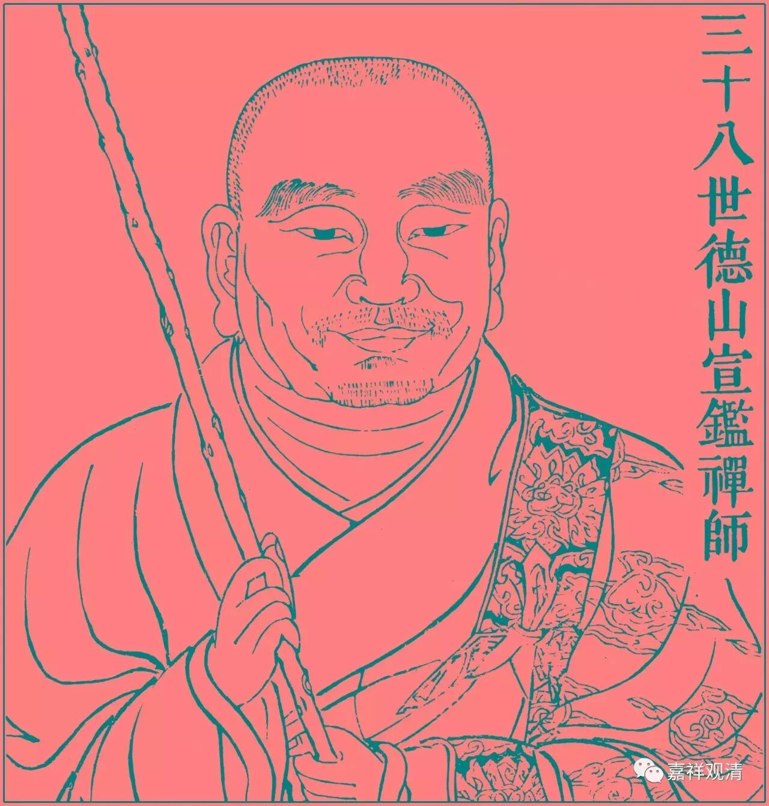

**《金刚经》049（四）**

德山宣鉴的开悟就是呆在龙潭崇信禅师那里的时候，有一次，天很晚了，龙潭崇信禅师让德山宣鉴禅师回僚房，并递给他点着的蜡烛。宣鉴禅师正要接过来，龙潭崇信禅师，呼，一口把蜡烛给吹灭了——这突然之间就开悟了……第二天跑到法堂前面，把《青龙疏抄》全给烧了。（太可惜了！）他把自己对《金刚经》的解释给烧了，说自己以前写了那么多文字，其实什么都没见到。“穷诸玄辩，若一毫置于太虚；竭世枢机，似一滴投于巨壑！”——想得再多，思辨再细，不过是一毛端之于宇宙、一滴水投于大海……

德山宣鉴禅师在禅宗里面是一位非常重要的人物，我们平时说的“棒喝”——“德山棒、临济喝”当中的“德山棒”，就是指他的“棒法”。估计他以前是不是也是练鞭杆的，或者也是练棒子的（开个玩笑）。那么这就是德山宣鉴禅师的故事。在后期，德山宣鉴禅师还有好几个故事，在他身上还有一个公案，令无数禅师跌倒呢。

《金刚经》“三心不可得”的意思大家都明白了吗？佛的殊胜智（五眼）能够通达一切众生的世俗心（三心），这个“五眼”是向佛的一切种智、一切智智。那么，** “过去心不可得，现在心不可得，未来心不可得”，**简单来讲，就是指“心无自性”，也就是前面讲的** “如来说诸心皆为非心，是名为心”**。而这个并不是如来以他的一切智智见一切众生心行的理由。这里** “何以故”**不是问理由的意思哦，只是追加说心无自性而缘起有。

这一段文字应该是很容易过的。那么多法师在那儿唠唠叨叨地解释呢，说实话他们自己也没搞懂。出现了一种说法以后，大家就跟风，都觉得这样就对了。其实这一段没那么复杂，至少不像他们所讲的那么复杂。这一段，就文字本身来说挺简单的——“佛见一切众生心”。当然也有一点早期翻译的问题。我们现在一看到** “何以故”**就觉得是为什么的意思，其实不见得，有时候就是发起个问题，就跟《金刚经》前面讲的** “须菩提，如来说第一波罗蜜，即非第一波罗蜜，是名第一波罗蜜”**是一样的，只是发起一个问题，不是说“因为这个……”。当然，你一定要牵强地说是因为这个，也不是不可以，但绝不是像一般外面所讲的那样。

好，今天《金刚经》先讲到这里，谢谢大家！

