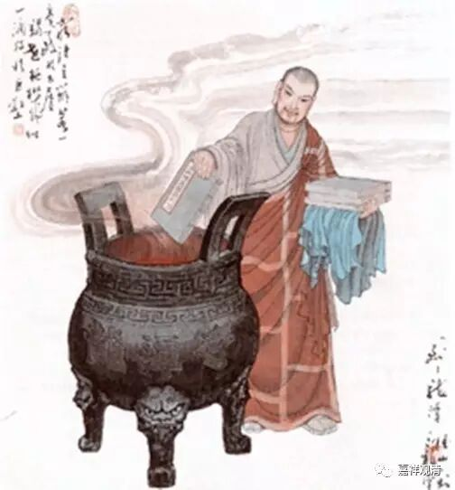

德山宣鉴禅师开悟因缘

鼎州德山宣鉴禅师，简州周氏子。廿岁出家，依年受具，精究律藏，于性相诸经贯通旨趣。常讲金刚般若，时谓之周金刚。常谓同学曰：“一毛吞海，海性无亏。纤芥投锋，锋利不动。学与无学，惟我知焉。”

后闻南方禅席颇盛，师气不平，乃曰：“出家儿千劫学佛威仪，万劫学佛细行，不得成佛。南方魔子，敢言直指人心，见性成佛。我当搂其窟穴，灭其种类，以报佛恩。”遂担《青龙疏钞》出蜀。

至澧阳，路上见一婆子卖饼，因息肩买饼点心。

婆指担曰：“这个是甚么文字？”

师曰：“《青龙疏钞》。”

婆曰：“讲何经？”

师曰：“金刚经。”

婆曰：“我有一问，你若答得，施与点心。若答不得，且别处去。《金刚经》道‘过去心不可得，现在心不可得，未来心不可得。’未审上座点那个心？”

师无语。

遂往龙潭，至法堂曰：“久向龙潭，及乎到来，潭又不见，龙又不现。”

潭引身曰：“子亲到龙潭。”

师无语，遂栖止焉。

一夕侍立次，潭曰：“更深，何不下去。”

师珍重便出。却回曰：“外面黑。”

潭点纸烛度与师。师拟接，潭复吹灭，师于此大悟。便礼拜。

潭曰：“子见个甚么？”

师曰：“从今向去，更不疑天下老和尚舌头也。”

至来日，龙潭升座谓众曰：“可中有个汉，牙如剑树，口似血盆，一棒打不回头。他时向孤峰顶上，立吾道去在。”

师将《疏钞》堆法堂前，举火炬曰：“穷诸玄辩，若一毫置于太虚。竭世枢机，似一滴投于巨壑。”遂焚之。

