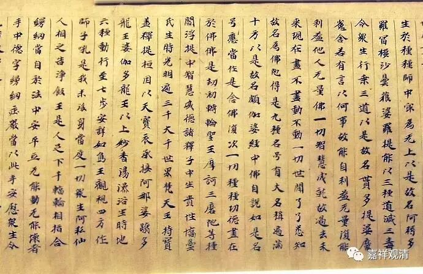

《大智度论》札记

——卷十五所引之《中论》原文

《大智度论》引《中论》原文之处甚多，之前已检出，做了两个对照表，今在第十五卷，发现有先前没有著录的四个颂子，现在做一下补充。

《大智度论》卷十五：

**如佛所言：“诸法虽空，亦不断，亦不灭；诸法因缘相续生，亦非常；诸法虽无神，亦不失罪福。”**

** **

此即《中论·观业品第十七》第二十颂：

** “虽空亦不断，虽有亦不常，**

** 业果报不失，是名佛所说。”**

** **

《大智度论》卷十五：

** “一切言语道过，心行处灭，常不生不灭，如涅槃相。何以故？若诸法相实有，不应无；若诸法先有今无，则是断灭。”**

** **

此即《中论·观法品第十八》第七颂：

** 诸法实相者，心行言语断，**

** 无生亦无灭，寂灭如涅槃。**

及《中论·观有无品第十五》第十一颂：

** 若法有定性，非无则是常，**

** 先有而今无，是则为断灭。**

（这里的“法相实有”，《中论》译为“法有定性”，和什译《金刚经》同。可知，什译之“定性”即“实有”。）

《大智度论》卷十五：

** “若无四谛，则无法宝；若无法宝，则无八贤圣道；若无法宝、僧宝，则无佛宝。”**

此即《中论·观四谛品第二十四》第三十颂：

** “无四圣谛故，亦无有法宝，**

** 无法宝僧宝，云何有佛宝。”**

**
**

《大智度论》第十五卷谈及忍波罗密多“谛察法忍”时广谈空相应的教法，所以引用的《中论》比较多。但都没翻译成颂文的形式，所以之前漏过了，现在补上。

**
**

