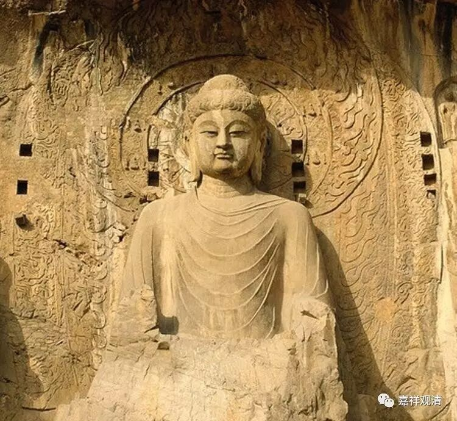

**《金刚经》050（中）**

昨天还有人提出：在世俗谛上是实有的，在胜义谛上是实无的。不是这样的！在世俗谛上和胜义谛上都是谛实无的，并不是说本来有的东西，圣者把它见没了或者破坏了。有些人认为，在世俗的层面上是实有的，然后是圣者把它见空了，好像是胜义破坏了世俗。不是啊！胜义和世俗是两面。我们讲缘起和性空也是两面，缘起是去成立性空的，性空也可以帮助成立缘起。

那么，福德的多也是依福德的自性无而建立的。有没有福德呢？有！凡夫呢，他其实就在这个无自性的当中，并不是说他不知道，他就不是无自性的了——他同样是无自性的。虽然说他没有像圣者的福德这么多，这么大，但他还是有福德的。依这些方便——除了智慧以外的布施、持戒、忍辱、精进、禅定的修行，他会有相应的功德。只是他的善行不是和空相应的，他的福德就不是初地以上的功德。这就是第十六个问题：** “依颠倒心，行诸善法，有无福德？”**其实这段的答案是：依善法行是有福德的，而这个福德呢，也还是无自性的。

下面这一段，又提出了一个新的问题：“既云佛证无为法，缘何得有色之相好？有色之相好岂非世俗相？”佛是证了无为法的，既然是证了无为法的，为什么又说佛具三十二相、八十种好呢？三十二相、八十种好这些相好是有为法——它不是世俗相吗？所以这里第十七个问题的意思就是：既然说佛证得无为法，那为什么又要用有为法的相好来表现呢？相好不是世俗相吗？不是缘起相吗？不是有为法吗？

** “‘须菩提，于意云何，佛可以具足色身见不？’‘不也，世尊，如来不应以具足色身见。何以故？如来说具足色身，即非具足色身，是名具足色身。’”**须菩提，佛是不是具有三十二相、八十种好这样圆满的色身呢？是还是不是呢？** “不也，世尊。”**不是的。须菩提跟世尊两个人一搭一档唱戏，回答都没错。但后面在另外一个版本中就有错了，这个后面再说。** “不也，世尊。”**不是这样的，世尊。** “如来不应以具足色身见。何以故？如来说具足色身，即非具足色身，是名具足色身。”**具足色身呢，也是无自性的，所以它是名言有。那么，佛是不是这三十二相、八十种好呢？佛显然不是三十二相、八十种好。我们讲过，转轮圣王也是三十二相、八十种好。那么，佛是什么呢？就终极而言，佛是无为法，对吧？我们说佛是二障断除，所有的障碍都消除了。障碍消除的那个是无为法，是佛。

** “须菩提，于意云何，如来可以具足诸相见不？”**具足色身的佛，具足三十二相、八十种好，或者说具足相好——看到这这个形象，就确定是佛吗？** “不也，世尊，如来不应以具足诸相见。何以故？如来说，诸相具足，即非具足，是名诸相具足。”“诸相具足”**就是圆满的相好。** “即非具足”**，圆满的相好有因有果，是缘起法，是自性空。** “即非具足，是名诸相具足。”**依名言而安立，或者唯依名言而安立。唯依名言而存在，唯依缘起而存在，** “是名诸相具足。”**

