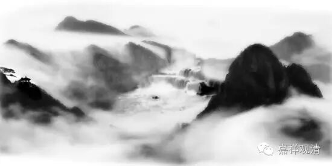

**《金刚经》 052 （上）**

** **

好，我们继续《金刚经》。

嗯，那我们也一样，以不可说之法来学不可说之《金刚经》。

下面是第十九个问题：“无所得法，将云何证？”无所得的法，怎么证呢？法，毕竟无自性，那怎么证这个无自性呢？

** “须菩提白佛言：‘世尊，佛得阿耨多罗三藐三菩提，为无所得耶？’”**须菩提就问佛：世尊，佛得阿耨多罗三藐三菩提，是无所得吗？

** “佛言：‘如是，如是。’”**是的，是的。** “须菩提，我于阿耨多罗三藐三菩提，乃至无有少法可得，是名阿耨多罗三藐三菩提。”**须菩提，我告诉你，在阿耨多罗三藐三菩提上，乃至无有少法可得，这就叫得阿耨多罗三藐三菩提。这个无所得，其实在《心经》里面也讲过了，是吧？** “是故空中无色，无受、想、行、识……”**这个空就是胜义谛。在“空中”无，就是在胜义谛上或者在胜义上无。** “空中无……”**，一直要“无”到哪里呢？一直到** “无智亦无得”**，这个** “无智”**的“智”，就是阿耨多罗三藐三菩提——无上正等正觉。** “亦无得”**，就是“佛得”的这个“得”。也可以说，佛得阿耨多罗三藐三菩提，都是** “空中无”**——胜义无的。

接下去呢，就要讲胜义无而缘起有，在胜义无的后面就要讲缘起有。** “乃至无有少法可得”**，那么，阿耨多罗三藐三菩提——无上正等正觉，到底是有还是没有呢？有啊！世俗有啊！所以，《心经》说** “三世诸佛依般若波罗蜜多故，得阿耨多罗三藐三菩提”**，是吧？胜义上，** “乃至无有少法可得，是名阿耨多罗三藐三菩提。”**世俗上呢，** “三世诸佛依般若波罗蜜多故，得阿耨多罗三藐三菩提。”**这部《金刚经》和《心经》一样，都是般若经,内容、意趣相通

那么，佛证不证无上正等正觉呢？佛证！能够证得阿耨多罗三藐三菩提。证得什么呢？证得阿耨多罗三藐三菩提也是无自性而唯名言有。假如说佛证阿耨多罗三藐三菩提的时候，** “有少法可得”**（这里的“少”念“shāo”），哪怕有一点点的东西可得，那么它就变成“胜义有”了。胜义当中观察，有没有呢？它如果是有的话，哪怕任何一点点的有——若认为是** “有少法可得”**，那就没有证得阿耨多罗三藐三菩提，或者说没有证空。没有证空的话，其他果位和相应的功德也就不谈了，是吧？

