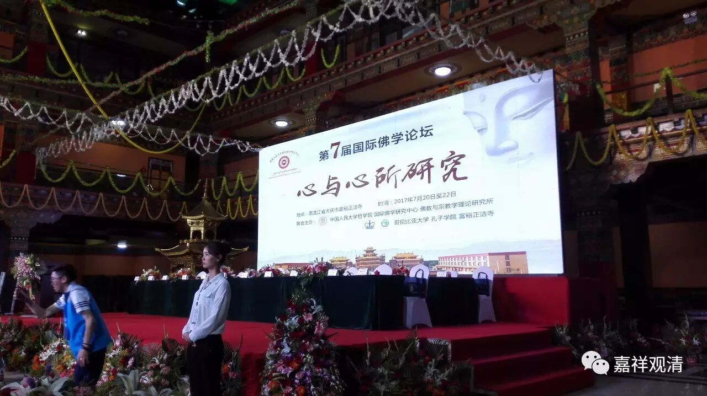

从“相应因”到“五别境”

——阿毗达磨论书中“五别境”的定型史

释观清

（莲花山白云寺住持）

【摘要】从《发智论》的十种“相应因”到世友、妙音的“十大地法”，再经《大毗婆沙论》固定和总结，“受、想、思、触、作意、欲、胜解、念、定、慧”作为“十大地法”在成熟期的有部文献中成立完成。大乘佛教兴起以后，瑜伽行派的论师不满有部“十大地法”之说，析为二分：自《抉择分》起始见“五遍行”、自《显扬圣教论》出现“五别境”，“五遍行”与“五别境”到无著而最终定型完成。

【关键词】十大地法 有部 瑜伽行派 五遍行 五别境

一、从《发智论》到《大毗婆沙论》

部派佛教的重要代表——有部，到迦旃延尼子所著之《发智论》问世以后，大致成熟而定型。在《发智论》中，“十大地法”的经典组合已经无稍增减地出现，但“十大地法”的固定称谓尚未提出。约在《发智论》之后，署名世友的《界身足论》、《品类足论》和署名尊者妙音的《阿毘昙甘露味论》等开始提出了“十大地法”，并最后被定型的《大毗婆沙论》固定和继承了下来。

《发智论》是有部成熟期的代表作，作者迦旃延尼子，约成书于公元前二世纪。《发智论》里尚未出现定型的“十大地法”，但全同的心所组合——即：受、想、思、触、作意、欲、胜解、念、定、慧，在释“六因”之“相应因”章节已全部出现。《发智论》卷一：

“云何相应因？

答：受与受相应法为相应因，受相应法与受为相应因；想、思、触、作意、欲、胜解、念、三摩地（乃至）慧与慧相应法为相应因，慧相应法与慧为相应因——是谓相应因。”

这里释“相应因”的十个心所，与后期的“十大地法”并无增减，但次序小异，“触、作意”二心所被放在“受、想、思”心所之后——这是有其原因的（“受”、“想”、“思”是与“色”、“识”并列而为“五蕴”的。此有余文另述）。

根本说一切有部发展到六足论时期，在《发智论》十个“相应因”背景下“十大地法”的名目开始出现了。这种总结，指向了有部的著名论师——尊者世友和尊者妙音。

尊者世友，据奘师所传，约为佛灭三百年北印度犍陀罗国人，说一切有部大师，主要活动时间当在《发智论》主迦旃延尼子之后，《大毗婆沙论》成立以前。有部著名的七部著作——一身六足论中，玄奘大师传为世友作品的有两部：《界身足论》和《品类足论》，但藏传和中观师传说则略有不同，见下表：

“六足论”作者之三说

玄奘

称友《俱舍释》

《大智度论》

集异门足论

舍利弗

俱希罗

诸论议师

法蕴足论

目犍连

舍利弗

诸论议师

施设足论

大迦旃延

目犍连

目犍连

识身足论

提婆设摩

提婆设摩

诸论议师

品类足论

世友

世友

世友作四品、罽宾阿罗汉作四品

界身足论

世友

富楼那

诸论议师

世友论师的作品里，最先把《发智论》里“相应因”的十种心所——“受、想、思、触、作意、欲、胜解、念、三摩地、慧”总结为“十大地法”。如《界身足论》卷上：

“三地各十种……

十大地法云何？一、受；二、想；三、思；四、触；五、作意；六、欲；七、胜解；八、念；九、三摩地；十、慧。”

《众事分阿毘昙论》（尊者世友造）卷二：

“云何十大地法？谓受、想、思、触、忆（作意）、欲、解脱（胜解）、念、定、慧。”

《阿毘达磨品类足论》（尊者世友造）卷二：

“十大地法云何？谓受、想、思、触、作意、欲、胜解、念、定、慧。”

上述论书中，一致地谈到“十大地法”，其中《众事分阿毗昙论》为早期的《品类足论》的异译本。

尊者瞿沙，此译妙音，也是有部四大论师之一，与尊者世友齐名，大约是同时代人。他的作品《阿毘昙甘露味论》，也提到了十大地法。《阿毘昙甘露味论》卷一：

“痛（受）、想、思、更乐（触）、忆（作意）、欲、解脱（胜解）、念、定、慧是十大地法。何以故。一切心共生。”

此一时期的有部阿毗达磨，皆无差别地沿用了《发智论》“受、想、思、触、作意、欲、胜解、念、定、慧”的排列次序，并开始有“十大地法”的称谓。

《大毗婆沙论》是《发智论》的“毗婆沙”（广解），是有部系统对其庞大理论之教科书式的、综述性的总结，而世友、妙音都是被称为《婆沙》“四大论师”之一，或者说为“有部的四大论师”之一的，这可以看作，尊者世友和尊者妙音系的学者在《大毗婆沙论》的完成过程中是很有发言权的，他们的学说作为重要被参考的对象，引入《婆沙》。所以，在释《发智论》“相应因”章节时，虽然没有明确点出承自尊者世友或者妙音，但可以看到，《大毗婆沙论》实际是沿用了《界身足论》、《品类足论》、《阿毘昙甘露味论》的这种“十大地法”的称谓，并做了进一步解释和发挥。《大毗婆沙论》卷十六：

“**……受与受相应法为相应因，受相应法与受为相应因。想、思、触、作意、欲、胜解、念、三摩地，慧与慧相应法为相应因，慧相应法与慧为相应因——是谓相应因** ……但说十大地法为相应因……”

这里可以看到，自《发智论》之“相应因”而《界身足论》等的“十大地法”，终于汇归《大毗婆沙论》以“十大地法”解释“相应因”轨迹。或者也可以说，《大毗婆沙论》实际点出了尊者世友、妙音在《界身足论》、《品类足论》、《阿毘昙甘露味论》里的“十大地法”来源于《发智论》的“相应因”。

二、《大毗婆沙论》两种“十大地法”次序

除了“受、想、思、触、作意、欲、胜解、念、定、慧”这一早期经典次序以外，《大毗婆沙论》中，十大地法的排列还出现了另一种次序，即“欲”心所被提前，置于“作意”之前。《大毗婆沙论》卷四十二：

“谓大地法有十种：一、受；二、想；三、思；四、触；五、欲；六、作意；七、胜解；八、念；九、三摩地；十、慧。”

“欲”心所之被提前，是因为《婆沙》发展出了一种说法，认为“受、想、思、触、欲”，此五“名实相符”；而“作意、胜解、念、定、慧”，此五心所，“体一分殊”——“念”，包含了“忘念”；“慧”，包含了“不正知”；“三摩地”，包含了“散乱”（“心乱”；一说“三摩地”不包含“心乱”，而《婆沙》“评”许前者为善）；“作意”，包含了“非理作意”；“胜解”，包括了“邪胜解”。（这里，“忘念、不正知、心乱、非理作意、邪胜解”都属于“十大烦恼地法”。）

《大毗婆沙论》卷四十二：

“此二种大地法（‘十大地法’与‘十大烦恼地法’），名虽二十，体唯十五。

谓大地法中，受、想、思、触、欲，名五，体亦五……

大烦恼地法中忘念即大地法中念；不正知即彼慧；心乱即彼三摩地；非理作意即彼作意；邪胜解即彼胜解……”

此中《婆沙》复有两种四句分别。《大毗婆沙论》卷四十二：

1、“然于此中应作四句：

有是‘大地法’非‘大烦恼地法’：谓受、想、思、触、欲；

有是‘大烦恼地法’非‘大地法’：谓不信、懈怠、放逸、掉举、无明；

有是‘大地法’亦‘大烦恼地法’：谓忘念、不正知、心乱、非理作意、邪胜解。

有非‘大地法’亦非‘大烦恼地法’：谓除前相。”

2、“诸有欲令“心乱”非“三摩地”者，彼说此二种大地法，名有二十，体有十六。所作四句，与前有异。

谓第一句（是‘大地法’非‘大烦恼地法’）有六法：即前五种（受、想、思、触、欲）及三摩地。

第二句（是‘大烦恼地法’非‘大地法’）亦有六法：谓前五（不信、懈怠、放逸、掉举、无明）及心乱。

第三句（是‘大地法’亦‘大烦恼地法’）有四法：谓前五中除心乱（即：忘念、不正知、非理作意、邪胜解）。

第四句（非‘大地法’亦非‘大烦恼地法’）如前说。”

二“大地法”体之虚实，整理见下表：

大地法体

十大地法

十大烦恼地（一说）

十大烦恼地（二说）

1

受

受

2

想

想

3

思

思

4

触

触

5

欲

欲

6

作意

作意

非理作意

非理作意

7

胜解

胜解

邪胜解

邪胜解

8

念

念

忘念

忘念

9

三摩地

三摩地

心乱（散乱）

10

慧

慧

不正知

不正知

11

不信

不信

不信

12

懈怠

懈怠

懈怠

13

放逸

放逸

放逸

14

掉举

掉举

掉举

15

无明

无明

无明

16

（心乱）

心乱（散乱）

此“十大地法”与“十大烦恼地法”之体，或谓十五，或谓十六；亦有两种四句分别。《婆沙》（卷四十二）对此评曰：“此中前说为善。”此二说之差别在于，“三摩地”包不包含“心乱”（散乱）。这个问题，直到《瑜伽师地论》时，“三摩地”和“散乱”已经明确地别立为实有，但仍在以另一种方式继续讨论着。

“三摩地”之包含“心乱”，从后期定型的阿毗达磨来看是很成问题的，但最初的阿含类典籍中仅泛指修定时座上或有得未得定之差别，此亦持之有故、言之成理，只是到了阿毗达磨成熟期，在要求所有典籍文字必须精准释名的背景下，早期粗放的文字显出跨越时代的尴尬。

《大毗婆沙论》中，“十大地法”又被析为两部分：“名实相符”的“受、想、思、触、欲”与“体一分殊”的“作意、胜解、念、定、慧”。但这还不是“五遍行”和“五别境”，只能说是有了后来发展的雏形。

三、《俱舍论》主对《婆沙》“十大地法”的总结和批判

《俱舍论》大约成书于公元四世纪，作者为著名的跨越三大教派的大论师——世亲。此论可以说是对有部庞大系统的一次基于旁观者角度的总结。《俱舍论》继承了《大毗婆沙论》的“十大地法”说而次序又异。《俱舍论》卷四：

“受想思触欲，慧念与作意，

　胜解三摩地，遍于一切心。

……如是已说十大地法。”

在《俱舍本颂》里“十大地法”，前五之次序全同于《大毗婆沙论》的“名实相应”的五个心所，后五个心所的次序则被完全打乱，这或者是因为要照顾到颂文音律的关系（？）。但“三摩地”被放到最后，似乎也可以认为，因为有部在“三摩地”上的异说，需要把它放在后面单独讨论。

《俱舍论》主对“十大地法”等心所法的安立并不随顺《婆沙》而是有自己的主张，并很明显可以看出是站在有部《婆沙》的对立面，所谓“私朋经部”；这在他的《俱舍论释》里表现了出来。《俱舍论》卷四：

“论曰：传说如是！所列十法，诸心刹那，和合遍有。

……诸心心所，异相微细；一一相续，分别尚难；况一刹那，俱时而有。有色诸药，色根所取，其味差别，尚难了知；况无色法，唯觉慧取。”

论主在这里用了“传说”一词，这便是指出——有部的这种观点他并不认同。世亲论师说：这十个心所，有部说各个心在刹那生起时便可以同时生起。但是，诸心王心所之间差别之处很小，在各相续次第中分辨都不容易，何况要在一刹那里同时生起它们还能辨别其中细微差别？正比如，从相对粗显的色法来看，我们喝一杯药尚且都分辨不清各别物质之间的微细差别，何况现在要用觉慧来分辨比物质更精微的心法呢？这是不可能做到的！

《俱舍论释》对有部“十大地法”心所同时俱起的这种观点颇不认同，而叹心所之微细难知。据玄奘师资传承，神泰说此是世亲所许，而遁麟则说此实为经部师所许。无论是经部宗所许还是世亲新说，都可以看作是俱舍论主所认可的观点，都是对有部“十大地法俱起”的批评和扬弃。

四、瑜伽行派析出“遍行”与“别境”

大乘唯识宗兴起以后，“十大地法”的说法被批评，并渐渐被改造为“五遍行”和“五别境”说。

瑜伽行派最初走上历史舞台时便已完成的《百科全书》式的作品是《瑜伽师地论》，早期又被称为《十七地论》，藏传习惯称之为《无著五地论》。关于《瑜伽师地论》的作者，汉传玄奘一系的传说，认为是大师弥勒，藏传则认为全部属于无著论师的作品。另有汉传真谛系则传说其《本地分》（《十七地论》）为弥勒大师的作品，此后《抉择分》等则皆为无著论师的作品。内学院吕澂先生亦朋此说——本文关于《瑜伽师地论》作者归属，按吕澂先生的说法展开。

在慈氏菩萨所著的《瑜伽师地论·本地分》里，“十大地法”的内容保留，但“十大地法”的称谓却突然不见了。同时《本地分》里尚未出现“五遍行”和“五别境”的说法。《瑜伽师地论·本地分》卷三：

“问：如是诸心所，几依一切处心生，一切地、一切时、一切（心生）耶？

答：五！谓‘作意’等，‘思’为后边。

（问：）几依一切处心生，一切地，非一切时，非一切（心生）耶？

答：亦五！谓欲等，慧为后边。”

这里还没有出现“遍行”和“别境”的说法。但要注意的是，这里，原先“十大地法”的次序再次被改变了，“作意”和“触”原来在“思”心所之后，现在被提前，置于“受、想、思”之前。“五遍行”和“五别境”的雏形已经开始形成。《瑜伽师地论·本地分》卷三：

“作意云何？谓心迴转。触云何？……受云何？……想云何？……思云何？……欲云何？……胜解云何？……念云何？……三摩地云何？……慧云何？……”

到了无著论师纂述的《瑜伽师地论·抉择分》，“五遍行”和“遍行”这类名词正式登场，但此时还没有出现“别境”和“五别境”，“五别境”仅作为“不遍行”中的“胜者”出现。《瑜伽师地论·抉择分》卷五十一：

“云何建立相应转相？谓阿赖耶识与五遍行心相应法恒共相应，谓作意、触、受、想、思。”

《瑜伽师地论·抉择分》卷五十五：

“问：诸识生时，与几遍行心法俱起？

答：五！一、作意；二、触；三、受；四、想；五、思。

问：复与几不遍行心法俱起？

答：不遍行法乃有多种，胜者唯五。一、欲；二、胜解；三、念；四、三摩地；五、慧。”

到了无著论师的《显扬圣教论》，“遍行”、“别境”等心所的完整称谓，都出现了。据汉地玄奘一系的传说，《显扬圣教论》是无著论师对《瑜伽师地论》的摄略和总结，一向被视作是《瑜伽师地论》的略本。当然严格看来，《显扬圣教论》和《瑜伽师地论》也不仅仅是广略本的关系。

《显扬圣教论》卷一说：

“心所有法者，谓若法从阿赖耶识种子所生，依心所起，与心俱转、相应。

彼复云何？

谓遍行有五：一、作意；二、触；三、受；四、想；五、思。

别境有五：一、欲；二、胜解；三、念；四、等持；五、慧。

善有十一：一、信；二、惭；三、愧；四、无贪；五、无瞋；六、无痴；七、精进；八、轻安；九、不放逸；十、捨；十一、不害。

烦恼有六：一、贪；二、瞋；三、慢；四、无明；五、见；六、疑。

随烦恼有二十：一、忿；二、恨；三、覆；四、恼；五、嫉；六、悭；七、诳；八、谄；九、憍；十、害；十一、无惭；十二、无愧；十三、惛沉；十四、掉举；十五、不信；十六、懈怠；十七、放逸；十八、失念；十九、心乱；二十、不正知。

不定有四：一、恶作；二、睡眠；三、寻；四、伺。”

这和后来的《百法明门论》的心所法，已经完全一致了。如果说《百法明门论》是对“《本地分》中略录名数”的话，其实还不如说是“《显扬论》中略录名数”来得更为贴切。

此后，“别境心所”的说法在瑜伽行派就变成了通行的名词，如《大乘五蕴论》（无著论师）：

“是诸心法：五是遍行，五是别境，十一是善，六是烦恼，余是随烦恼，四是不决定。”

《唯识三十颂》（世亲论师）：

“次别境谓欲、胜解、念、定、慧，所缘事不同。”

《大乘百法明门论》（世亲论师，藏地译自汉地，但作者署名为护法，不知何故。）：

“二、別境五者：一、欲；二、胜解；三、念；四、定；五、慧。”

《大乘阿毗达磨杂集论》（安慧论师）：

“……如是‘思’等五十五法，若遍行、若别境、若善、若烦恼、若随烦恼、若不定，如其次第，五、五、十一、十、二十、四……”

此后，佛法传入吐蕃，瑜伽行派“别境”的安立也影响到了西藏传说分属“经部宗”的《心明学》，如《心明建立》（扎巴协珠）中说：

“别境有五，以欲、胜解、念、三摩地、慧等五，于各别境决定，称为别境故……”

从根本说一切有部著名论师尊者世友的《界身足论》（约公元前一世纪）最初提出“十大地法”的名目开始，到大乘瑜伽行派弥勒之《瑜伽师地论》（约公元三、四世纪）拆做“遍行”和“胜不遍行”，终至无著论师（公元四世纪人）的《显扬圣教论》释“遍行”和“别境”各五，五遍行“作意、触、受、想、思”和五别境“欲、胜解、念、定、慧”终于被定型完成。

五、“大地法”之“恒于一切心有”：

——《婆沙》“六种一切”与《瑜伽》的“四种一切”

“大地法”在梵语当中可以有多种释词，但最后都解释为“与一切心共起”“恒于一切心有”。

《阿毘昙甘露味论》卷上（尊者瞿沙造）：

“痛、想、思、更乐、忆、欲、解脱、念、定、慧是十大地法。何以故？一切心共生。”

《大毗婆沙论》卷十六：

“问：大地法是何义？

答：大者，谓心。如是十法，是心起处，大之地故；名为大地。大地即法，名大地法。

有说：心名为大。体用胜故。即大是地，故名大地。是诸心所所依处故。受等十法，于诸大地，遍可得故，名大地法。

有说：受等十法，遍诸心品，故名为大。心是彼地，故名大地。受等即是大地所有，名大地法。”

《大毗婆沙论》卷四十：

谓大地法有十种……若法，一切心中可得；名大地法。谓若染污，不染污，若有漏，无漏，若善，不善，无记，若三界系，不系，若学，无学，非学非无学，若见所断，修所断，不断，若在意地，若五识身，一切心中，皆可得故，名大地法。

《俱舍论》卷四:

“地、谓行处，若此是彼所行处，即说此为彼法地，大法地故，名为大地。此中若法，大地所有，名大地法——谓法、恒于一切心有。”

这里的“恒于一切心有”、“一切心共起”是略说，若广说，则如《婆沙》所说之“六种一切”：一切界、一切地、一切趣、一切生、一切种、一切心。

《大毗婆沙论》卷十六：

“问：何故但说十大地法为相应因，非馀法耶？

答：……

有说：若法一切界、一切地、一切趣、一切生、一切种、一切心可得者，此中说之……”

此处《大毗婆沙论》之十大地法“六种一切”说，略同于后来《瑜伽》所谓“四种一切”说——即：“一切处、一切地、一切时、一切（耶）”。

《瑜伽师地论》卷三：

“问：如是诸心所，几依一切处心生？一切地、一切时、一切耶？

答：五。谓‘作意’等，‘思’为后边……”

《瑜伽师地论·遁伦记》解释说：

“‘一切处’者，《唯识》第五解云，谓三性处。

‘一切地’者，有二义：一云‘有寻’等三地；二云九地，谓从欲界乃至非想。

‘一切时’者，心生必有。

‘一切耶’者，随其自位，起一必俱。

‘遍行’具四。”

此中，《婆沙》之“一切界、一切地、一切趣”即《瑜伽》之“一切地”，“一切种”即“一切处”之三性，“一切生”即“一切时”，“一切心”即“一切（耶）”之“起一必俱”之俱起。如下表：

《大毗婆沙论》

《瑜伽师地论》

解释

一切界

一切地

三界

一切地

九地，或谓“有寻有伺”等三地

一切趣

五趣，或六趣

一切种

一切处

三性

一切生

一切时

心生

一切心

一切耶

俱起

《婆沙》乃至《发智论》都说“受、想、思、触、作意、欲、胜解、念、定、慧”十个心所是一心相应、同时“必”俱起，《瑜伽》则谓不然，一心相应，同时“必”俱起的，只有五个遍行心所——作意、触、受、想、思。如《瑜伽师地论》卷三：

“问：如是诸心所，几依一切处心生？一切地、一切时、一切耶？

答：五。谓作意等，思为后边。

几依一切处心生，一切地，非一切时，非一切耶？

答：亦五。谓欲等，慧为后边。”

《瑜伽师地论·遁伦记》释曰：

“遍行具四，别境非后二。”

这是说，五遍行心所，遍生起于三界、九地、五趣、三性，与一切心心所俱起，若起其一，余必俱起；而别境心所，仅遍生起于三界、九地、五趣、三性，非与一切心心所俱起，若起其一，余不必俱（仅为“或俱”）。瑜伽行派之通说如是。

但，“五别境”之解释中，有一个另类——瑜伽行派的著名论师安慧，他的“别境说”有着完全不同于《瑜伽》和《俱舍》的两种说法，且两说截然相反。其一，“起一必俱”：若生起一个，余五必同时生起——此则“别境”似全同于“遍行”；其二“起必不俱”，若生起任何一个，同时必不能生起其余四个心所——此则不是《瑜伽》所说的“非一切俱”，而是“一切非俱”了。（此有别文，详见拙文《安慧论师的二种别境说》。）

