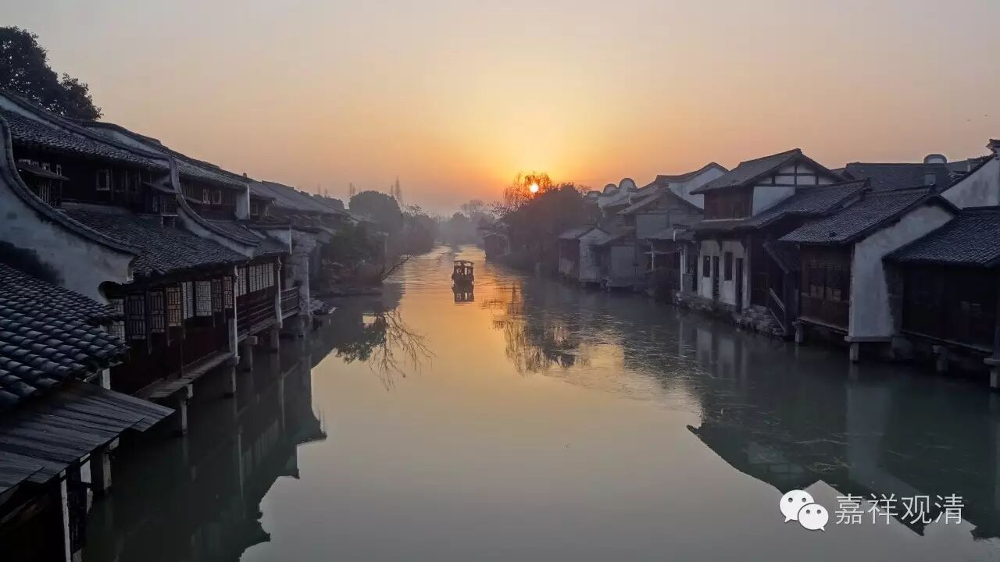

**《金刚经》052（中）**

** “复次，须菩提，”**另外，或者继续，** “须菩提，是法平等，无有高下，是名阿耨多罗三藐三菩提。”**嗯，还是再强调一遍——这句话不是指定义啊！很多人有这样的情况：平时定义不好好学，却把《金刚经》里面根本不是定义的语句当作定义来说。这个不是定义啊！

** “是法平等，无有高下，是名阿耨多罗三藐三菩提。以无我、无人、无众生、无寿者修一切善法，即得阿耨多罗三藐三菩提。”**那么，阿耨多罗三藐三菩提，** “是法平等，无有高下。”**怎么证阿耨多罗三藐三菩提呢？证得一切法的平等性。这个在《华严经》里面也有讲，有“十平等性”。主要的平等性是指什么呢？就是诸法——也就是一切的事物，都是缘起有而自性空的，在这个上面诸法** “平等，无有高下”**，明白吧？“十平等性”主要指的就是这个，就是诸法无自性。

如果你说，我们眼前的杯子啊、手机啊、电脑啊等等，那还是有差别的。世俗上的差别还是有的，不是没有的，是有的。水就是水，地就是地，风就是风，地、水、火、风，它们之间是有差别的，但这个差别背后的“自性无”是一样的。诸法** “平等，无有高下”**，是指在这个无自性的方面都是平等的。

** “以无我、无人、无众生、无寿者修一切善法，即得阿耨多罗三藐三菩提。”“以无我、无人、无众生、无寿者”**，我们讲过了，它是排比关系，不是递进关系，也就是无我或者无自性的意思。那么，无我或无自性，是和什么有关呢？是和智慧有关，或者说和空性有关。** “修一切善法”**，是和什么有关呢？是和除了智慧以外的方便有关，和布施、持戒、忍辱、精进、禅定等等这些有关。还和什么有关呢？和缘起有关。所以，就是和缘起、和方便、和世俗有关。

大乘的众生，在发起菩提心以后，所有的智慧资粮，所有的无我、无人、无众生、无寿者的智慧资粮，在将来得阿耨多罗三藐三菩提的时候就是佛的智慧身。而** “修一切善法”**所获得的福德资粮，在以后会得到什么呢？就是得佛的福德身。所以，前者得的是佛的智慧身，后者得的是佛的福德身。当然，这是我们硬要这么分开来讲的。（也不是我一个人硬要这么分开来讲，一直就是这么讲的。）

有些人说：“其他的法都不用修了，只要观空就可以了，只要在那里打坐就可以了”。也有些宗派就是这么说的：“布施啊、学习啊等等都不重要，在那里打坐修空性最重要。”但是，《金刚经》在这里非常明确地讲，要** “以无我、无人、无众生、无寿者修一切善法”**，除了智慧以外，还要做什么呢？要修一切善法方便——布施、持戒、忍辱、精进、禅定、方便、愿力等等，这些都要修啊！只有智慧的那一部分，那只是** “无我、无人、无众生、无寿者”**的那一部分，是不圆满的修习，对吧？所以有些人说“哎呀！只要修个智慧就好了，其他都不要了”，这种方式是不行的！是不可能的！错误的！

