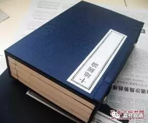

《十地经论》释“十平等法”

今第六地中，说取染净法分别慢对治，以十平等法故。

经曰：

**尔时金刚藏菩萨言：“诸佛子。若菩萨已善具足第五地道。欲入第六菩萨地。当以十平等法得入第六地。何等为十。一者。一切法无相平等故。二者。一切法无想平等故。三者。一切法无生平等故。四。一切法无成平等故。五。一切法寂静平等故。六。一切法本净平等故。七。一切法无戏论平等故。八。一切法无取舍平等故。九。一切法如幻梦影响水中月镜中像焰化平等故。十。一切法有无不二平等故。**

** 是菩萨如是观一切法相，除垢故、随顺故、无分别故，得入第六菩萨现前地，得明利顺忍，未得无生法忍。”**

**
**

论曰。

“取染净法分别慢对治”者，谓“十平等”法。是中“一切法无相”乃至“一切有无不二平等”者，是十二入一切法，自性无相平等故。

复次，相分别对治有九种：

一、十二入自相想，如经“一切法无想平等故”；

二、念展转行相，如经“一切法无生平等故”；

三、生展转行相，如经“一切法无成平等故”；

四、染相，如经“一切法寂静平等故”；

五、净相，如经“一切法本净平等故”；

六、分别相，如经“一切法无戏论平等故”；

七、出没相，如经“一切法无取舍平等故”；

八、我非有相，如经“一切法如幻、梦、影、响、水中月、镜中像、焰、化平等故”；

九、成坏相，如经“一切法有无不二平等故”。

“除垢”者，远离障垢故；

“随顺”者，随顺平等真如法故，

“无分别”者，不生分别相故，

“明利”者，微细慢对治故——前二地中，麁中慢对治故，得软中；

“忍顺”者，随顺无生法忍故；

“未得无生法忍”者，此忍，顺无生法忍，非即无生忍故。

是名“取染净法分别慢对治”。

清案：初是总相，余九是别相。

