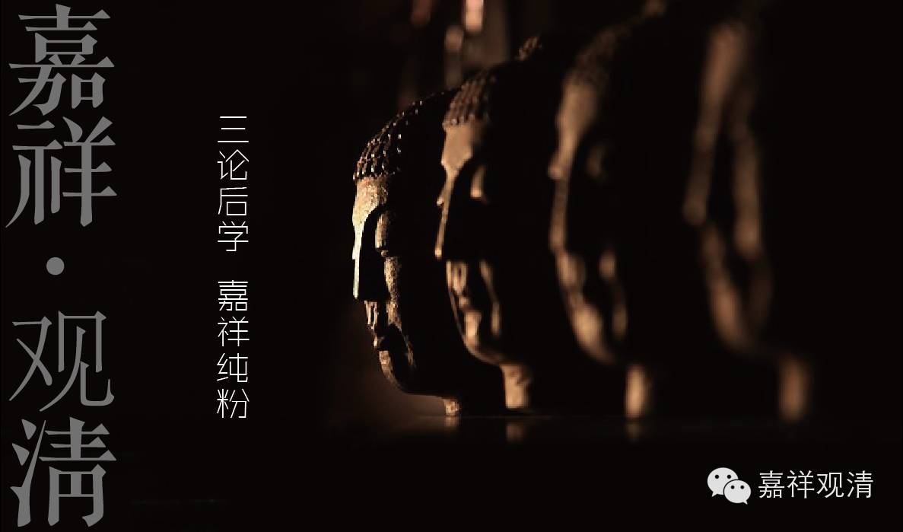
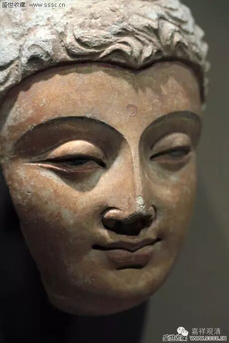

**《金刚经》 053**

好，我们继续《金刚经》。

前面已经讲完第二十个问题了。“文字非即是法，闻思当无利益？”文字不就是佛法的内容，只是佛法的内容由文字所携带而已，或者说由声音所携带而已。既然文字不就是法，那么闻思有没有利益呢？回答是：闻思也是有利益的，闻思与空相应的教法的功德要比单单地布施、持戒等等的功德更加超胜，因为这是随顺解脱的、随顺涅槃的，是趋向涅槃、趋向胜义的。

下面就是第二十一个问题：“若云‘是法平等，无有高下’，则佛不能度众生？”前面已经讲过** “是法平等，无有高下”**，而下面的听众还是没听懂。既然说** “是法平等，无有高下”**，那么佛就不能度众生了，因为佛和众生平等，无有高下嘛。我们说佛是证得阿耨多罗三藐三菩提，那我们呢？还是凡夫。这个好像是有上有下哦。而现在《金刚经》里面讲** “是法平等，无有高下”**，那么，就有人要问：“如果这样的话，那佛就不能度众生了喽？佛和众生已经平等了嘛！”

我们在前面已经讲过** “是法平等，无有高下”**，还记得我们讲的是什么吗？** “是法平等，无有高下”**，是指所有的法，在它的自性空上是平等的。这个平等，在《华严经》里面也谈到过了，好像是说第六地的时候所讲到的十平等性，十平等性的核心就是诸法在无自性上平等。杯子也是自性空，念珠也是自性空，电脑也是自性空，手机也是自性空，桌子……等等都是自性空，在这个上面都是平等的。如果你找桌子的自性，那不存在，证得桌子的自性空，和找窗子的自性不存在，证得窗子的自性空，这都一样，都可以证果。

** “是法平等，无有高下”**，一切法在自性空上、胜义上是平等的，并不是说佛和众生就是完全平等、全同。如果是完全平等的话，那姚明估计有四五百斤、将近二米三，我跟他咋都不平等啊？姚明和那个写书的郭敬明，差得也太远了吧！这个明明是有高下嘛，一个高一个下，差得好远。不是很恰当地比喻一下：他们俩在人、男人、中国人这些方面都是平等的，是一样的，但是在身高上还是有差别的。那么，佛和众生，在胜义无或者是自性无的上面，是** “无有高下”**的。但是在缘起有上呢？佛和你的差别很大嘞！你身上那么多烦恼，他一个都没有；他身上那么多功德，你也基本上没有。这个差别就很大。

