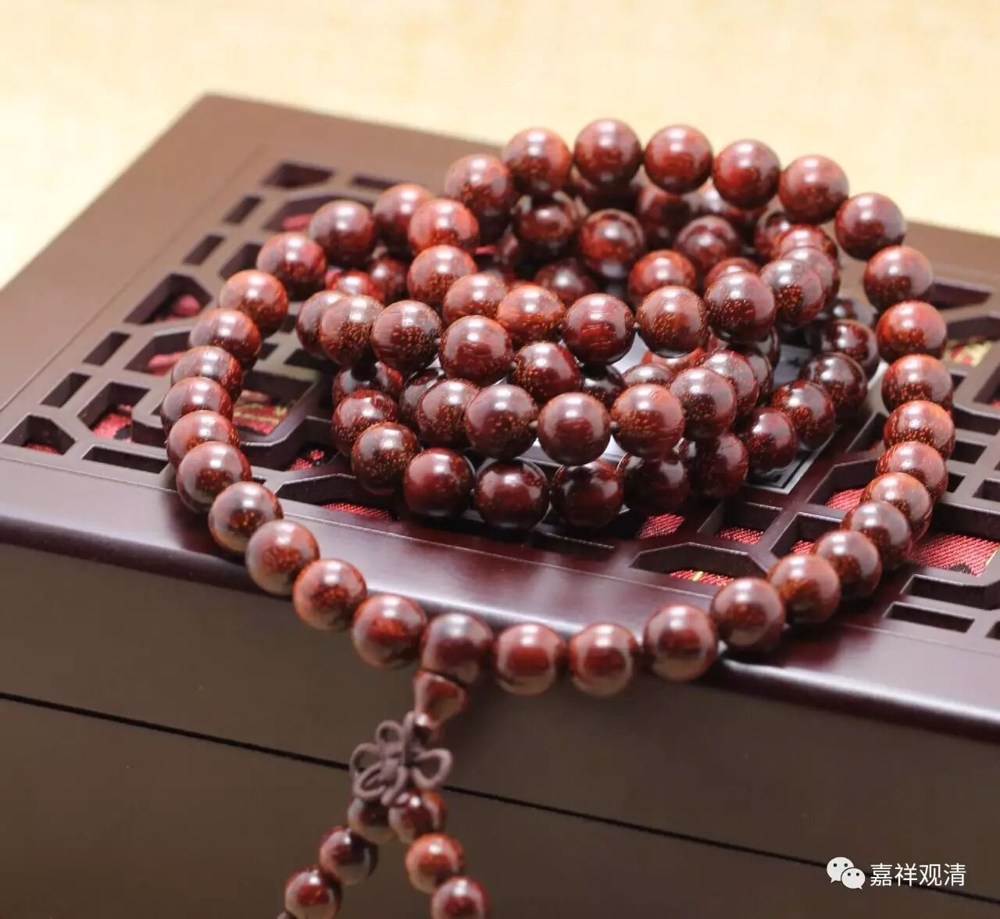

**《金刚经》053（三）**

** “须菩提，如来说有我者，”**如来在各部经典当中提到了有我，** “则非有我，”**这个实有的我是没有的，** “而凡夫之人以为有我。”**凡夫认为有实有的我，有自性的我。他们认为如来所讲的我，就是从过去到现在然后到未来的这一个，是实有的。很多人讲这是灵魂，或者有些人再换一个词，“灵魂不能用，就叫神识”。你换一个词有什么用啊？你就认为这个东西从一个壳子跳到另外一个壳子里面，这种我，佛教从来都不承认的哦。你们如果学的是民间宗教，那就另外再说。如果你们真的想学佛的话，是没有这种“我”的哦。

佛教首先讲的是无我，什么是无我呢？“我”是唯依名言安立的，是在五蕴——色受想行识上，或者在心法和色法上而安立的这个“我”，就像我们一直所讲的瓶、衣、帐、军、林、鬘、树……

瓶子，有瓶口、瓶底、瓶盖等等，才有了这样一个瓶。有了这些部分以后，才会有瓶，那么离开这些部分呢，也就没有一个瓶了。

衣服也是一样的，有袖子呀、领子呀、衣襟呀等等，然后有了衣，或者说是由这些线才有了衣。而衣呢，离开这些线，就没有衣了。

林，树林也是一样，找不到一个实体的林，林是依于那些树而有的。

帐是什么？忘了。军帐？军帐也可以。比如说，帐篷也是一样的，有横梁，有竖过来的柱子，有绳子，再有这个布，要下雨的话，外面还再披一个雨布，这样才会有帐篷的。离开这些东西，也不能成一个帐篷，是吧？

军，是军队，离开一个一个的军人，也就没有军队。那个军队过来的时候，看起来好像有一个军队，心里一下子就感觉好像有一个实有的军队过来了，但离开了一个个的人，哪有一个军队？

鬘（màn），或者是鬘mān，也有人念mán。这个鬘，上面是繁体的发的上半部分，下面是一个曼。我以前查字典是念mān，现在有人说是念mán，有点搞不清楚了。鬘，就是什么呢？比如说珠鬘（我们还是念màn比较轻松一点吧），就是念珠，或者你的项链也可以是珠鬘，那么，离开了一个个的珠子和绳子，或者讲究一点的，还有佛头、配珠等等，离开了这些东西也就没有一个珠鬘。但是，我们的感觉好像是：“哎！你把那个念珠给我拿过来。”一下子就感觉好像有一个实有的念珠一样，好像有一个实有的念珠一样，好像这个实有的念珠和那串东西是不可分的。

树，也是一样哦，树枝、树叶、树根、树干等等，然后才有了这个树，是吧？

瓶、衣、帐、军、林、鬘、树，这些可以说都是依他的支分而有。你感觉起来好像是有一支军队过来，吓都吓死了，但你仔细去找的话，发觉它仅仅是名言安立的，不是独立存在的。

名言安立这个东西真的太厉害了！广告就是在给你名言安立，或者说行业标准，就是名言安立。大家想赚钱的话，就要想办法去制订一个行业标准。如果某一个行业的标准是由你来制订的，而你还在那个行业里的话，那你就赚了。为什么呢？因为你创造了一套名言系统——这种叫A货，那种叫B货，那种叫C货，然后A货应该值钱到什么程度。假如市场上都接纳了这种说法，那你肯定在之前先囤了一批货嘛，对吧？之后你就赚钱了。

