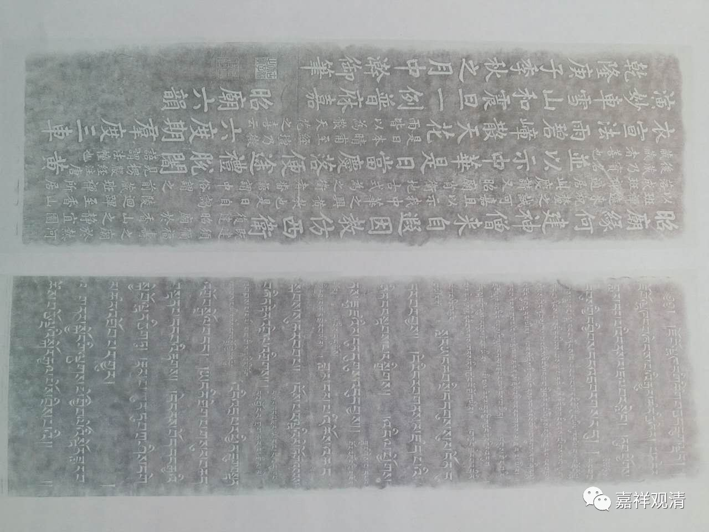
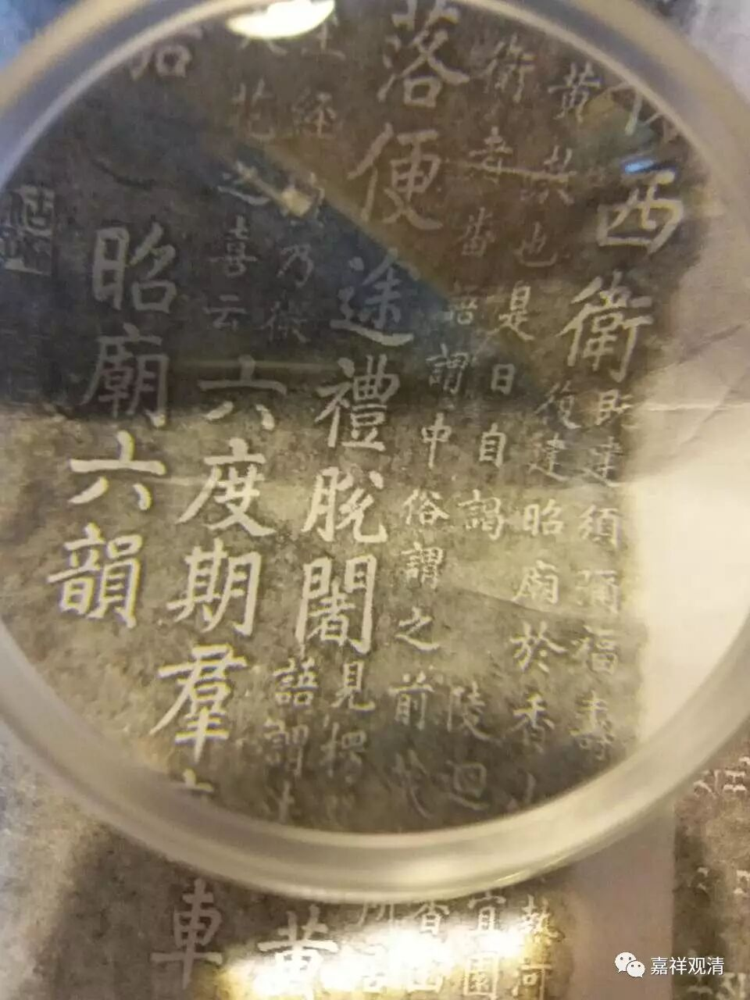

“昭庙六韵”略读

有法师贴出“昭庙六韵”的拓本，诸法师略作断句释读。“优波罗”法师略作解释。

又，此昭庙，在北京香山，乾隆有碑文，名“昭庙六韵”，乃为六世班禅进京而作。

昭庙六韵

昭庙缘何建，神僧来自遐，

因教仿西卫，并以示中华。

既建须弥福寿之庙于热河，复建昭庙于香山静宜园，以班禅远来，祝厘之诚可嘉，且以示我中华之兴黄教也。是日自谒陵回跸，至香山落成，班禅适居此庆赞。又，昭庙，肖卫地古式为之。卫者，番语谓中，俗谓之前藏。班禅所居后藏乃实名藏。藏者，善也。

是日当庆落，便途礼脱闍，

见《楞严经注》。唐语谓法幢也。

黄衣宣法雨，碧嶂散天花。

是日本晴，甫至经坛，乃微雨，皆以为散天花之喜云。

六度期群度，三车演妙车，

雪山和震旦，一例普庥嘉。

昭庙六韵  乾隆庚子季秋之月中澣御笔

 （印）古稀天子之宝

注：

班禅：此为六世班禅·罗桑华丹益希（1738—1780）。

祝釐（厘）：祈福。

脱闍：法幢。

庥：xiū，遮盖、庇护。

中澣（浣）：中旬。

“卫者，番语谓中，俗谓之前藏。班禅所居后藏乃实名藏。”——汉人当时把目前西藏自治区的地域，先自己混淆一锅煮成“藏”，然後俗称前藏、後藏。藏语中，“dbus”就是拉萨为中心的地区，曰“中土”，因释迦佛等身像、诸大寺院、僧伽常住，乃如印度摩羯陀。乾隆的西藏史地知识，不能引为正义。

“gTzang”是现今日喀则为中心地区，“gTzang”，与古汉语“净”、“江”同源（古藏汉语同源理论）。藏区南部多江河，“gTzang”多指江河，比如“雅鲁藏布江”，“藏布”即“江”，“雅鲁”即江名。

“藏者，善也”。——这纯粹是弘历自己联想过度的翻译理解。他涉及藏语、佛教的有些翻译、解释，很多联想过度或者纯粹讹谬的东西。比如《喇嘛说》里面也是。引用、解释时要慎察，不要以讹转讹。

