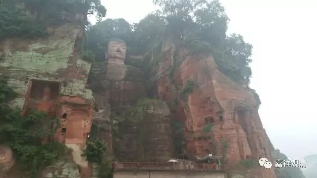

**《金刚经》 054（上）**

好，继续《金刚经》。

我们已经讲了一大半了，“若云‘是法平等，无有高下’，则佛不能度众生？”第二十一个问题也已经讲过了。结合之前所说的，诸法在“自性空”上无有差别，但其缘生则各不同，乃至凡圣亦然——虽然都无有实体，但圣者触证，佛则圆证，而凡夫不证。佛以其圆满的智慧观见众生一切心行，故广演方便法，欲令众生脱离苦海，证悟究竟涅槃……

下面是第二十二个问题。在《金刚经》的不同版本中，中观派和唯识派的传本并不一样。在鸠摩罗什法师的版本当中，须菩提的回答是错误的，但在玄奘法师和义净法师的版本当中，须菩提的回答是正确的，所以下面这段的文字上稍微有点不同。

我们来看第二十二个问题：“佛（法）身可否以色身比知？”佛身——实际上这里真正讲的是佛的法身，我们还是泛泛地讲佛身。佛身能不能观知？能不能观见？这里的问题就是：简单来说，佛身能不能以色身来比方？身，就是佛的三十二相、八十种好。可以不可以呢？大家听到现在基本上应该知道答案了，但是（罗什版的《金刚经》里）须菩提却被忽悠进去了——这个也挺奇怪的。

好，我们来看。** “须菩提，于意云何，可以三十二相观如来不？”**这问题其实前面已经说过了，可以三十二相见如来不？不过“见”和“观”可以不一样哦。如果真的是从见和观的角度来说，我们的观察可能就要另外考虑了……这个问题后面再讲，我们先把文字过一遍。** “须菩提，于意云何，可以三十二相观如来不？”**须菩提，我来问你，能不能以三十二相观如来呢？

** “须菩提言：‘如是如是，以三十二相观如来。’”**可以，可以，以三十二相观如来，以三十二相、八十种好这种佛的色身形象来观如来。

** “佛言：‘须菩提，若以三十二相观如来者，转轮圣王，则是如来。’”**须菩提，如果你以三十二相来观如来的话，那我问你，转轮圣王不也是三十二相吗？那转轮圣王是如来喽？那你所观的，到底是转轮圣王还是如来呢？但显然，转轮圣王不是如来。

这里我先把答案已经说出来了，或者说是把后面想说的话拿到前面来说了。

