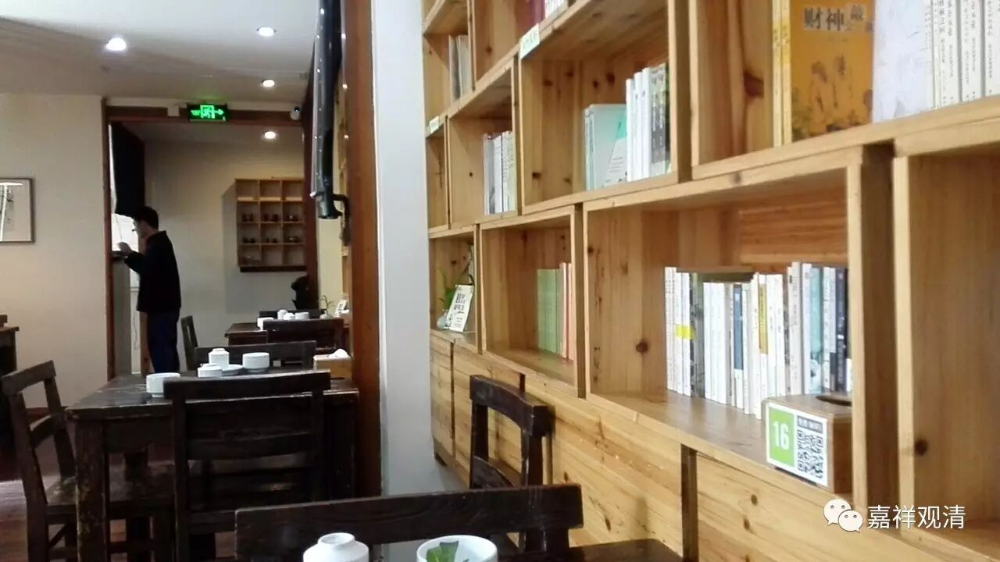
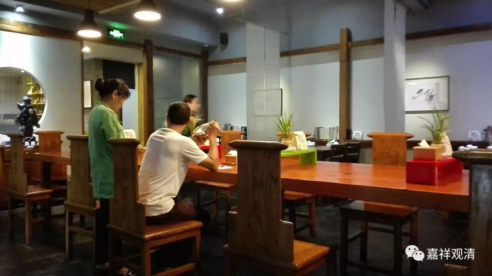
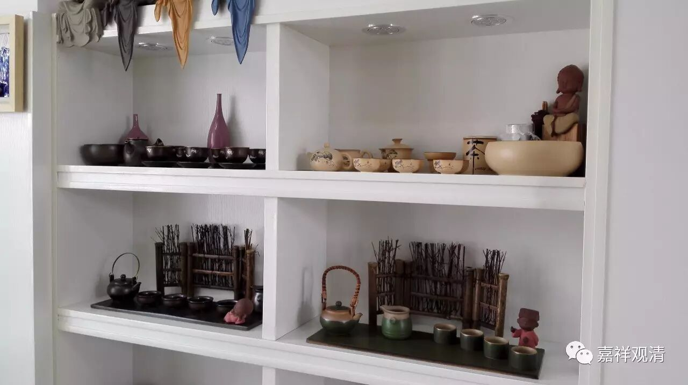
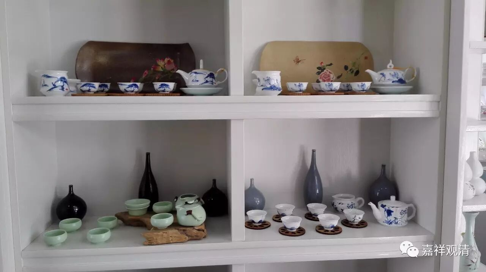
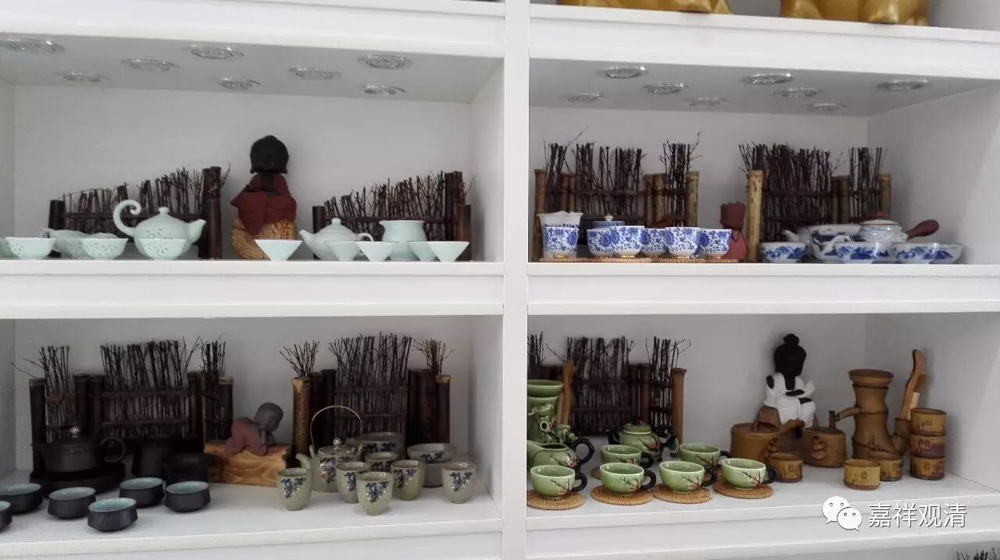
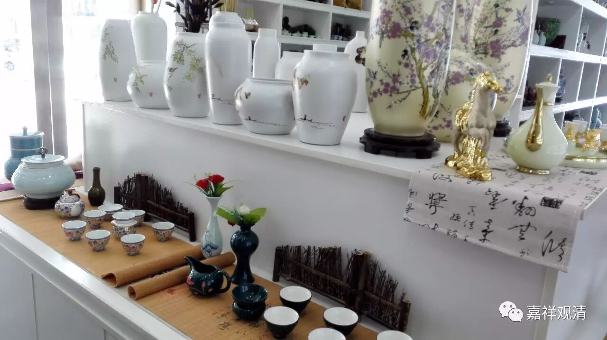
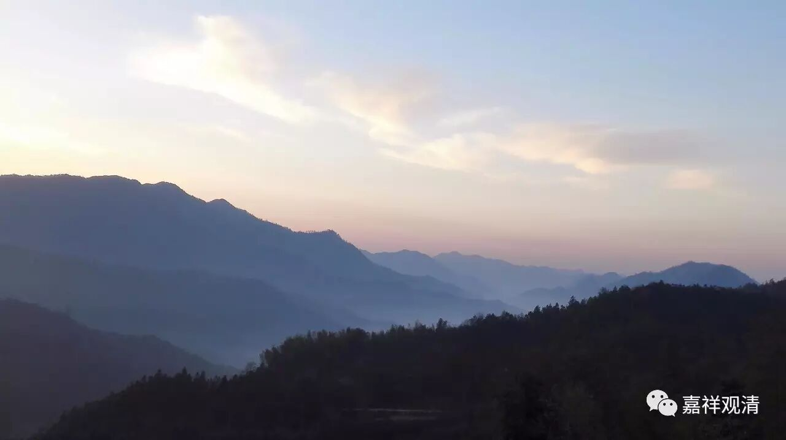
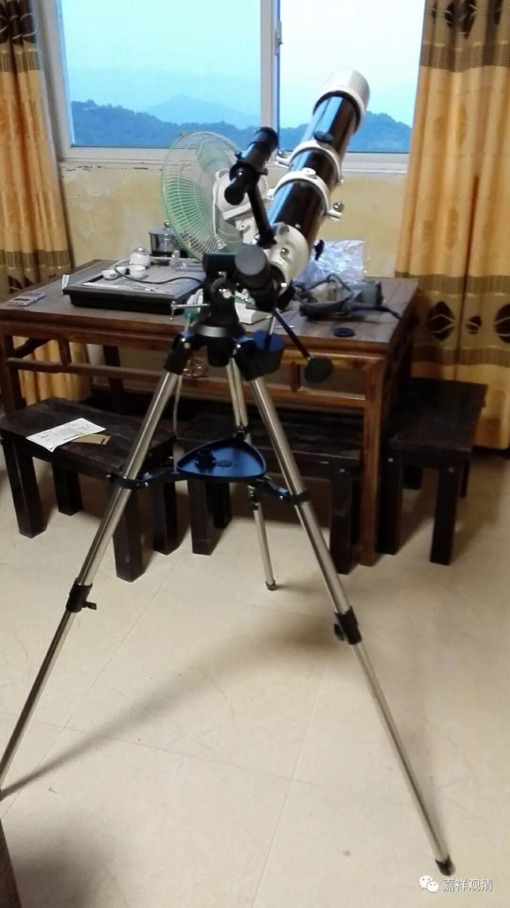

**
**

** 回庙啦**

或许因为天热的原因，昨天的航班被取消了，改到今天。于是昨天就有空请宝大德在吉祥草“应供”了——这也算是航空公司给的福报吧。宝大德的照片忘了给拍了，这是“吉祥草”素食馆。

结账时试用微信付款，果然可以——祖国果然引领世界新潮流！据说老外对中国这么接地气的创新很惊诧，我们是日用而不知了……

飞机照例晚点，好在有人接，算不得辛苦。

好久没逛景德镇陶瓷城，于是去黄居士店走走。她的店新装修了，添了不少新款。

同时取些东西：一套《大正藏》和两个“游泳池”。小车居然塞得下，这其实是我没想到的。

驱车回寺院，觉得车子很沉重，以为是大藏经的缘故，扭头一瞥……司机老桂眼皮正在打架了！忙让他停车休息！后来一路开玩笑，他也提起了精神。好险——其实本来我想在车上睡一会儿的……

弟弟和老妈一早开车上路，比我们先到寺院了。他带来了天文望远镜，自己照着说明书摸索着装了起来——看起来模样是有了。俩游泳池准备明天装。

装修还在进行，过两天上照——临近结束，有点不上照。

