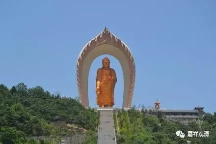

**《金刚经》054（中）**

前面讲的是“见”，以中观的版本来谈的话，这是“观”。比如说，我们观一个佛相的时候，是不是以三十二相来观呢？大部分人都是这样认为的——眼睛绀青色、耳朵大大的，脸、嘴、鼻子……各有样貌。那佛在《金刚经》这里就说了，如果你观出三十二相、八十种好，那转轮圣王不也是三十二相、八十种好吗？那你观的、观想的是如来呢，还是转轮圣王呢？

我们再举个其他的例子，比如印度、中国等各国的各个时代的佛像，都一样吗？哪个才是真正的佛相呢？以前《西游记》里面观音菩萨的扮演者左大玢，就被大家公认为是观音菩萨“应该的”样子。有一次她去普陀山朝拜，从普陀山的大殿里出来的时候，正被一位居士看到了，那居士赶紧就跪下来磕头，以为是“观音菩萨显灵”被她见到了。形象就是佛菩萨吗？

** “可以三十二相观如来不？”**我们现在基本上就是这样的哦，以三十二相这个样子来观想——这就是佛，观想成功或者没成功……可能我们连这个还做不到呢。如果观想出来有一个画像的样子，就觉得自己观出了佛相，还觉得挺美好的。那问一下：色身是如来嘛？或者我们观出的这个相就是如来吗？佛的五蕴当中，哪个重要呢？色蕴吗？佛就是物质、形色吗？……当然了，佛的五蕴也不能谈哪个重要。那么智慧呢？

我弟弟就有这样一件事情。我那个时候还没出家，他在家里过来对我说：“啊呀！我看见佛了。”我当时也没当回事儿。过了几分钟，他又回来说了：“啊呀！刚才看错了。”我就问怎么回事，原来因为当时是晚上，家里的佛像映在玻璃上，我弟弟正看窗外，在窗子上看到尊佛像，就误以为看到的是窗外的佛的形像，把他激动的呀……。实际上，就是晚上家里的灯光比较亮，把佛像反射到窗户上而已。后来他很丧沮地说：“哦，不是的，是照到了。”我们平时很多所谓的观也好，甚至有些是臆想也好，都是真的吗？观察一下吧！有人说：“师父，我梦到你了！”你梦到的是我吗？

好，在这里佛就讲了，转轮圣王也是三十二相，即使你把三十二相观出来了，这个一定是如来的相吗？转轮圣王也是这个相啊！

** “须菩提白佛言：‘世尊，如我解佛所说义，不应以三十二相观如来。’”**这里须菩提又继续说了：世尊，我明白了，如果我知道佛的意思的话，不应以三十二相观如来。还要继续观什么呢？实际上是一定要观三十二相背后的性空等等，这样才可以。色身如影像，法身是这背后的真实。

