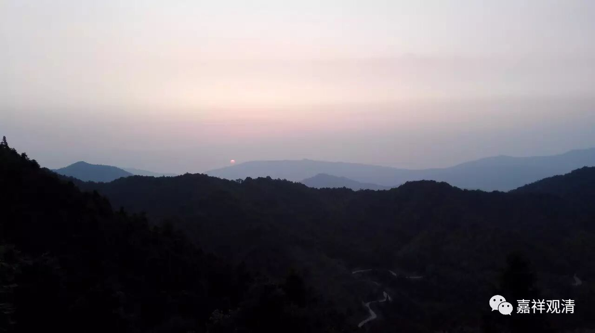
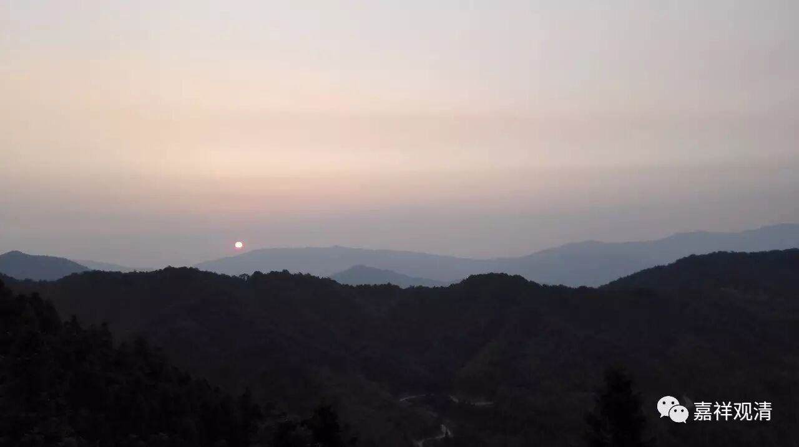
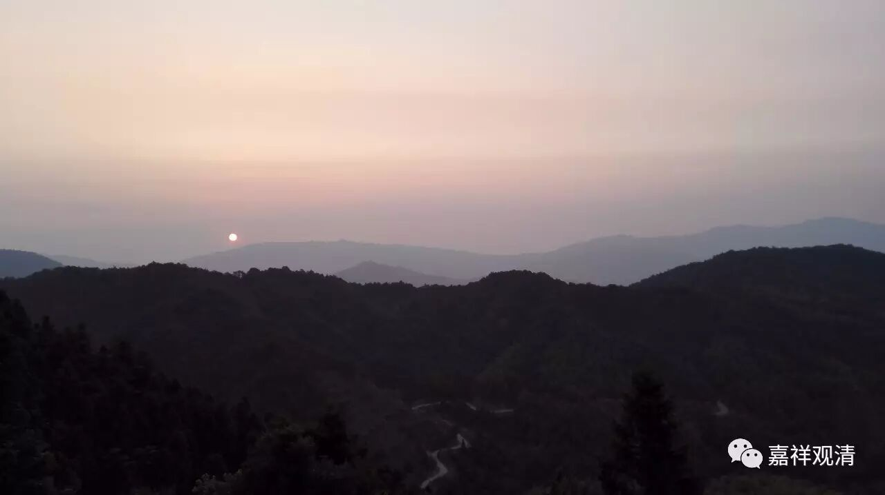
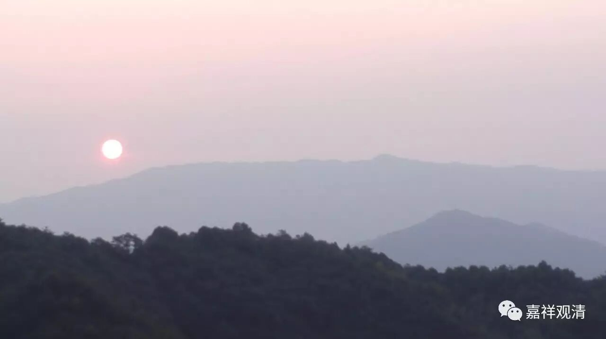
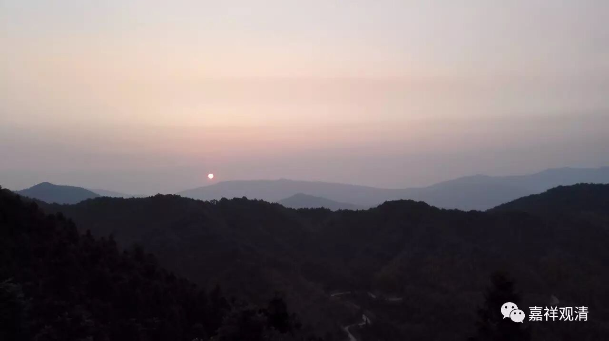
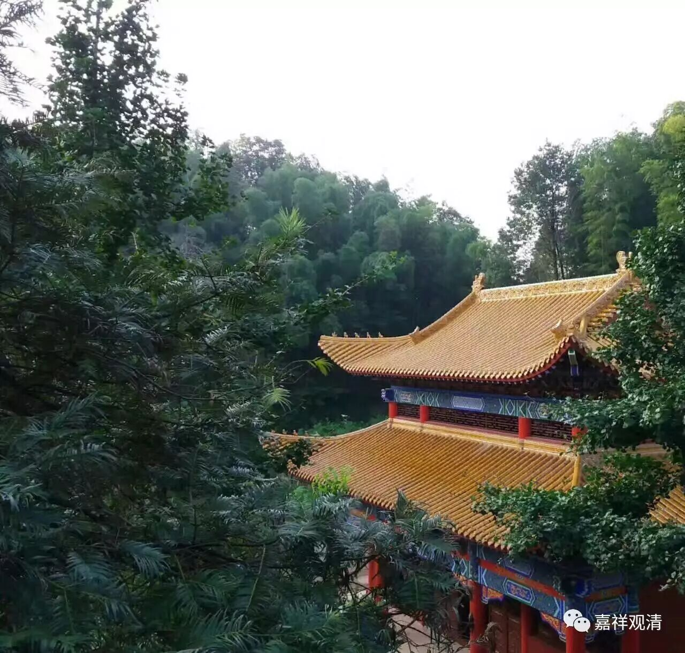
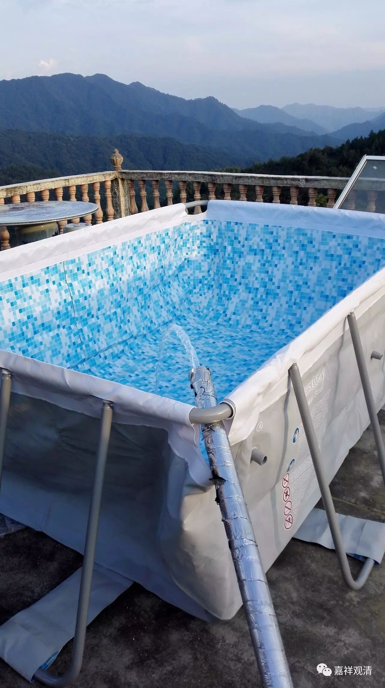
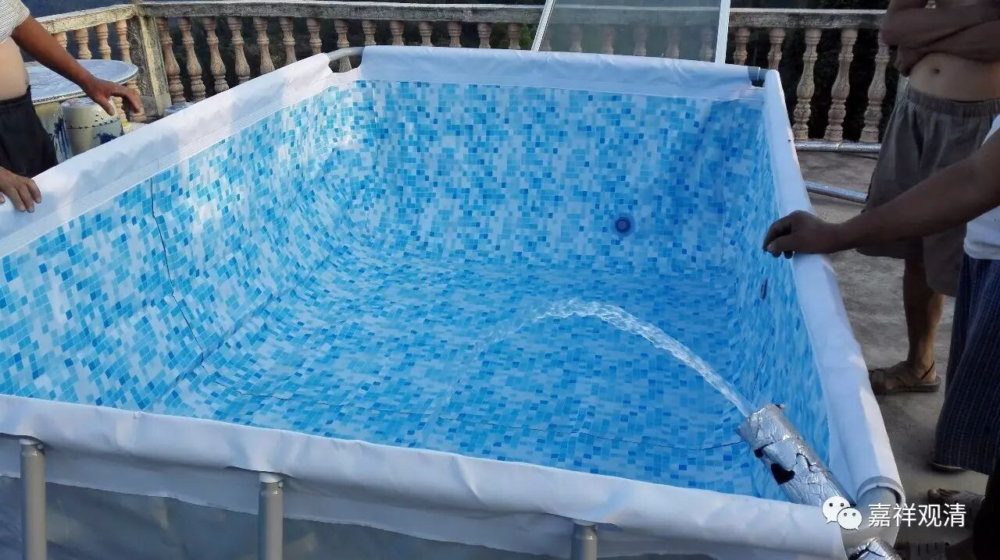
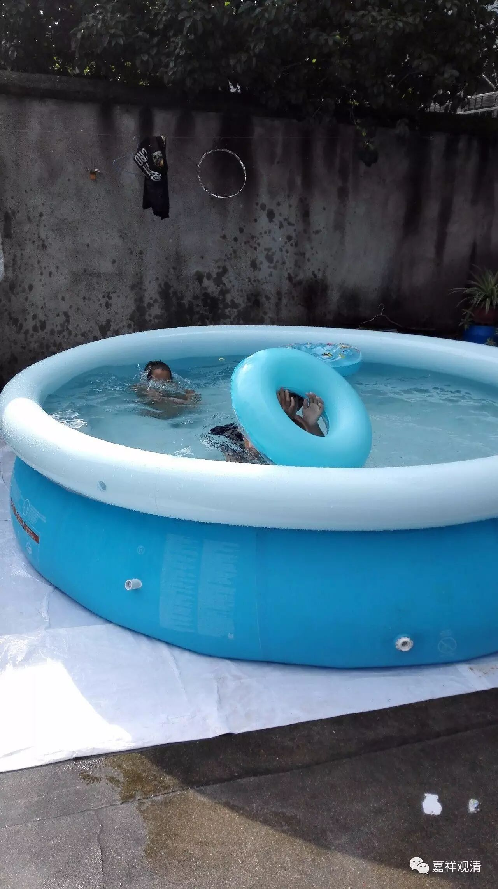

**回山，第二天**

山上空气好，早早便醒来。打开窗，正是日出，掏出手机，就是“日出·印象”。好东西，大家分享……

吃完早饭，提了根竹杖，步行上山。手表说我爬了有二十多层楼，一千多米，正是好运动，但运动量还不太够。白云寺在山顶上的小盆地里，四周是五个小山包，中间是寺院主体建筑，建筑不多，但林密，太阳直射时间也比山下少，所以比山下的村里和山腰的综合楼都要凉快些，一般比山脚下要凉个六七度呢。森林公园三十度的话，山上也就二十多度，夜里必须盖薄被子，所以当地称为“小庐山”也是有道理的——当然本身就属于庐山-黄山一脉。

和上海义工聊会儿天，再接连处理几件的事儿。现在我们的两处场子都进入装修的收尾阶段，必须操心。做饭大师傅张居士也回山帮忙了，这样我们轻松很多咯。寺院都是各方因缘所成，义工、各种做事的人都必不可少。小寺院，就如麻雀虽小，五脏也必须全的，因缘要凑齐，也是不容易的事儿呢。

落晚，和弟弟把游泳池装起来一个。工人们很兴奋地围过来看新鲜，小木匠说要给孙子买一个。哦，有孙子的那个木工并不老，呵呵，前天听说，附近还有35岁做外婆的呢。我是前几年就被山下的孩子叫“爷爷”了，当时特别地“刺耳”，现在，我也习惯了——没叫“祖爷爷”就算是好的了。

还有一个泳池略小些，看看明后天安装。

茶室的地板铺完了，我们预计，这里会很受欢迎，也许大家会更爱在这里打地铺。茶室的照片，明天补了。

