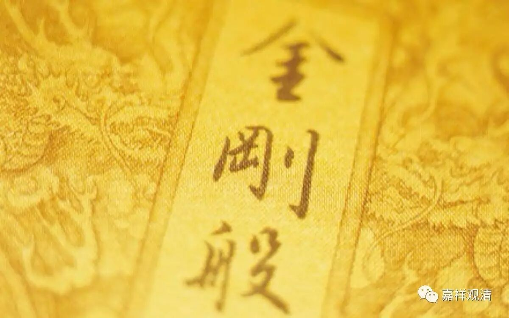

**《金刚经》054（下）**

** “尔时世尊而说偈言：‘若以色见我，以音声求我，是人行邪道，不能见如来。’”**如果认为佛应是形象，或者是声音，** “是人行邪道，不能见如来。”**如果他这样认为，那么这个人的方向就走错了，是不能认识到真正的如来的。

这个是鸠摩罗什法师的版本，如果在其他的版本当中，还有四句话的，这四句话加上去，意思就更明显了。有人说，“若以色见我……”这个就是四句偈——其实不是啊！我们讲过很多次了，“四句偈”是指《金刚经》中任意一段话都可以。在玄奘法师和义净法师的版本当中都还有四句话，加了这四句呢，我们对整段文字的意思就会更清楚一点。在前面这四句遮了以后，也就是从反面讲了以后，后面的这四句话其实是表，是从正面讲的。

** “应观佛法性，即导师法身，法性非所识，故彼不能了。”**应该知道佛的法性、佛的空性、佛的自性身，** “即导师法身”**，才是真正的佛身。如果要观察的话，应该怎么观如来呢？应该观空。须菩提就是解空第一，对吧？不是观如来的色法——如来长成什么样、长得多高、光有多大……这些都不重要。如果要见佛的话，或者说要观佛的话，应该观空，应该见空性才行，否则就走错路了，** “是人行邪道”**，都走错路了。** “应观佛法性，”**佛的这个法性、这个空性，** “即导师法身”**。如果观佛的话，应该观佛的法性，这才是观佛的身。要观什么呢？观佛的自性空，简单来说就是观空。

** “法性非所识，故彼不能了。”**这个好象有点是唯识的说法。没办法，唯识的版本就是这样的文字。** “法性非所识，”**法性不是分别的。怎么说呢？在我们证空性的时候，或者观空性的时候，不是以分别心去见的，是以圣根本无分别定或者圣根本无分别心，去观见的。** “法性非所识，故彼不能了。”**所以说，我们的分别心、我们的世俗心，是不能够见法性的。我们去追求以色见佛、以音声求的时候，这种分别是不能真正认知到佛的法身的，也就不能真正观察到佛或者认知到佛。

《华严经》里有一个偈颂，那来这里是刚刚好：

** “佛身不可取，无生无起作，**

** 应物普现前，平等如虚空。”**

这就是第二十二个问题：“佛（法）身可否以色身比知？”佛身能不能以色身比知呢？能不能以观佛的三十二相的方式来认知呢？答案在这里说了，如果加上后面这四句就更明显了——

** “若以色见我，以音声求我，**

** 是人行邪道，不能见如来。**

** 应观佛法性，即导师法身，**

** 法性非所识，故彼不能了。”**

真正的认知或者观察佛身，是什么呢？是以根本无分别心见空，或者说以根本无分别心见佛的法性空，才是真正的观佛的身。如果以佛的三十二相来观呢，当然佛教里面也有这样一种方便，是一种趣入的引导，而其背后是要让我们学习为什么会有佛这样的相好。

在最后，是要见佛的本性，就是他的空性。所以，大家要记住加上这四句话，** “应观佛法性，”**佛的法性，** “即导师法身，”**就是佛的法身。** “法性非所识，”**空性不是以我们的分别心所见的。** “故彼不能了。”**所以我们的分别心是见不了佛身的。

好，今天我们先到这里。《金刚经》这次微课堂也快讲完了，谢谢大家一直以来的参与！

