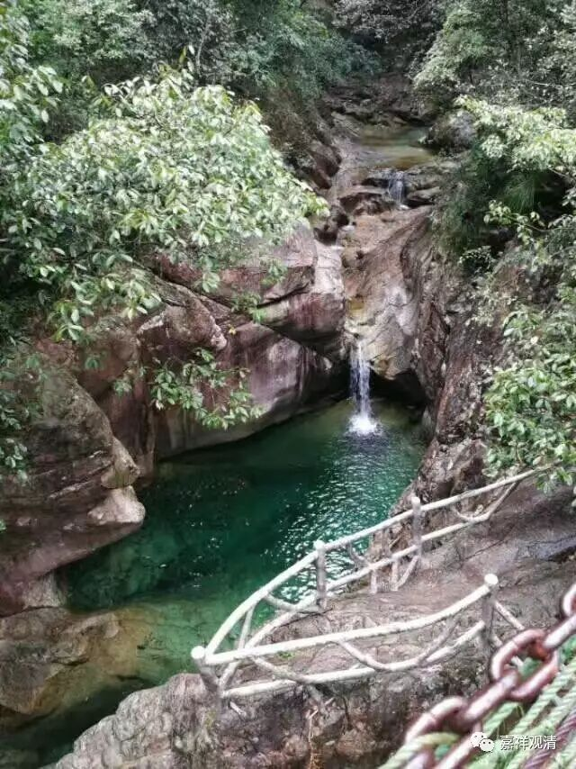
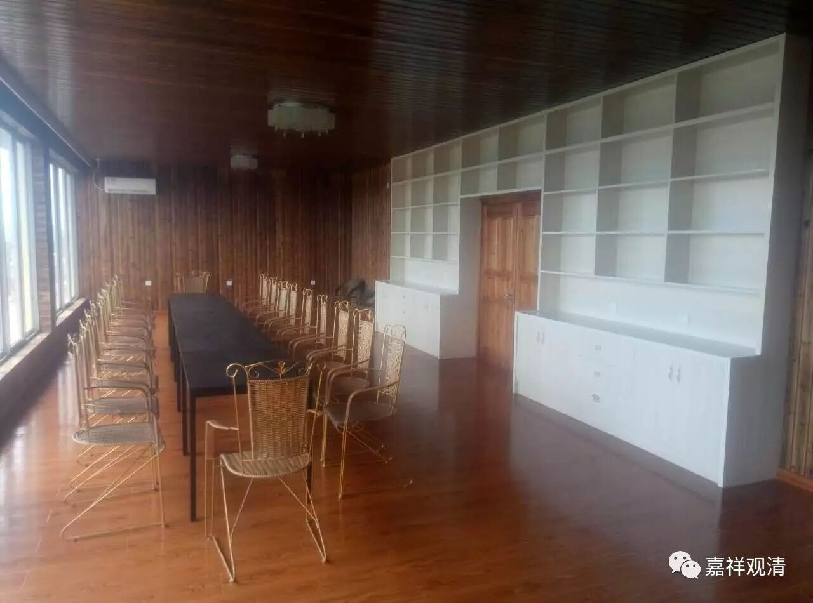
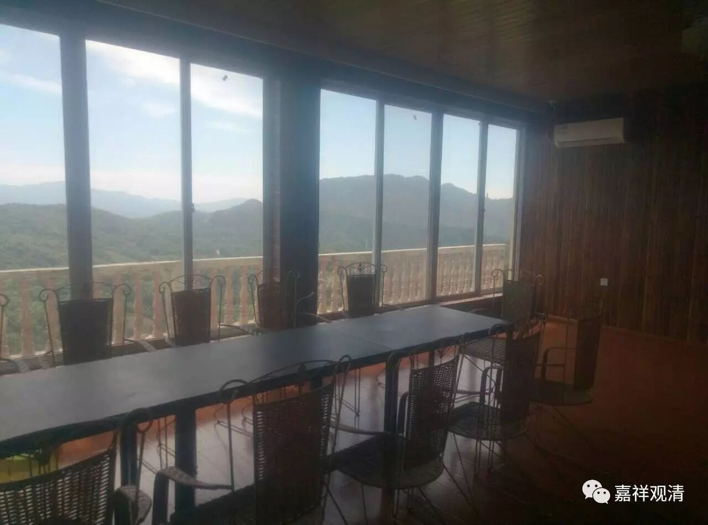
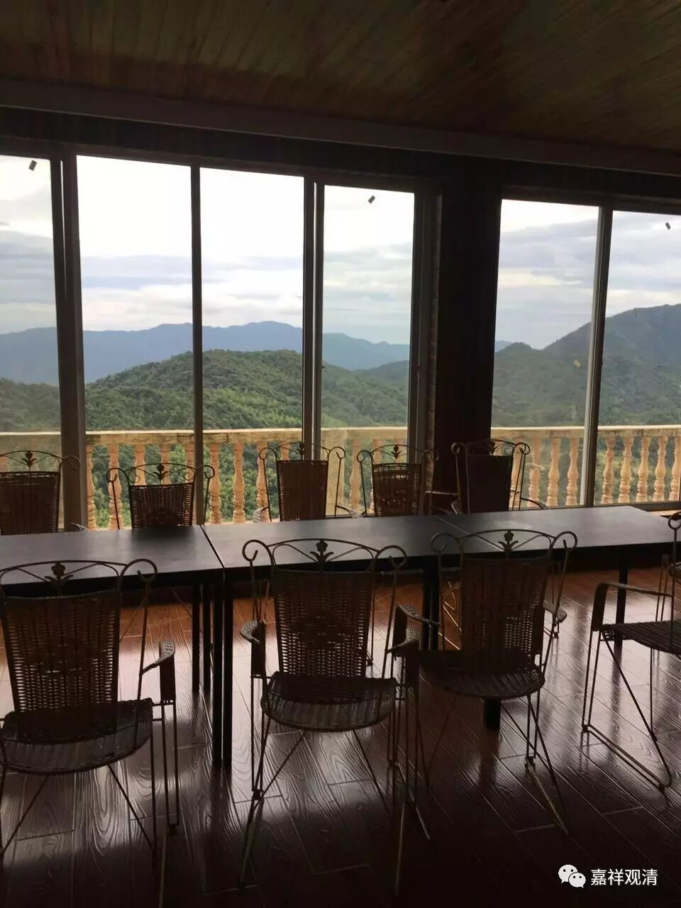
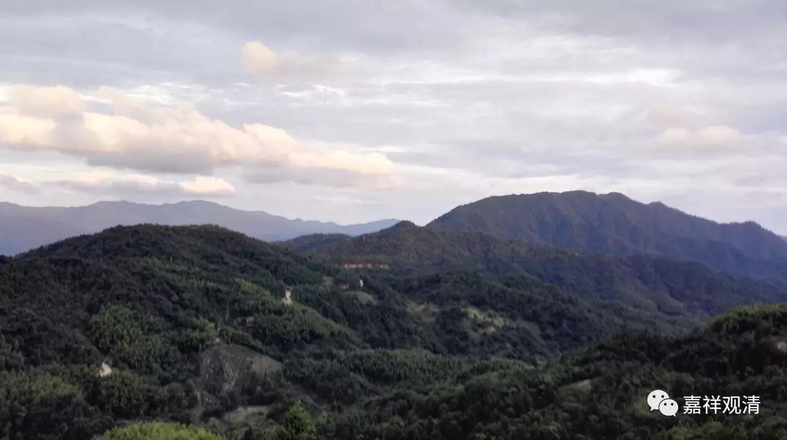
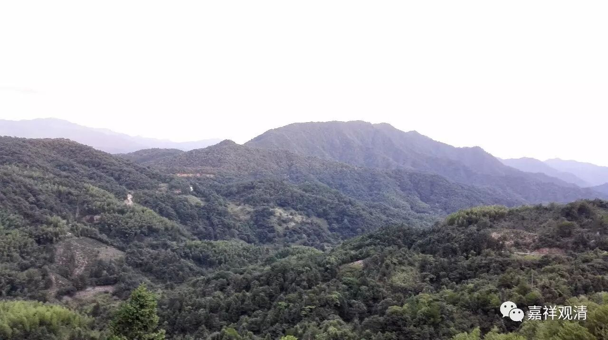
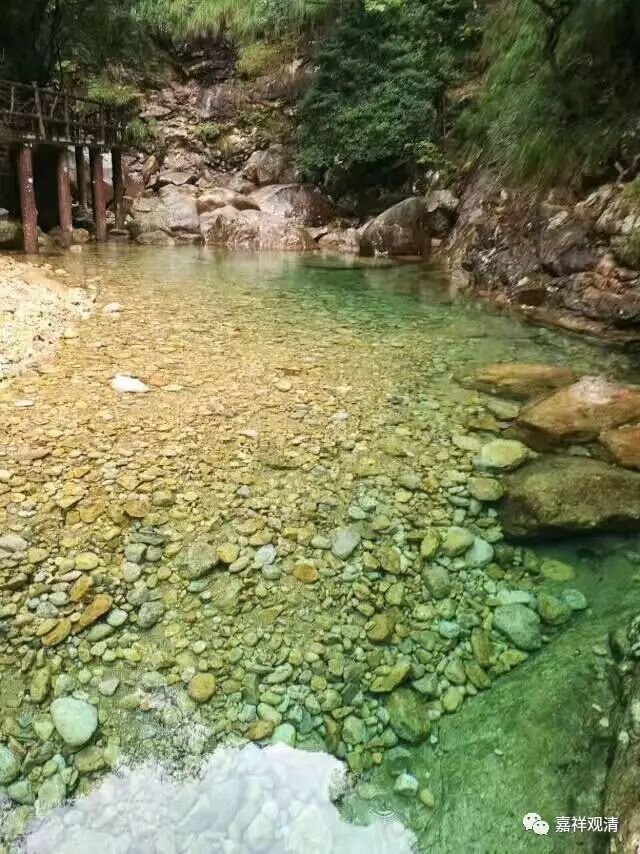
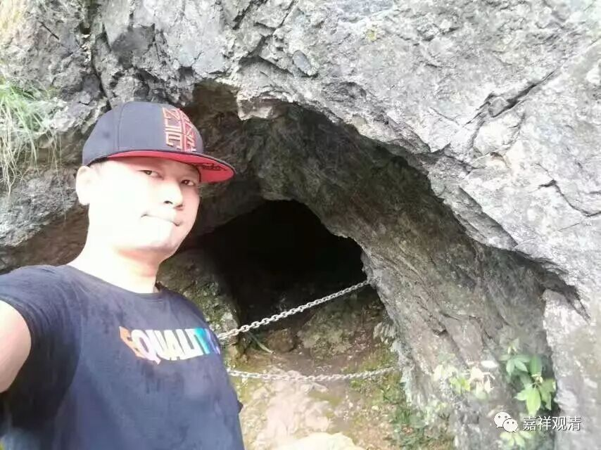

**在山·泉水·清**

今天，四楼的茶室清理干净，早来的小张给打扫完了，现在上照片。大家上眼——LOOK！其实叫茶室、咖啡厅、阅览室也都可以。

大房间还在铺地板，明天应该可以完成，那就等着明天上照了。算是一个多功能的大厅，兼顾了图书馆、禅堂、武馆、佛堂的功能……我觉得还可以加一个功能——集体打地铺！

这次莲花山夏令营，我们又新开发一个超级酷炫吸睛的项目——做瓷器！我们请来了景德镇的高级工艺美术师做辅导，专门上山为老师、学生指导三天。我想全程录影，方便大家学习，也在考虑，这以后可以作为一个长期的项目来做。反正我自己是相当的期待，其它人有动心的没有？（还等什么，赶快买票或者开车飞奔过来啊！大致，陶瓷课安排在八月四、五、六这三天。）

下午起风了，应该是受到台风的影响，温度瞬间降了下来，让刚装的空调显得略无意义了。下午，武汉到了两拨人，过两天会陆续来人的。弟弟和老妈去安徽牯牛降景区，今天玩high了……

