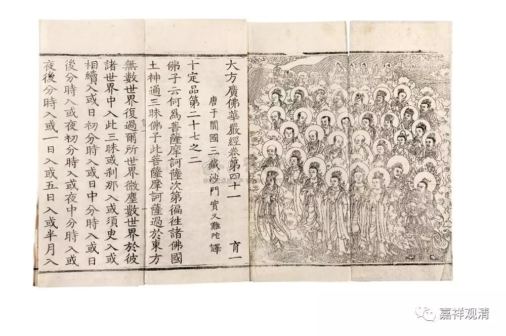

**《金刚经》 055（上）**

好，我们继续《金刚经》。

上次讲到第二十二个问题：“佛（法）身可否以色身比知？”佛身能不能用观三十二相、八十种好来观察？这里的回答是：** “若以色见我，以音声求我，是人行邪道，不能见如来。”**如果说三十二相的话，转轮圣王也有这样的三十二相，所以它并不能够代表佛的样子，以这个形象来代表佛的话，恐怕是有出入的。所以在其他版本——玄奘法师和义净法师的版本当中还有另外四句话：** “应观佛法性，即导师法身，法性非所识，故彼不能了。”**佛的空性、法性、自性清净身，才是佛真正的身，所以称为自性清净身，或者自性身。它不是我们分别心的对象，** “故彼不能了。”**不是以我们的分别心来见的，它是以根本无分别心来见的。

上面的问题是问佛身能不能用三十二相、八十种好来观，回答说不能，因为真正的佛身是佛的自性身。说自性身，是从讲佛的四身的角度来讲的，如果从佛的三身的角度来讲，那就是法身。

《华严经》也有这样一个偈颂，可以参看：

佛身不可取，无生无起作，

应物普现前，平等如虚空。

佛身是无有起作的无为法，无有自性可得；其应化众生，依缘而起，现身引导，而此一切，背后皆无有实体可得。

这个问题讲完后，接下来显然就会问：佛到底有没有身体？经典当中处处提到的“佛有三十二相、八十种好”都是指什么呢？难道三十二相八十种好的佛身是没有的吗？……显然就会出现这些问题，这就是第二十三个问题：“岂非佛无福德身耶？色身岂非断灭耶？”——佛有没有这个福德身呢？

** “须菩提，汝若作是念：‘如来不以具足相故，得阿耨多罗三藐三菩提。’须菩提，莫作是念：‘如来不以具足相故，得阿耨多罗三藐三菩提。’”**这个呢，就是再重新发起一个提问。须菩提，你不要这样认为如来没有三十二相，前面讲以三十二相观如来是不行的，但并不是说佛没有三十二相。

