**回山流水账**

昨天下午，受台风影响，山里起风了。晚上，开着窗，得盖被子，有点小凉——山里真是避暑的好地方啊！

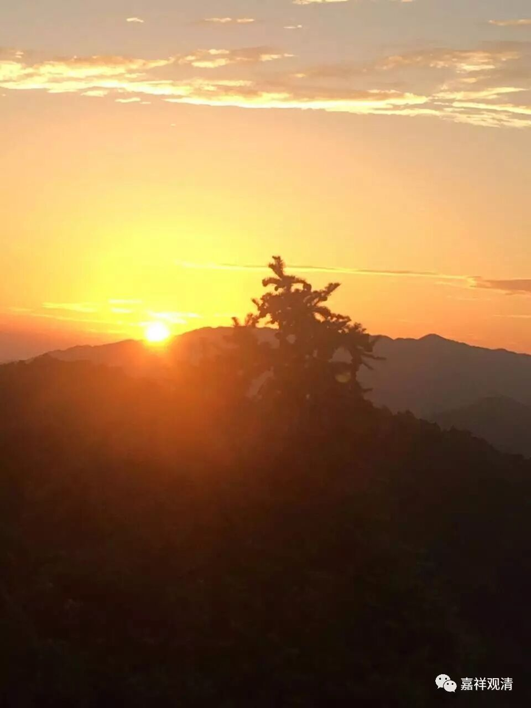

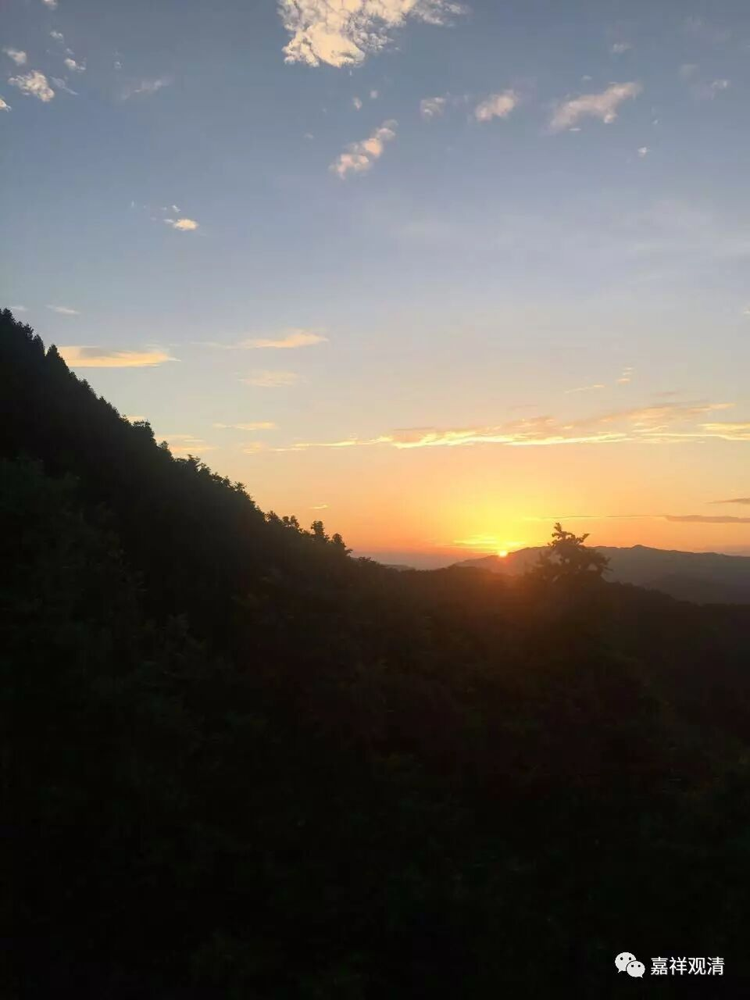

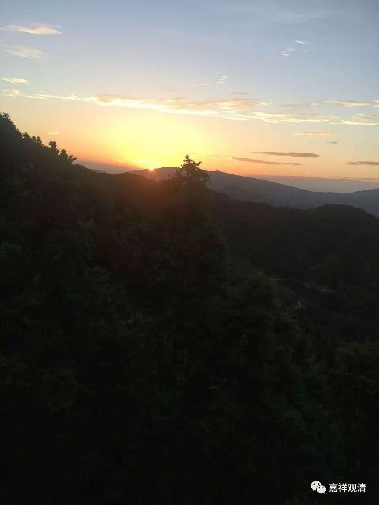

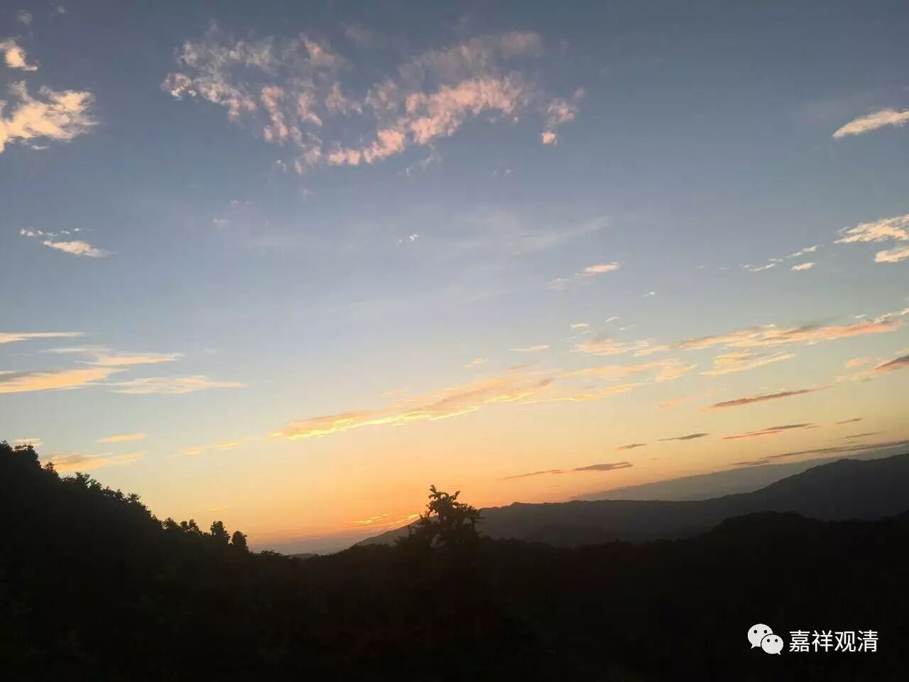

早晨，天气不错，这是居士早起拍的日出。拍日出在这里不需要刻意，清晨起来，窗户里看出去就是了……

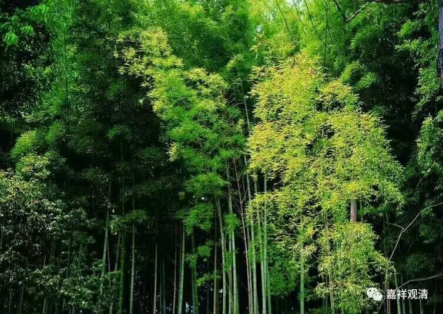

吃完早饭，带着武汉的两个居士上山，参观了寺院，上海的义工阿姨也跟着我们走了一圈——她来寺院半个多月了（寺院里缺人，她们来帮忙来了，真是感谢），并不知道一些关于寺院的典故，正好今天要回上海了，这回去之前，还能多了解一点寺院。带他们到后山走了走。

庙里的张居士给我准备了稀饭，于是再吃一碗……

下午下了阵雨，山里的气温进一步下降了。冒雨回综合楼……雨天，路显得有点陡。短褂湿了。

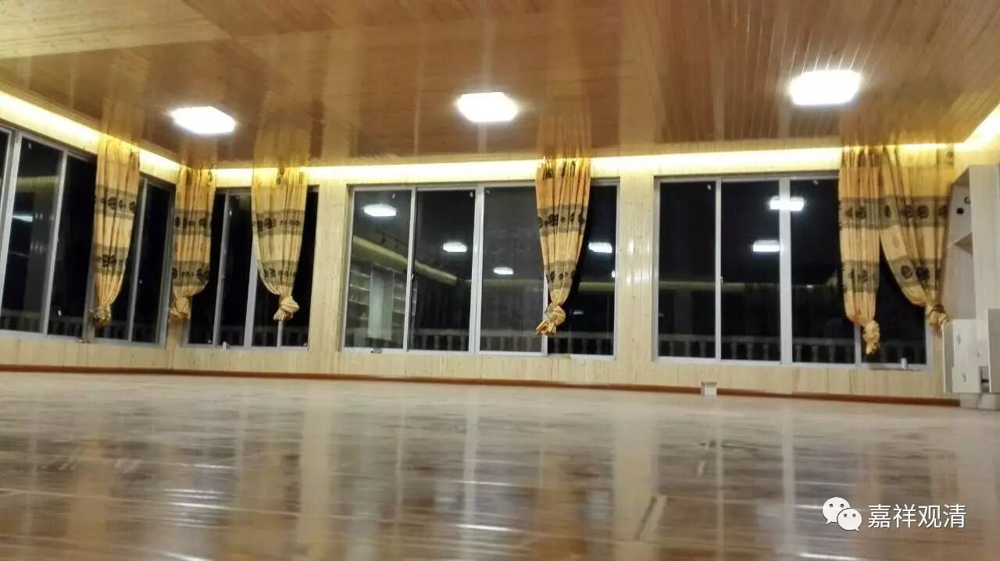

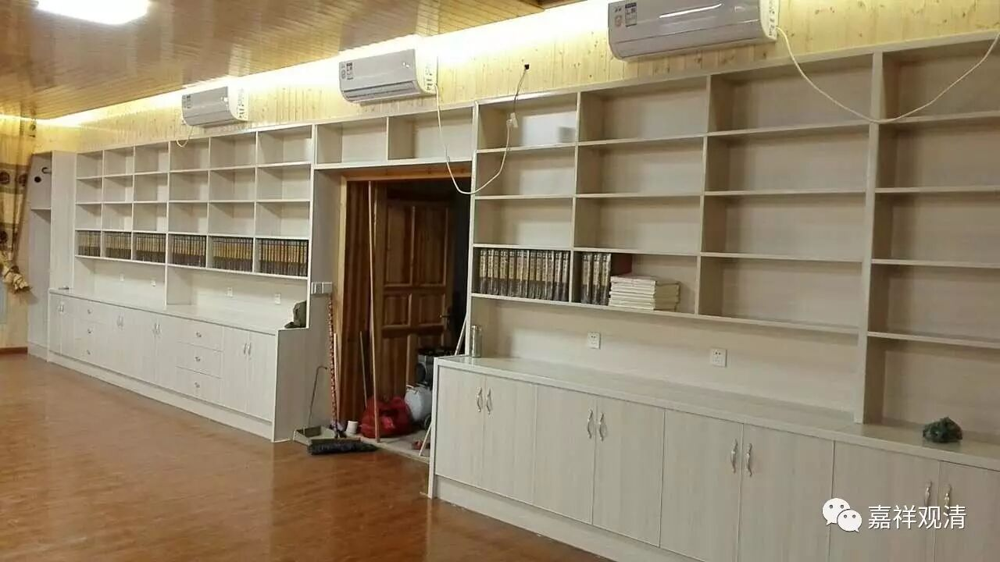

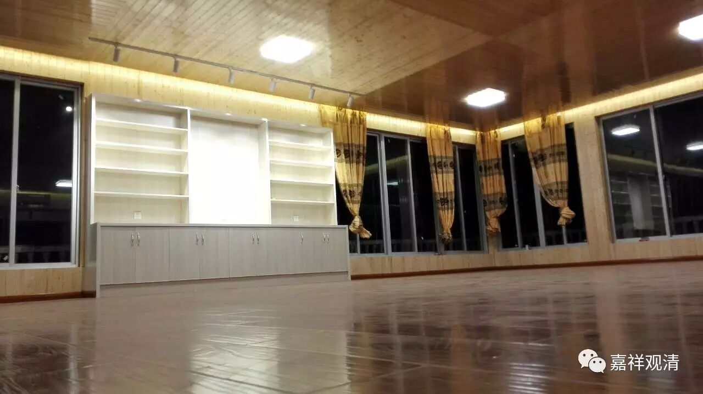

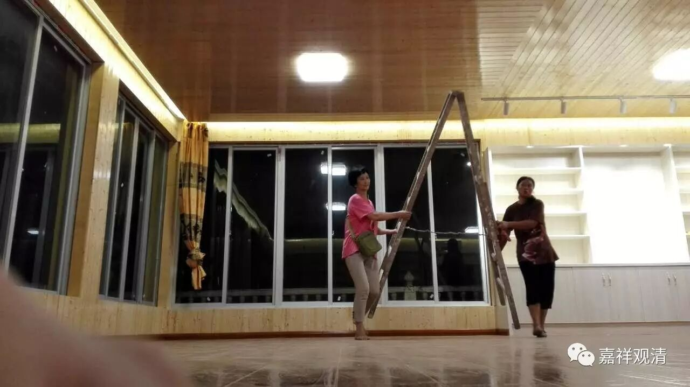

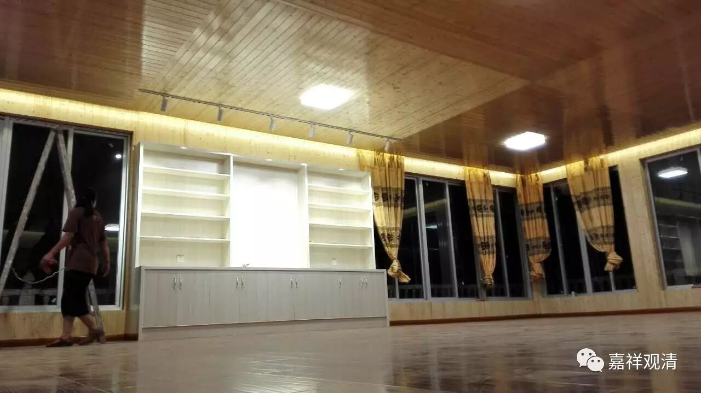

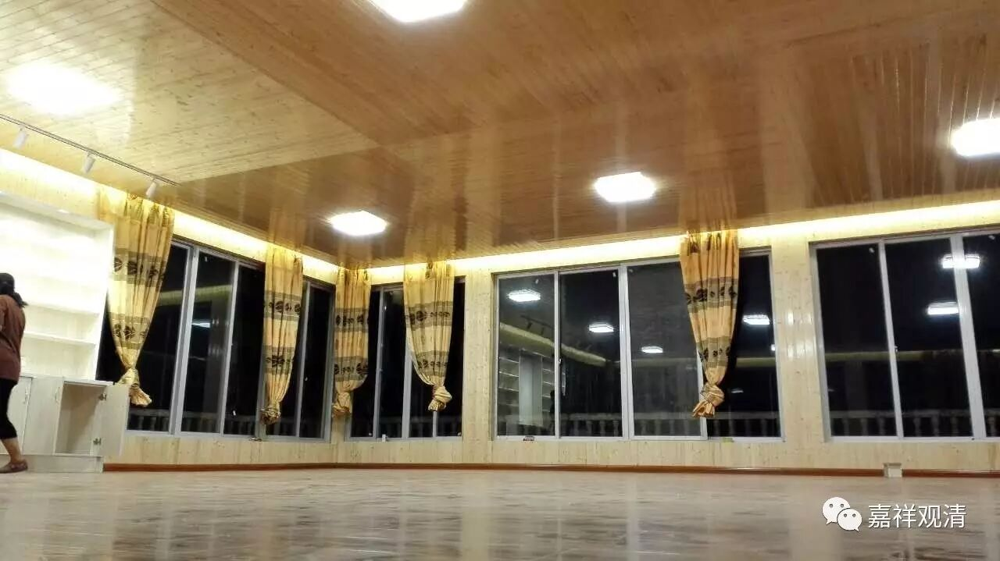

综合楼大厅基本装修完毕，有人说“高大上”，呃，豪华可能算不上，至少可以说有点养眼。……正好请大家帮忙搬动、摆放大藏经。山里有三套藏经——一套大正藏，两套龙藏。到时候，可以运一套龙藏去宁波。

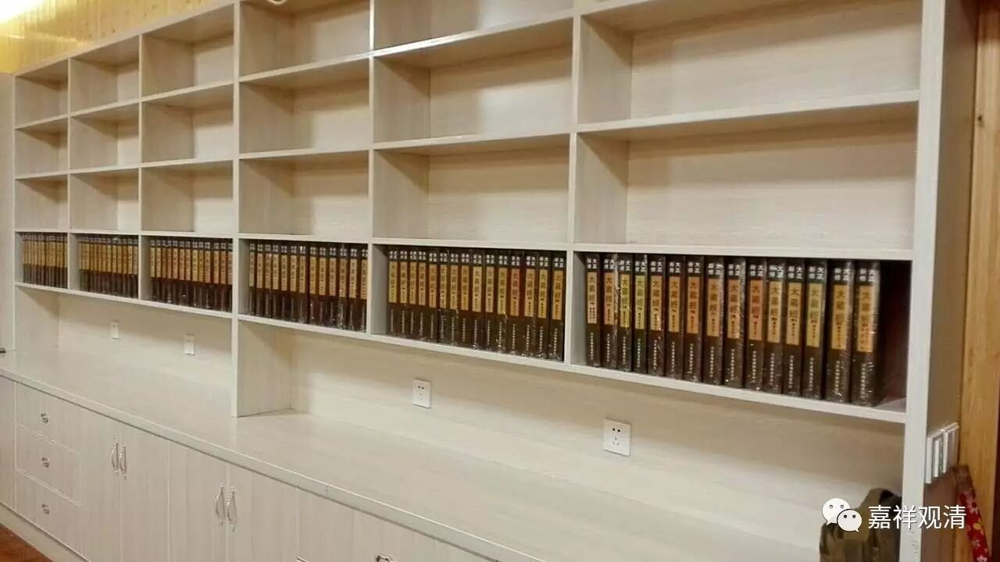

因为都在装修中，所以楼里到处都很乱、很脏，义工们打扫了一天，综合楼的样貌就变了很多，真是辛苦了。