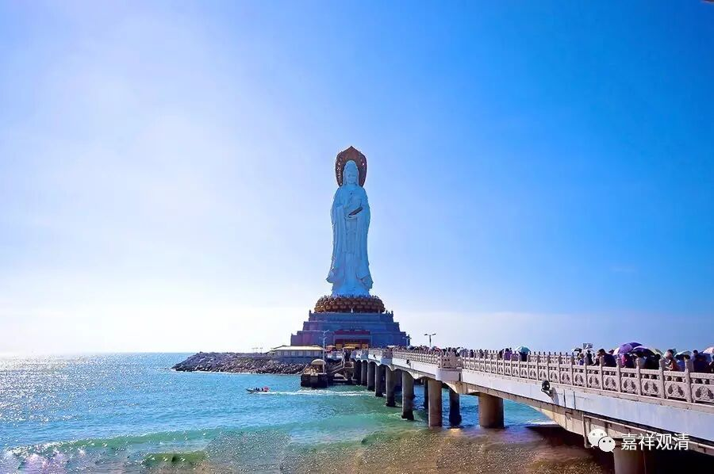

**《金刚经》055（中）**

我们继续把文字过一遍，然后再讲回来。

** “须菩提，汝若作是念：‘发阿耨多罗三藐三菩提心者，说诸法断灭。’莫作是念。何以故？发阿耨多罗三藐三菩提心者，于法不说断灭相。”**前面讲了佛的法性才是佛真正的身，那么能不能以三十二相观如来呢？你说错了，不能以三十二相观如来。

有些人就会认为：如来没有色身吗？如来没有福德身吗？如来不具足相吗？佛都是具有的！我们已经讲过好几次了，佛具有福德身和智慧身。福德身呢，又分报身和化身。报身和化身，按照一般的习惯来说，应化身和报身都有三十二相、八十种好，或者说圆满的相好。那么，佛有三身，你不可能说佛只有一个身而没有其他的身。佛是三身成就的，是吧？其中最重要是佛的法身或者说佛的自性身，这个是核心的，但报身和化身不能说没有。我们说佛具有福德身和智慧身，福德身是有的，但福德身不是究竟的佛身，不要以为见到这个福德身就是见到真正的佛了。

我们再讲一个须菩提自身的例子。那时候佛去天界给母亲讲法，回来的时候，大家都要去迎接佛，莲华色比丘尼也要挤进去。但人实在太多了，挤不进去，她有神通，就化现成一个国王。那个时候也是这样噢，大家看见国王来了以后就给她让路，她就跑到最前面去了。佛来了以后就说：“莲华色，你以为你是第一个见我的吗？不是！你不是第一个见我的。第一个见我的是须菩提。”其实须菩提那个时候并没有在现场，须菩提在那里观空呢。

大家明白了吗？这是法身的一个很好的比喻，也是发生在须菩提身上呢。怎样才能真正的观佛呢？观空，而不是仅仅见那个相好。佛不是那个物质，怎么说也是心要比物质更重要吧？智慧更重要吧？可以说见空、见真理了就是见佛了，当然这只是一个比方，不能说是很精确的说法。我看有些人在写论文的时候也是这么说，说佛性是真理。这个真理呢，如果简单来讲可以，但是仔细来讲的话，讲空性是真理就不太好，写论文的时候这样讲就不太好了。我们现在是随便聊聊，就用真理来讲也可以。

那么，** “不应以三十二相观如来”**，就会有人说：“哦，佛没有三十二相。”或者说：“哦，佛说其他东西都是没有的，唯有空才是对的。”不是这样的！这个“空”和“有”是一体的两面。简单来讲，“空”是一面，“有”是另一面。我们说，佛不可能只有自性身而没有应化身的，这是不可能的。空，也要有他的“所依”，是什么空，而不是单纯的空。这一点，中观唯识都明确——空和有，都要讲清楚，什么空，什么有，不是泛泛地谈空说有。那，在这里，我们就要说，佛，不是单纯的空，独立于福德身的法性身是不存在的。

