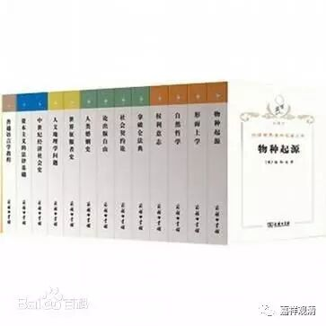

**大王回山之**

** ——“一地鸡毛”**

今天是大家都很辛苦的一天……

9号台风早上五点到了鄱阳湖，已成强弩之末，带来了不大的风雨，便敷衍过去——就地解散了。

今天，义工老师们都很辛苦地打扫房间。因为综合楼的装修还没结束，所以打扫房间任务不轻。昨晚有个房间的抽水马桶漏水严重，早上用水突然成了问题，寻到到水源一看，水箱的水竟全被放完了……只能慢慢积水。到晚上水箱终于积满，水泵又坏了，只好等明天鄱阳发来新水泵再说……

大厅装修还没结束，于是昨天打扫的成果被木匠们的“战果”掩埋。下午我搬书，一套大正藏、一套龙藏、一套商务的世界名著译丛（四百多本）、一套《大般若经》都上架了。晚上大家一起帮忙搬书，书还是很多的，目前的书架看来不够用呢。书多，搬起来还是很累的，大家可算是好好做了大功德。找到了很多《药师经》和《金刚经》，很有趣，这批书是米医生们印的，那时候这些书结缘来的时候我们还不认识，现在都很熟了。还找到以前我们参与印的义净版的《金刚经》，《浪丐心泪》也找到一箱。

今天，厨房铺地砖的工人犯傻，地砖铺完以后，发现门关不上了——铺地板的时候没算地平的高度，真是“醉了”。有些人就是这样，不仅笨，还柠，无法交流。只好明天把门拆了抬高。

今天真是“一地鸡毛”。流水账到这里，我去洗澡咯。总算热水没问题……

今天忙，没拍照

